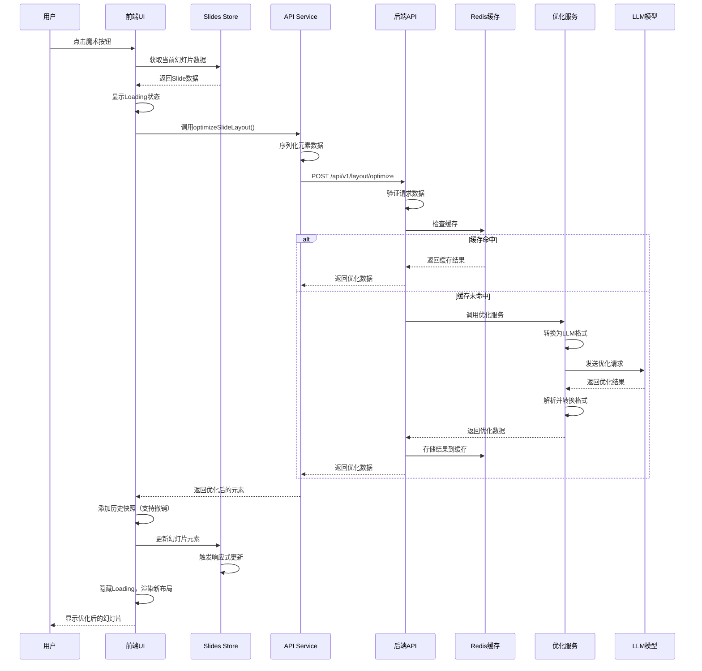

# PPT内容排版优化功能架构设计

> **文档版本**: v1.0  
> **创建日期**: 2025-10-28  
> **设计目标**: 基于LLM的智能PPT排版优化功能完整实现方案

## 目录
1. [整体架构设计框架](#1-整体架构设计框架)
2. [数据格式设计](#2-数据格式设计)
3. [核心实现流程](#3-核心实现流程)
4. [前端实现方案](#4-前端实现方案)
5. [后端实现方案](#5-后端实现方案)
6. [LLM提示词设计](#6-llm提示词设计)
7. [错误处理和容错](#7-错误处理和容错)
8. [性能优化方案](#8-性能优化方案)
9. [测试方案](#9-测试方案)
10. [部署和配置](#10-部署和配置)

---

## 1. 整体架构设计框架

### 1.1 系统架构图

```
┌─────────────────────────────────────────────────────────────┐
│                       前端层 (Vue 3)                        │
├─────────────────────────────────────────────────────────────┤
│  ┌───────────────┐  ┌───────────────┐  ┌──────────────┐    │
│  │ 魔术按钮组件  │  │ 数据收集服务  │  │ 状态管理     │    │
│  │ MagicButton   │  │ Optimization  │  │ Slides Store │    │
│  └───────────────┘  └───────────────┘  └──────────────┘    │
│                            │                                │
│                            ▼                                │
│  ┌─────────────────────────────────────────────────────┐   │
│  │          API Service (optimization.ts)               │   │
│  │  • 请求构建   • 状态管理   • 错误处理               │   │
│  └─────────────────────────────────────────────────────┘   │
└──────────────────────────────┬──────────────────────────────┘
                                │
                                │ HTTP POST /api/v1/layout/optimize
                                ▼
┌─────────────────────────────────────────────────────────────┐
│                       后端层 (FastAPI)                      │
├─────────────────────────────────────────────────────────────┤
│  ┌─────────────────────────────────────────────────────┐   │
│  │     Endpoint: layout_optimization.py (轻路由)        │   │
│  │  • 参数验证   • 调用Handler   • 返回标准响应       │   │
│  └─────────────────────┬───────────────────────────────┘   │
│                        │                                    │
│                        ▼                                    │
│  ┌─────────────────────────────────────────────────────┐   │
│  │     Handler: LayoutOptimizationHandler               │   │
│  │  • 网络层逻辑  • 日志记录  • 异常处理  • 缓存检查 │   │
│  └─────────────────────┬───────────────────────────────┘   │
│                        │                                    │
│                        ▼                                    │
│  ┌─────────────────────────────────────────────────────┐   │
│  │     Service: LayoutOptimizationService (核心业务)   │   │
│  │  • 数据转换  • LLM调用  • 结果解析  • 数据验证    │   │
│  └──────────────┬──────────────────────┬─────────────────  │
│                 │                      │                    │
│                 ▼                      ▼                    │
│  ┌──────────────────────┐  ┌─────────────────────────┐   │
│  │   数据转换工具       │  │  结果验证工具           │   │
│  │  • LLM格式转换      │  │  • 元素ID一致性         │   │
│  │  • 前端格式转换      │  │  • 内容不变校验         │   │
│  └──────────────────────┘  └─────────────────────────┘   │
└──────────────────────────────┬──────────────────────────────┘
                                │
                                ▼
┌─────────────────────────────────────────────────────────────┐
│                        LLM服务层                            │
├─────────────────────────────────────────────────────────────┤
│  ┌─────────────┐  ┌─────────────┐  ┌─────────────┐         │
│  │ AIClient    │  │ OpenAI API  │  │ Azure OpenAI│         │
│  │ (封装)      │──▶│             │  │             │         │
│  └─────────────┘  └─────────────┘  └─────────────┘         │
└─────────────────────────────────────────────────────────────┘
                                │
                                ▼
┌─────────────────────────────────────────────────────────────┐
│                        支撑服务层                           │
├─────────────────────────────────────────────────────────────┤
│  ┌─────────────┐  ┌─────────────┐  ┌─────────────┐         │
│  │ Redis缓存   │  │ MLflow追踪  │  │ 日志服务    │         │
│  │ (内容哈希)  │  │ (AI追踪)    │  │ (结构化)    │         │
│  └─────────────┘  └─────────────┘  └─────────────┘         │
└─────────────────────────────────────────────────────────────┘
```

### 1.2 架构特点

#### 1.2.1 分层设计
- **展示层**: Vue3组件，负责用户交互和UI渲染
- **业务层**: FastAPI服务，负责业务逻辑处理
- **数据层**: Redis缓存和日志存储
- **服务层**: LLM模型服务和支撑服务

#### 1.2.2 关键技术选型
| 技术组件 | 选型 | 原因 |
|---------|------|------|
| 前端框架 | Vue 3 + Composition API | 现有技术栈，响应式状态管理 |
| 后端框架 | FastAPI | 高性能异步支持，自动API文档 |
| LLM客户端 | OpenAI SDK | 统一接口，支持多种模型 |
| 缓存系统 | Redis | 高性能键值存储，支持过期策略 |
| 监控追踪 | MLflow | AI模型调用追踪和性能监控 |

#### 1.2.3 数据流向

```
用户点击魔术按钮
   ↓
收集当前幻灯片数据 (前端)
   ↓
序列化为API请求格式 (前端)
   ↓
发送HTTP POST请求 (前端 → 后端)
   ↓
请求验证和缓存检查 (后端)
   ↓
转换为LLM可理解格式 (后端)
   ↓
调用LLM生成优化布局 (后端 → LLM)
   ↓
解析LLM返回的结果 (后端)
   ↓
转换为前端数据格式 (后端)
   ↓
返回优化后的数据 (后端 → 前端)
   ↓
更新幻灯片元素 (前端)
   ↓
重新渲染界面 (前端)
```

---

## 2. 数据格式设计

### 2.1 前端数据结构

#### 2.1.1 优化请求数据格式

```typescript
// frontend/src/types/optimization.ts

/**
 * 幻灯片优化请求
 */
export interface SlideOptimizationRequest {
  // 幻灯片ID
  slideId: string;
  
  // 幻灯片元素数据
  elements: PPTElement[];
  
  // 画布尺寸
  canvasSize: {
    width: number;
    height: number;
  };
  
  // 优化选项（可选）
  options?: {
    // 保持原有颜色方案
    keepColors?: boolean;
    // 保持原有字体
    keepFonts?: boolean;
    // 优化风格：professional | creative | minimal
    style?: 'professional' | 'creative' | 'minimal';
  };
}

/**
 * 幻灯片优化响应
 */
export interface SlideOptimizationResponse {
  // 响应状态
  success: boolean;
  
  // 优化后的元素数据
  elements: PPTElement[];
  
  // 优化说明（可选）
  description?: string;
  
  // 错误信息（失败时）
  error?: string;
  
  // 优化耗时（毫秒）
  duration?: number;
}
```

#### 2.1.2 元素数据简化格式

为了减少传输数据量，需要对元素进行精简：

```typescript
/**
 * 精简的元素数据（用于传输）
 */
export interface SimplifiedElement {
  id: string;
  type: ElementTypes;
  
  // 位置和尺寸
  left: number;
  top: number;
  width: number;
  height: number;
  rotate: number;
  
  // 文本元素特有属性
  content?: string;
  defaultFontName?: string;
  defaultColor?: string;
  lineHeight?: number;
  
  // 形状元素特有属性
  fill?: string;
  outline?: PPTElementOutline;
  text?: ShapeText;
  
  // 图片元素特有属性
  src?: string;
  fixedRatio?: boolean;
}
```

### 2.2 后端数据结构

#### 2.2.1 API请求模型

```python
# backend/app/schemas/layout_optimization.py

from typing import List, Optional, Dict, Any
from pydantic import BaseModel, Field

class CanvasSize(BaseModel):
    """画布尺寸"""
    width: float = Field(..., gt=0, description="画布宽度")
    height: float = Field(..., gt=0, description="画布高度")

class OptimizationOptions(BaseModel):
    """优化选项"""
    keep_colors: bool = Field(default=False, description="保持原有颜色")
    keep_fonts: bool = Field(default=False, description="保持原有字体")
    style: str = Field(default="professional", pattern="^(professional|creative|minimal)$")

class ElementData(BaseModel):
    """元素数据"""
    id: str = Field(..., description="元素ID")
    type: str = Field(..., description="元素类型")
    left: float
    top: float
    width: float
    height: float
    rotate: float = 0
    
    # 可选属性
    content: Optional[str] = None
    defaultFontName: Optional[str] = None
    defaultColor: Optional[str] = None
    lineHeight: Optional[float] = None
    fill: Optional[str] = None
    outline: Optional[Dict[str, Any]] = None
    text: Optional[Dict[str, Any]] = None
    src: Optional[str] = None
    fixedRatio: Optional[bool] = None

class LayoutOptimizationRequest(BaseModel):
    """布局优化请求"""
    slide_id: str = Field(..., description="幻灯片ID")
    elements: List[ElementData] = Field(..., description="元素列表")
    canvas_size: CanvasSize = Field(..., description="画布尺寸")
    options: Optional[OptimizationOptions] = Field(default=None, description="优化选项")
    
    class Config:
        json_schema_extra = {
            "example": {
                "slide_id": "slide_001",
                "elements": [
                    {
                        "id": "el_001",
                        "type": "text",
                        "left": 100,
                        "top": 50,
                        "width": 600,
                        "height": 80,
                        "rotate": 0,
                        "content": "幻灯片标题",
                        "defaultFontName": "Microsoft YaHei",
                        "defaultColor": "#333333"
                    }
                ],
                "canvas_size": {
                    "width": 1000,
                    "height": 562.5
                },
                "options": {
                    "keep_colors": False,
                    "keep_fonts": False,
                    "style": "professional"
                }
            }
        }
```

#### 2.2.2 API响应模型

```python
# backend/app/schemas/layout_optimization.py (续)

from app.schemas.common import StandardResponse

class LayoutOptimizationResponseData(BaseModel):
    """布局优化响应数据"""
    slide_id: str = Field(..., description="幻灯片ID")
    elements: List[ElementData] = Field(..., description="优化后的元素列表")
    description: Optional[str] = Field(default=None, description="优化说明")
    duration: Optional[float] = Field(default=None, description="优化耗时（秒）")
    
    class Config:
        json_schema_extra = {
            "example": {
                "slide_id": "slide_001",
                "elements": [],
                "description": "标题字体增大并加粗，整体布局居中对齐",
                "duration": 2.5
            }
        }

# 使用标准响应格式
# StandardResponse 定义：
# - status: str ("success" | "error" | "warning")
# - message: str (响应消息)
# - data: Optional[Any] (响应数据)
```

### 2.3 LLM交互数据格式

#### 2.3.1 LLM输入格式

将幻灯片元素转换为LLM易于理解的JSON格式：

```json
{
  "canvas": {
    "width": 1000,
    "height": 562.5
  },
  "elements": [
    {
      "id": "el_001",
      "type": "text",
      "position": { "x": 100, "y": 50 },
      "size": { "width": 600, "height": 80 },
      "content": "幻灯片标题",
      "style": {
        "font": "Microsoft YaHei",
        "color": "#333333",
        "fontSize": 36
      }
    },
    {
      "id": "el_002",
      "type": "shape",
      "position": { "x": 200, "y": 200 },
      "size": { "width": 300, "height": 200 },
      "fill": "#f0f0f0",
      "text": "形状内文本"
    }
  ]
}
```

#### 2.3.2 LLM输出格式

LLM返回优化后的布局数据，格式与输入类似但包含优化后的位置、尺寸、样式等：

```json
{
  "optimized_elements": [
    {
      "id": "el_001",
      "position": { "x": 150, "y": 80 },
      "size": { "width": 700, "height": 100 },
      "style": {
        "font": "Microsoft YaHei",
        "color": "#1a1a1a",
        "fontSize": 42,
        "fontWeight": "bold"
      }
    },
    {
      "id": "el_002",
      "position": { "x": 150, "y": 250 },
      "size": { "width": 700, "height": 250 },
      "fill": "#4a90e2",
      "style": {
        "color": "#ffffff",
        "fontSize": 18
      }
    }
  ],
  "optimization_notes": "标题字体增大并加粗，提升视觉层次；形状背景色优化为主题蓝色，提升专业感；整体布局居中对齐，留白合理。"
}
```

---

## 3. 核心实现流程

### 3.1 整体流程时序图



### 3.2 前端核心流程

#### 3.2.1 用户交互流程

1. **触发优化**
   - 用户点击魔术按钮
   - 禁用按钮，显示Loading状态
   - 调用优化API

2. **数据收集**
   - 从Slides Store获取当前幻灯片
   - 提取elements数组
   - 获取画布尺寸信息

3. **请求发送**
   - 构建请求数据
   - 发送POST请求到后端
   - 处理网络错误

4. **结果应用**
   - 接收优化后的元素数据
   - 添加历史快照（支持Undo）
   - 更新Slides Store
   - 触发界面重新渲染

5. **状态恢复**
   - 隐藏Loading状态
   - 启用魔术按钮
   - 显示成功/失败提示

#### 3.2.2 错误处理流程

```typescript
try {
  // 1. 显示Loading
  setLoading(true);
  
  // 2. 收集数据
  const slideData = collectSlideData();
  
  // 3. 发送请求
  const response = await optimizeSlideLayout(slideData);
  
  // 4. 验证响应
  if (!response.success) {
    throw new Error(response.error || '优化失败');
  }
  
  // 5. 添加历史快照
  addHistorySnapshot();
  
  // 6. 更新幻灯片
  updateSlideElements(response.elements);
  
  // 7. 显示成功提示
  message.success('排版优化完成');
  
} catch (error) {
  // 错误处理
  console.error('优化失败:', error);
  message.error('排版优化失败：' + error.message);
  
} finally {
  // 恢复状态
  setLoading(false);
}
```

### 3.3 后端核心流程

#### 3.3.1 请求处理流程

```python
async def optimize_slide_layout(
    request: LayoutOptimizationRequest,
    db: AsyncSession
) -> LayoutOptimizationStandardResponse:
    """
    优化幻灯片布局的核心处理函数
    """
    start_time = time.time()
    
    try:
        # 1. 请求验证
        logger.info("接收到布局优化请求", slide_id=request.slide_id)
        
        # 2. 生成缓存键
        cache_key = generate_cache_key(request)
        
        # 3. 检查缓存
        cached_result = await redis_client.get(cache_key)
        if cached_result:
            logger.info("命中缓存", cache_key=cache_key)
            return parse_cached_result(cached_result)
        
        # 4. 调用优化服务
        service = LayoutOptimizationService(db)
        optimized_elements = await service.optimize_layout(
            slide_id=request.slide_id,
            elements=request.elements,
            canvas_size=request.canvas_size,
            options=request.options
        )
        
        # 5. 构建响应
        duration = time.time() - start_time
        response = LayoutOptimizationResponse(
            slide_id=request.slide_id,
            elements=optimized_elements,
            duration=duration
        )
        
        # 6. 缓存结果
        await redis_client.setex(
            cache_key,
            3600,  # 1小时过期
            response.model_dump_json()
        )
        
        # 7. 返回结果
        logger.info("布局优化完成", 
                   slide_id=request.slide_id,
                   duration=duration)
        
        return LayoutOptimizationStandardResponse(
            success=True,
            data=response,
            message="布局优化完成"
        )
        
    except Exception as e:
        logger.error("布局优化失败",
                    slide_id=request.slide_id,
                    exception=str(e))
        
        return LayoutOptimizationStandardResponse(
            success=False,
            error={
                "code": "OPTIMIZATION_FAILED",
                "message": str(e)
            }
        )
```

#### 3.3.2 LLM交互流程

```python
class LayoutOptimizationService:
    """布局优化服务"""
    
    async def optimize_layout(
        self,
        slide_id: str,
        elements: List[ElementData],
        canvas_size: CanvasSize,
        options: Optional[OptimizationOptions] = None
    ) -> List[ElementData]:
        """
        优化幻灯片布局的核心方法
        """
        # 1. 转换为LLM格式
        llm_input = self._convert_to_llm_format(
            elements, canvas_size, options
        )
        
        # 2. 构建提示词
        system_prompt = self._build_system_prompt()
        user_prompt = self._build_user_prompt(llm_input, options)
        
        # 3. 调用LLM
        llm_response = await self.ai_client.ai_call(
            system_prompt=system_prompt,
            user_prompt=user_prompt,
            temperature=0.7,
            max_tokens=2000
        )
        
        # 4. 解析LLM响应
        optimized_data = self._parse_llm_response(llm_response)
        
        # 5. 转换回前端格式
        optimized_elements = self._convert_to_frontend_format(
            optimized_data, elements
        )
        
        # 6. 验证结果
        self._validate_optimized_elements(
            optimized_elements, elements
        )
        
        return optimized_elements
```

---

## 4. 前端实现方案

详细的前端实现代码和组件设计请参见：
[`前端实现细节.md`](./前端实现细节.md)

关键实现包括：
- 魔术按钮组件 (MagicButton.vue)
- 数据收集服务 (optimization.ts)
- API服务封装 (api/optimization.ts)
- 状态管理扩展 (store/slides.ts)

---

## 5. 后端实现方案

详细的后端实现代码和服务设计请参见：
[`后端实现细节.md`](./后端实现细节.md)

关键实现包括：
- API端点 (endpoints/layout_optimization.py)
- 优化服务 (services/layout_optimization_service.py)
- LLM交互 (使用现有AIClient)
- 缓存策略 (Redis)

---

## 6. LLM提示词设计

### 6.1 系统提示词

```
你是一位专业的演示文稿设计专家，精通排版设计原则和视觉传达理论。你的任务是优化PowerPoint幻灯片的布局，使其更加美观、专业和易读。

核心原则：
1. **内容不变**：严格保持所有文字内容不变，不得修改、删除或添加任何文字
2. **视觉层次**：通过字体大小、位置、颜色建立清晰的视觉层次
3. **对齐原则**：确保元素之间的对齐关系，使用网格系统
4. **留白空间**：合理利用留白，避免过度拥挤
5. **色彩协调**：优化配色方案，提升视觉吸引力
6. **比例平衡**：保持元素之间的比例协调

设计规范：
- 标题字体：36-48px，加粗，视觉焦点
- 正文字体：18-24px，易读
- 元素间距：至少20px
- 边距：距离画布边缘至少50px
- 对齐方式：优先使用居中或左对齐

输出要求：
以JSON格式返回优化后的元素布局数据，包含每个元素的位置、大小和样式属性。
```

### 6.2 用户提示词模板

```
请优化以下幻灯片的布局设计：

## 画布信息
- 宽度：{canvas_width}px
- 高度：{canvas_height}px

## 当前元素布局
{elements_json}

## 优化要求
{optimization_options}

请返回优化后的布局数据，格式如下：
```json
{
  "optimized_elements": [
    {
      "id": "元素ID",
      "position": { "x": 数值, "y": 数值 },
      "size": { "width": 数值, "height": 数值 },
      "style": {
        "font": "字体名称",
        "fontSize": 数值,
        "color": "#颜色值"
      }
    }
  ],
  "optimization_notes": "优化说明"
}
```
```

---

## 7. 错误处理和容错

### 7.1 前端错误处理

```typescript
export enum OptimizationErrorCode {
  NETWORK_ERROR = 'NETWORK_ERROR',
  SERVER_ERROR = 'SERVER_ERROR',
  INVALID_RESPONSE = 'INVALID_RESPONSE',
  TIMEOUT = 'TIMEOUT',
  UNKNOWN_ERROR = 'UNKNOWN_ERROR'
}

export class OptimizationError extends Error {
  constructor(
    public code: OptimizationErrorCode,
    message: string,
    public details?: any
  ) {
    super(message);
    this.name = 'OptimizationError';
  }
}

// 错误处理函数
export function handleOptimizationError(error: any): OptimizationError {
  if (error.response) {
    // 服务器返回错误
    return new OptimizationError(
      OptimizationErrorCode.SERVER_ERROR,
      error.response.data?.message || '服务器错误',
      error.response.data
    );
  } else if (error.request) {
    // 网络错误
    return new OptimizationError(
      OptimizationErrorCode.NETWORK_ERROR,
      '网络连接失败，请检查网络设置',
      error
    );
  } else if (error.code === 'ECONNABORTED') {
    // 超时
    return new OptimizationError(
      OptimizationErrorCode.TIMEOUT,
      '请求超时，请稍后重试',
      error
    );
  } else {
    // 未知错误
    return new OptimizationError(
      OptimizationErrorCode.UNKNOWN_ERROR,
      error.message || '未知错误',
      error
    );
  }
}
```

### 7.2 后端错误处理

```python
# backend/app/core/exceptions.py

class LayoutOptimizationException(Exception):
    """布局优化异常基类"""
    def __init__(self, message: str, code: str, details: dict = None):
        self.message = message
        self.code = code
        self.details = details or {}
        super().__init__(self.message)

class LLMCallException(LayoutOptimizationException):
    """LLM调用异常"""
    def __init__(self, message: str, details: dict = None):
        super().__init__(message, "LLM_CALL_FAILED", details)

class ParseException(LayoutOptimizationException):
    """解析异常"""
    def __init__(self, message: str, details: dict = None):
        super().__init__(message, "PARSE_FAILED", details)

class ValidationException(LayoutOptimizationException):
    """验证异常"""
    def __init__(self, message: str, details: dict = None):
        super().__init__(message, "VALIDATION_FAILED", details)

# 异常处理器
@router.exception_handler(LayoutOptimizationException)
async def layout_optimization_exception_handler(
    request: Request, 
    exc: LayoutOptimizationException
):
    return JSONResponse(
        status_code=400,
        content={
            "success": False,
            "error": {
                "code": exc.code,
                "message": exc.message,
                "details": exc.details
            }
        }
    )
```

---

## 8. 性能优化方案

### 8.1 前端性能优化

1. **请求去抖动**
```typescript
// 防止用户频繁点击
const debouncedOptimize = debounce(async () => {
  await optimizeSlideLayout();
}, 1000, { leading: true, trailing: false });
```

2. **数据精简**
```typescript
// 只传输必要的数据字段
function simplifyElement(element: PPTElement): SimplifiedElement {
  return {
    id: element.id,
    type: element.type,
    left: element.left,
    top: element.top,
    width: element.width,
    height: element.height,
    rotate: element.rotate,
    // 只包含类型相关的必要字段
    ...(element.type === 'text' && {
      content: element.content,
      defaultFontName: element.defaultFontName,
      defaultColor: element.defaultColor
    })
  };
}
```

3. **本地缓存**
```typescript
// 使用IndexedDB缓存优化结果
const cacheOptimizationResult = async (
  slideId: string,
  elements: PPTElement[]
) => {
  const db = await openDB('pptist', 1);
  await db.put('optimizations', {
    id: slideId,
    elements,
    timestamp: Date.now()
  });
};
```

### 8.2 后端性能优化

1. **Redis缓存策略**
```python
# 缓存键生成
def generate_cache_key(request: LayoutOptimizationRequest) -> str:
    """
    基于请求内容生成唯一缓存键
    使用元素内容的哈希值，相同输入返回相同缓存
    """
    import hashlib
    import json
    
    # 序列化请求数据
    data = {
        "elements": [el.dict() for el in request.elements],
        "canvas_size": request.canvas_size.dict(),
        "options": request.options.dict() if request.options else {}
    }
    
    # 生成哈希
    content_hash = hashlib.sha256(
        json.dumps(data, sort_keys=True).encode()
    ).hexdigest()
    
    return f"layout_opt:{content_hash}"

# 缓存过期策略
CACHE_EXPIRE_TIME = 3600  # 1小时
```

2. **异步处理**
```python
# 使用FastAPI的异步特性
@router.post("/optimize")
async def optimize_layout_endpoint(
    request: LayoutOptimizationRequest,
    background_tasks: BackgroundTasks,
    db: AsyncSession = Depends(get_db)
):
    """异步处理优化请求"""
    # 主流程
    result = await optimize_layout(request, db)
    
    # 后台任务：统计、日志、缓存预热等
    background_tasks.add_task(log_optimization_metrics, result)
    
    return result
```

3. **并发控制**
```python
# 使用信号量限制并发LLM调用
semaphore = asyncio.Semaphore(5)  # 最多5个并发请求

async def call_llm_with_limit(prompt: str):
    async with semaphore:
        return await ai_client.ai_call(prompt)
```

### 8.3 LLM调用优化

1. **提示词压缩**
   - 移除不必要的字段
   - 使用简洁的JSON格式
   - 压缩元素描述

2. **响应解析优化**
```python
def parse_llm_response(response: str) -> dict:
    """快速解析LLM响应"""
    # 1. 提取JSON部分
    json_match = re.search(r'```json\s*(.*?)\s*```', response, re.DOTALL)
    if json_match:
        response = json_match.group(1)
    
    # 2. 解析JSON
    try:
        return json.loads(response)
    except json.JSONDecodeError:
        # 容错处理
        return extract_json_from_text(response)
```

---

## 9. 测试方案

### 9.1 单元测试

#### 前端单元测试
```typescript
// tests/unit/optimization.spec.ts

describe('Layout Optimization Service', () => {
  it('should simplify elements correctly', () => {
    const element: PPTTextElement = {
      id: 'el_001',
      type: ElementTypes.TEXT,
      left: 100,
      top: 50,
      width: 600,
      height: 80,
      rotate: 0,
      content: '<p>Test</p>',
      defaultFontName: 'Arial',
      defaultColor: '#000000'
    };
    
    const simplified = simplifyElement(element);
    
    expect(simplified).toEqual({
      id: 'el_001',
      type: ElementTypes.TEXT,
      left: 100,
      top: 50,
      width: 600,
      height: 80,
      rotate: 0,
      content: '<p>Test</p>',
      defaultFontName: 'Arial',
      defaultColor: '#000000'
    });
  });
  
  it('should handle optimization errors', async () => {
    // Mock API error
    vi.spyOn(api, 'post').mockRejectedValue(new Error('Network error'));
    
    try {
      await optimizeSlideLayout(mockRequest);
      expect.fail('Should throw error');
    } catch (error) {
      expect(error).toBeInstanceOf(OptimizationError);
      expect(error.code).toBe(OptimizationErrorCode.NETWORK_ERROR);
    }
  });
});
```

#### 后端单元测试
```python
# tests/unit/test_layout_optimization.py

import pytest
from app.services.layout_optimization_service import LayoutOptimizationService

class TestLayoutOptimizationService:
    @pytest.fixture
    async def service(self, db_session):
        return LayoutOptimizationService(db_session)
    
    async def test_convert_to_llm_format(self, service):
        """测试转换为LLM格式"""
        elements = [
            ElementData(
                id="el_001",
                type="text",
                left=100,
                top=50,
                width=600,
                height=80,
                rotate=0,
                content="Test Title"
            )
        ]
        
        llm_input = service._convert_to_llm_format(
            elements,
            CanvasSize(width=1000, height=562.5),
            None
        )
        
        assert llm_input["canvas"]["width"] == 1000
        assert len(llm_input["elements"]) == 1
        assert llm_input["elements"][0]["id"] == "el_001"
    
    async def test_parse_llm_response(self, service):
        """测试解析LLM响应"""
        llm_response = '''
        ```json
        {
          "optimized_elements": [
            {
              "id": "el_001",
              "position": {"x": 150, "y": 80},
              "size": {"width": 700, "height": 100}
            }
          ]
        }
        ```
        '''
        
        parsed = service._parse_llm_response(llm_response)
        assert "optimized_elements" in parsed
        assert len(parsed["optimized_elements"]) == 1
```

### 9.2 集成测试

```python
# tests/integration/test_layout_optimization_api.py

import pytest
from httpx import AsyncClient

class TestLayoutOptimizationAPI:
    async def test_optimize_layout_success(self, client: AsyncClient):
        """测试布局优化成功场景"""
        request_data = {
            "slide_id": "slide_001",
            "elements": [
                {
                    "id": "el_001",
                    "type": "text",
                    "left": 100,
                    "top": 50,
                    "width": 600,
                    "height": 80,
                    "rotate": 0,
                    "content": "Test Title"
                }
            ],
            "canvas_size": {
                "width": 1000,
                "height": 562.5
            }
        }
        
        response = await client.post(
            "/api/v1/layout/optimize",
            json=request_data
        )
        
        assert response.status_code == 200
        data = response.json()
        assert data["success"] is True
        assert "data" in data
        assert "elements" in data["data"]
    
    async def test_optimize_layout_invalid_request(self, client: AsyncClient):
        """测试无效请求"""
        request_data = {
            "slide_id": "slide_001",
            "elements": [],  # 空元素列表
            "canvas_size": {
                "width": 1000,
                "height": 562.5
            }
        }
        
        response = await client.post(
            "/api/v1/layout/optimize",
            json=request_data
        )
        
        assert response.status_code == 422  # Validation error
```

### 9.3 E2E测试

```typescript
// tests/e2e/layout-optimization.spec.ts

import { test, expect } from '@playwright/test';

test.describe('Layout Optimization', () => {
  test('should optimize slide layout successfully', async ({ page }) => {
    // 1. 打开编辑器
    await page.goto('/editor');
    
    // 2. 等待幻灯片加载
    await page.waitForSelector('.canvas');
    
    // 3. 点击魔术按钮
    await page.click('[data-testid="magic-button"]');
    
    // 4. 等待优化完成
    await page.waitForSelector('[data-testid="magic-button"]:not([disabled])');
    
    // 5. 验证布局已更新
    const elements = await page.$$('.base-element');
    expect(elements.length).toBeGreaterThan(0);
    
    // 6. 验证成功提示
    await expect(page.locator('.message-success')).toBeVisible();
  });
  
  test('should handle optimization errors gracefully', async ({ page }) => {
    // Mock API error
    await page.route('**/api/v1/layout/optimize', (route) => {
      route.fulfill({
        status: 500,
        body: JSON.stringify({
          success: false,
          error: { message: 'Internal server error' }
        })
      });
    });
    
    await page.goto('/editor');
    await page.click('[data-testid="magic-button"]');
    
    // 验证错误提示
    await expect(page.locator('.message-error')).toBeVisible();
    await expect(page.locator('.message-error')).toContainText('排版优化失败');
  });
});
```

---

## 10. 部署和配置

### 10.1 环境变量配置

```bash
# backend/.env

# LLM配置
OPENAI_API_KEY=your_api_key_here
OPENAI_BASE_URL=https://api.openai.com/v1
DEFAULT_LLM_MODEL=gpt-4

# Redis配置
REDIS_HOST=localhost
REDIS_PORT=6379
REDIS_DB=0

# 优化功能配置
LAYOUT_OPTIMIZATION_ENABLED=true
LAYOUT_OPTIMIZATION_CACHE_TTL=3600
LAYOUT_OPTIMIZATION_TIMEOUT=30
LAYOUT_OPTIMIZATION_MAX_ELEMENTS=50
```

### 10.2 Docker配置

```yaml
# docker-compose.yml

version: '3.8'

services:
  backend:
    build: ./backend
    environment:
      - REDIS_HOST=redis
      - OPENAI_API_KEY=${OPENAI_API_KEY}
    depends_on:
      - redis
      - postgres
  
  redis:
    image: redis:7-alpine
    volumes:
      - redis_data:/data
  
  frontend:
    build: ./frontend
    environment:
      - VITE_API_BASE_URL=http://backend:8000

volumes:
  redis_data:
```

### 10.3 部署检查清单

- [ ] 环境变量已正确配置
- [ ] Redis连接正常
- [ ] LLM API密钥有效
- [ ] 前端API代理配置正确
- [ ] 缓存策略已启用
- [ ] 日志记录正常工作
- [ ] 错误处理已测试
- [ ] 性能监控已配置

---

## 附录

### A. API接口文档

完整的API文档请访问：`http://localhost:8000/docs`（Swagger UI）

### B. 参考资料

1. [FastAPI官方文档](https://fastapi.tiangolo.com/)
2. [Vue 3官方文档](https://vuejs.org/)
3. [OpenAI API文档](https://platform.openai.com/docs/)
4. [Redis文档](https://redis.io/docs/)

### C. 相关文档

- [需求文档v0.2](../../requirement/需求文档v0.2.md)
- [系统架构设计](../系统架构设计.md)
- [API设计与实现规范](../../standard/API设计与实现规范.md)

---

**文档维护者**: AI开发团队  
**最后更新**: 2025-10-28  
**版本**: v1.0

