# PPT内容排版优化功能架构设计 - 完善版

> **文档版本**: v1.1 (评审后完善版)  
> **创建日期**: 2025-10-28  
> **最后更新**: 2025-10-28  
> **状态**: 已评审，待开发

## 文档说明

本文档基于评审报告的建议和项目既有规范，对原架构设计进行了完善：

### 主要调整
1. ✅ **接口契约统一**：全面采用 `StandardResponse(status/message/data)` 格式
2. ✅ **分层架构完善**：增加Handler层（网络层逻辑）+ Service层（业务逻辑）
3. ✅ **路由规范对齐**：遵循项目路由管理规范（endpoint使用空字符串，router.py统一管理prefix）
4. ✅ **日志规范统一**：使用log_messages和结构化日志
5. ✅ **错误码体系**：使用统一的错误码分类
6. ✅ **代码示例更新**：所有代码示例符合项目规范
7. ✅ **LLM交互优化**：采用HTML生成方式，利用LLM擅长HTML的特性提高输出质量

### 核心技术方案

💡 **[HTML生成与DOM解析方案](./HTML生成与DOM解析方案.md)** - 详细的技术实现指南，包含完整代码示例

---

## 目录
1. [整体架构设计框架](#1-整体架构设计框架)
2. [数据格式设计](#2-数据格式设计)
3. [核心实现流程](#3-核心实现流程)
4. [前端实现方案](#4-前端实现方案)
5. [后端实现方案](#5-后端实现方案)
6. [错误处理和容错](#6-错误处理和容错)
7. [性能优化方案](#7-性能优化方案)
8. [测试方案](#8-测试方案)
9. [实施路线图](#9-实施路线图)

---

## 1. 整体架构设计框架

### 1.1 系统架构图

```
┌─────────────────────────────────────────────────────────────┐
│                       前端层 (Vue 3)                        │
├─────────────────────────────────────────────────────────────┤
│  ┌───────────────┐  ┌───────────────┐  ┌──────────────┐    │
│  │ 魔术按钮组件  │  │ 数据收集服务  │  │ 状态管理     │    │
│  │ MagicButton   │  │ Optimization  │  │ Slides Store │    │
│  └───────────────┘  └───────────────┘  └──────────────┘    │
│                            │                                │
│                            ▼                                │
│  ┌─────────────────────────────────────────────────────┐   │
│  │          API Service (optimization.ts)               │   │
│  │  • 请求构建   • 状态管理   • 错误处理               │   │
│  └─────────────────────────────────────────────────────┘   │
└──────────────────────────────┬──────────────────────────────┘
                                │
                                │ HTTP POST /api/v1/layout/optimize
                                ▼
┌─────────────────────────────────────────────────────────────┐
│                       后端层 (FastAPI)                      │
├─────────────────────────────────────────────────────────────┤
│  ┌─────────────────────────────────────────────────────┐   │
│  │     Endpoint: layout_optimization.py (轻路由)        │   │
│  │  • 参数验证   • 调用Handler   • 返回StandardResponse│   │
│  └─────────────────────┬───────────────────────────────┘   │
│                        │                                    │
│                        ▼                                    │
│  ┌─────────────────────────────────────────────────────┐   │
│  │     Handler: LayoutOptimizationHandler (重处理)     │   │
│  │  • 网络层逻辑  • 日志记录  • 异常处理  • 缓存检查 │   │
│  └─────────────────────┬───────────────────────────────┘   │
│                        │                                    │
│                        ▼                                    │
│  ┌─────────────────────────────────────────────────────┐   │
│  │     Service: LayoutOptimizationService (核心业务)   │   │
│  │  • HTML生成  • LLM调用  • DOM解析  • 数据验证     │   │
│  └──────────────┬──────────────────────┬─────────────────  │
│                 │                      │                    │
│                 ▼                      ▼                    │
│  ┌──────────────────────┐  ┌─────────────────────────┐   │
│  │   HTML转换工具       │  │  结果验证工具           │   │
│  │  • PPTist→HTML      │  │  • 元素ID一致性         │   │
│  │  • DOM→PPTist       │  │  • 内容不变校验         │   │
│  └──────────────────────┘  └─────────────────────────┘   │
└──────────────────────────────┬──────────────────────────────┘
                                │
                                ▼
┌─────────────────────────────────────────────────────────────┐
│                        LLM服务层                            │
├─────────────────────────────────────────────────────────────┤
│  ┌─────────────┐  ┌─────────────┐  ┌─────────────┐         │
│  │ AIClient    │  │ OpenAI API  │  │ Azure OpenAI│         │
│  │ (封装)      │──▶│             │  │             │         │
│  └─────────────┘  └─────────────┘  └─────────────┘         │
└─────────────────────────────────────────────────────────────┘
                                │
                                ▼
┌─────────────────────────────────────────────────────────────┐
│                        支撑服务层                           │
├─────────────────────────────────────────────────────────────┤
│  ┌─────────────┐  ┌─────────────┐  ┌─────────────┐         │
│  │ Redis缓存   │  │ MLflow追踪  │  │ 日志服务    │         │
│  │ (内容哈希)  │  │ (AI追踪)    │  │ (结构化)    │         │
│  └─────────────┘  └─────────────┘  └─────────────┘         │
└─────────────────────────────────────────────────────────────┘
```

### 1.2 分层职责说明

#### Endpoint 层（轻路由）
- ✅ 处理HTTP请求和响应
- ✅ Pydantic参数验证
- ✅ 调用Handler处理业务
- ✅ 返回StandardResponse

#### Handler 层（重处理）
- ✅ 网络层异常处理
- ✅ 结构化日志记录
- ✅ 缓存检查和管理
- ✅ 调用Service执行业务

#### Service 层（核心业务）
- ✅ 业务逻辑实现
- ✅ HTML生成（PPTist元素 → HTML）
- ✅ LLM模型调用（HTML优化）
- ✅ DOM解析（优化后HTML → PPTist元素）
- ✅ 数据验证和返回

---

## 2. 数据格式设计

### 2.1 前端数据结构

#### 优化请求接口

```typescript
// frontend/src/types/optimization.ts

/**
 * 优化请求数据
 */
export interface OptimizationRequest {
  slide_id: string;
  elements: SimplifiedElement[];
  canvas_size: {
    width: number;
    height: number;
  };
  options?: {
    keep_colors?: boolean;
    keep_fonts?: boolean;
    style?: 'professional' | 'creative' | 'minimal';
  };
}

/**
 * 精简元素数据（仅传输必要字段）
 */
export interface SimplifiedElement {
  id: string;
  type: string;
  left: number;
  top: number;
  width: number;
  height: number;
  rotate: number;
  // 类型特定字段
  content?: string;  // text类型
  defaultFontName?: string;
  defaultColor?: string;
  fill?: string;  // shape类型
  src?: string;  // image类型
}

/**
 * 优化响应（符合StandardResponse规范）
 */
export interface OptimizationResponse {
  status: 'success' | 'error' | 'warning';
  message: string;
  data?: {
    slide_id: string;
    elements: SimplifiedElement[];
    description?: string;
    duration?: number;
  };
  error_code?: string;
  error_details?: any;
}
```

### 2.2 后端数据结构

#### Pydantic模型定义

```python
# backend/app/schemas/layout_optimization.py

from typing import List, Optional, Dict, Any
from pydantic import BaseModel, Field

class CanvasSize(BaseModel):
    """画布尺寸"""
    width: float = Field(..., gt=0, description="画布宽度")
    height: float = Field(..., gt=0, description="画布高度")

class OptimizationOptions(BaseModel):
    """优化选项"""
    keep_colors: bool = Field(default=False, description="保持原有颜色")
    keep_fonts: bool = Field(default=False, description="保持原有字体")
    style: str = Field(
        default="professional",
        pattern="^(professional|creative|minimal)$",
        description="优化风格"
    )

class ElementData(BaseModel):
    """元素数据"""
    id: str = Field(..., description="元素ID")
    type: str = Field(..., description="元素类型：text/shape/image等")
    left: float = Field(..., description="X坐标")
    top: float = Field(..., description="Y坐标")
    width: float = Field(..., gt=0, description="宽度")
    height: float = Field(..., gt=0, description="高度")
    rotate: float = Field(default=0, description="旋转角度")
    
    # 可选属性（根据type不同而不同）
    content: Optional[str] = None
    defaultFontName: Optional[str] = None
    defaultColor: Optional[str] = None
    lineHeight: Optional[float] = None
    fill: Optional[str] = None
    outline: Optional[Dict[str, Any]] = None
    text: Optional[Dict[str, Any]] = None
    src: Optional[str] = None
    fixedRatio: Optional[bool] = None

class LayoutOptimizationRequest(BaseModel):
    """布局优化请求"""
    slide_id: str = Field(..., description="幻灯片ID")
    elements: List[ElementData] = Field(
        ..., 
        min_length=1,
        max_length=50,
        description="元素列表（1-50个）"
    )
    canvas_size: CanvasSize = Field(..., description="画布尺寸")
    options: Optional[OptimizationOptions] = Field(
        default=None,
        description="优化选项"
    )

class LayoutOptimizationResponseData(BaseModel):
    """布局优化响应数据（data字段内容）"""
    slide_id: str = Field(..., description="幻灯片ID")
    elements: List[ElementData] = Field(..., description="优化后的元素列表")
    description: Optional[str] = Field(
        default=None,
        description="优化说明"
    )
    duration: Optional[float] = Field(
        default=None,
        description="优化耗时（秒）"
    )
```

### 2.3 LLM交互格式

**核心设计思想**：利用LLM擅长HTML的特性，将PPTist元素转换为HTML格式，而非JSON。这样可以：
- ✅ 提高LLM理解和生成质量
- ✅ 减少自定义数据结构的学习成本  
- ✅ 利用HTML语义化特性更好地表达布局

#### LLM输入格式

```html
<!-- 画布尺寸: 1000x562.5 -->
<div class="ppt-canvas" style="width: 1000px; height: 562.5px; position: relative; background: white;">
  
  <!-- 文本元素 -->
  <div 
    class="ppt-element ppt-text" 
    data-id="el_001" 
    data-type="text"
    style="
      position: absolute;
      left: 100px;
      top: 50px;
      width: 600px;
      height: 80px;
      transform: rotate(0deg);
      font-family: 'Microsoft YaHei';
      font-size: 24px;
      color: #333333;
      line-height: 1.5;
    ">
    幻灯片标题
  </div>
  
  <!-- 形状元素 -->
  <div 
    class="ppt-element ppt-shape" 
    data-id="el_002" 
    data-type="shape"
    data-shape-type="rect"
    style="
      position: absolute;
      left: 100px;
      top: 150px;
      width: 760px;
      height: 300px;
      background-color: #f5f5f5;
      border: 2px solid #ddd;
      border-radius: 8px;
    ">
    <div class="shape-text" style="padding: 20px; font-size: 16px; color: #666;">
      内容描述文字
    </div>
  </div>
  
  <!-- 图片元素 -->
  
  
</div>
```

**数据属性说明**：
- `data-id`: 元素唯一标识（必须保持不变）
- `data-type`: 元素类型（text/shape/image）
- `data-shape-type`: 形状类型（仅shape元素）
- `style`: 内联样式包含位置、尺寸、样式信息

#### LLM输出格式

LLM返回优化后的HTML，保持相同的结构和data属性：

```html
<div class="ppt-canvas" style="width: 1000px; height: 562.5px; position: relative; background: white;">
  
  <!-- 优化后的文本元素：调整位置、字体大小 -->
  <div 
    class="ppt-element ppt-text" 
    data-id="el_001" 
    data-type="text"
    style="
      position: absolute;
      left: 150px;
      top: 80px;
      width: 700px;
      height: 100px;
      transform: rotate(0deg);
      font-family: 'Microsoft YaHei';
      font-size: 42px;
      font-weight: bold;
      color: #1a1a1a;
      line-height: 1.2;
      text-align: center;
    ">
    幻灯片标题
  </div>
  
  <!-- 优化后的形状元素：调整位置和颜色 -->
  <div 
    class="ppt-element ppt-shape" 
    data-id="el_002" 
    data-type="shape"
    data-shape-type="rect"
    style="
      position: absolute;
      left: 120px;
      top: 220px;
      width: 760px;
      height: 280px;
      background-color: #f8f9fa;
      border: none;
      border-radius: 12px;
      box-shadow: 0 2px 8px rgba(0,0,0,0.1);
    ">
    <div class="shape-text" style="padding: 24px; font-size: 18px; color: #333; line-height: 1.6;">
      内容描述文字
    </div>
  </div>
  
  <!-- 优化后的图片元素：调整大小和位置 -->
  
  
</div>

<!-- 优化说明 -->
<!-- 
优化要点：
1. 标题字体增大至42px并加粗，提升视觉层次
2. 标题居中对齐，增强视觉焦点
3. 形状元素添加阴影，增强立体感
4. 整体布局留白更合理，视觉平衡感更强
-->
```

**输出约束**：
1. ✅ 必须保持所有 `data-id` 不变
2. ✅ 文本内容绝对不能修改
3. ✅ 仅调整位置、尺寸、样式属性
4. ✅ 返回完整的HTML结构

---

## 3. 核心实现流程

### 3.1 完整时序图

```mermaid
sequenceDiagram
    participant User as 用户
    participant UI as MagicButton
    participant API as API Service
    participant Endpoint as Endpoint
    participant Handler as Handler
    participant Service as Service
    participant Cache as Redis
    participant LLM as LLM/AIClient

    User->>UI: 点击魔术按钮
    UI->>UI: 显示Loading
    UI->>API: 调用optimizeSlideLayout()
    
    API->>API: 精简元素数据
    API->>Endpoint: POST /api/v1/layout/optimize
    
    Endpoint->>Endpoint: Pydantic验证
    Endpoint->>Handler: 调用handle_optimize_layout()
    
    Handler->>Handler: 记录开始日志
    Handler->>Cache: 检查缓存
    
    alt 缓存命中
        Cache-->>Handler: 返回缓存数据
        Handler->>Handler: 记录缓存命中日志
    else 缓存未命中
        Handler->>Service: 调用optimize_layout()
        
        Service->>Service: 1. 转换PPTist元素为HTML
        Service->>Service: 2. 构建HTML优化Prompt
        Service->>LLM: 3. 调用AI模型（传入HTML）
        LLM-->>Service: 4. 返回优化后的HTML
        Service->>Service: 5. 解析HTML DOM
        Service->>Service: 6. 转换DOM为PPTist元素
        Service->>Service: 7. 验证结果（ID、内容一致性）
        Service-->>Handler: 返回优化数据
        
        Handler->>Cache: 存储到缓存
        Handler->>Handler: 记录成功日志
    end
    
    Handler-->>Endpoint: 返回优化数据
    Endpoint-->>API: StandardResponse
    API-->>UI: 返回结果
    
    UI->>UI: 添加历史快照
    UI->>UI: 更新Slides Store
    UI->>UI: 隐藏Loading
    UI-->>User: 显示优化结果
```



---

## 4. 前端实现方案

### 4.1 API配置

首先在 `frontend/src/configs/api.ts` 中添加布局优化API配置：

```typescript
// frontend/src/configs/api.ts

export const API_CONFIG = {
  // ... 其他API配置
  
  // 布局优化相关API
  LAYOUT: {
    // 优化幻灯片布局
    OPTIMIZE: '/api/v1/layout/optimize',
  },
  
  // ...
} as const
```

### 4.2 API服务模块

```typescript
// frontend/src/services/optimization.ts

import { api } from './api';
import API_CONFIG from '@/configs/api';
import type { PPTElement } from '@/types/slides';
import type { 
  OptimizationRequest,
  OptimizationResponse,
  SimplifiedElement 
} from '@/types/optimization';

/**
 * 精简元素数据（仅传输必要字段）
 */
function simplifyElement(element: PPTElement): SimplifiedElement {
  const base = {
    id: element.id,
    type: element.type,
    left: element.left,
    top: element.top,
    width: element.width,
    height: element.height,
    rotate: element.rotate,
  };

  // 根据元素类型添加特定字段
  switch (element.type) {
    case 'text':
      return {
        ...base,
        content: element.content,
        defaultFontName: element.defaultFontName,
        defaultColor: element.defaultColor,
        lineHeight: element.lineHeight,
      };
    case 'shape':
      return {
        ...base,
        fill: element.fill,
        outline: element.outline,
        text: element.text,
      };
    case 'image':
      return {
        ...base,
        src: element.src,
        fixedRatio: element.fixedRatio,
      };
    default:
      return base;
  }
}

/**
 * 优化幻灯片布局
 */
export async function optimizeSlideLayout(
  slideId: string,
  elements: PPTElement[],
  canvasSize: { width: number; height: number },
  options?: OptimizationRequest['options']
): Promise<OptimizationResponse> {
  try {
    // 精简元素数据
    const simplifiedElements = elements.map(simplifyElement);

    // 构建请求
    const request: OptimizationRequest = {
      slide_id: slideId,
      elements: simplifiedElements,
      canvas_size: canvasSize,
      options,
    };

    // 使用API_CONFIG统一管理的端点
    const response = await api.post<OptimizationResponse>(
      API_CONFIG.LAYOUT.OPTIMIZE,
      request
    );

    return response.data;

  } catch (error: any) {
    console.error('优化请求失败:', error);
    
    // 返回符合StandardResponse格式的错误
    return {
      status: 'error',
      message: error.response?.data?.message || error.message || '网络请求失败',
      error_code: error.response?.data?.error_code || 'NETWORK_ERROR',
      error_details: error.response?.data?.error_details,
    };
  }
}
```

### 4.3 魔术按钮组件

```vue
<!-- frontend/src/views/Editor/Toolbar/MagicButton.vue -->
<template>
  <div class="magic-button-wrapper">
    <el-tooltip
      content="智能优化当前幻灯片排版"
      placement="bottom"
      :disabled="loading"
    >
      <el-button
        class="magic-button"
        :class="{ 'is-loading': loading }"
        :disabled="loading || disabled"
        @click="handleOptimize"
      >
        <svg-icon
          name="magic-wand"
          class="magic-icon"
          :class="{ 'rotating': loading }"
        />
        <span v-if="!loading">优化排版</span>
        <span v-else>优化中...</span>
      </el-button>
    </el-tooltip>
  </div>
</template>

<script lang="ts" setup>
import { ref, computed } from 'vue';
import { storeToRefs } from 'pinia';
import { useSlidesStore } from '@/store';
import { message } from '@/utils/message';
import { optimizeSlideLayout } from '@/services/optimization';
import { useHistorySnapshot } from '@/hooks/useHistorySnapshot';

const slidesStore = useSlidesStore();
const { currentSlide, viewportSize, viewportRatio } = storeToRefs(slidesStore);
const { addHistorySnapshot } = useHistorySnapshot();

const loading = ref(false);

// 禁用条件：没有元素或正在加载
const disabled = computed(() => {
  return !currentSlide.value || 
         currentSlide.value.elements.length === 0;
});

// 处理优化请求
const handleOptimize = async () => {
  if (!currentSlide.value) {
    message.error('请先选择一个幻灯片');
    return;
  }

  if (currentSlide.value.elements.length === 0) {
    message.error('当前幻灯片没有可优化的元素');
    return;
  }

  loading.value = true;

  try {
    // 调用优化服务
    const response = await optimizeSlideLayout(
      currentSlide.value.id,
      currentSlide.value.elements,
      {
        width: viewportSize.value,
        height: viewportSize.value * viewportRatio.value
      }
    );

    // 检查StandardResponse的status字段
    if (response.status === 'success' && response.data) {
      // 添加历史快照（支持撤销）
      addHistorySnapshot();

      // 更新幻灯片元素
      slidesStore.updateSlide({
        elements: response.data.elements
      });

      message.success(response.message || '排版优化完成！');
    } else {
      throw new Error(response.message || '优化失败');
    }
  } catch (error: any) {
    console.error('优化失败:', error);
    message.error(`排版优化失败：${error.message}`);
  } finally {
    loading.value = false;
  }
};
</script>

<style lang="scss" scoped>
// 样式代码保持不变
</style>
```

---

## 5. 后端实现方案

### 5.1 路由注册

```python
# backend/app/api/v1/router.py

from fastapi import APIRouter
from app.api.v1.endpoints import (
    image_manager,
    image_search,
    image_upload,
    image_tags,
    tags,
    generation,
    ai_model,
    layout_optimization,  # 新增
)

api_router = APIRouter()

# 注册各模块路由 - 统一在此管理前缀
api_router.include_router(image_manager.router, prefix="/images", tags=["图片管理"])
api_router.include_router(image_upload.router, prefix="/images", tags=["图片上传"])
api_router.include_router(image_search.router, prefix="/images", tags=["图片搜索"])
api_router.include_router(image_tags.router, prefix="/images", tags=["图片标签"])
api_router.include_router(tags.router, prefix="/tags", tags=["标签管理"])
api_router.include_router(generation.router, prefix="/generate", tags=["AI Generation"])
api_router.include_router(ai_model.router, prefix="/models", tags=["AI Models"])
api_router.include_router(layout_optimization.router, prefix="/layout", tags=["布局优化"])  # 新增
```

### 5.2 Endpoint层实现

```python
# backend/app/api/v1/endpoints/layout_optimization.py

"""
布局优化API端点（轻路由）
负责参数验证、调用Handler、返回标准响应
"""

from fastapi import APIRouter, Depends, HTTPException
from sqlalchemy.ext.asyncio import AsyncSession

from app.db.database import get_db
from app.schemas.layout_optimization import (
    LayoutOptimizationRequest,
    LayoutOptimizationResponseData
)
from app.schemas.common import StandardResponse
from app.services.layout.layout_optimization_handler import LayoutOptimizationHandler
from app.core.log_utils import get_logger

logger = get_logger(__name__)

# 注意：使用空字符串""作为根路径，prefix在router.py中统一管理
router = APIRouter(tags=["布局优化"])


@router.post(
    "/optimize",  # 完整路径：/api/v1/layout/optimize
    response_model=StandardResponse,
    summary="优化幻灯片布局",
    description="使用LLM智能优化幻灯片的排版布局，保持内容不变"
)
async def optimize_slide_layout(
    request: LayoutOptimizationRequest,
    db: AsyncSession = Depends(get_db)
) -> StandardResponse:
    """
    优化幻灯片布局的API端点
    
    Args:
        request: 布局优化请求（Pydantic自动验证）
        db: 数据库会话
        
    Returns:
        StandardResponse: 标准响应格式
            - status: "success" | "error" | "warning"
            - message: 响应消息
            - data: LayoutOptimizationResponseData | None
            - error_code: 错误码（可选）
            - error_details: 错误详情（可选）
    """
    try:
        # 调用Handler处理业务
        handler = LayoutOptimizationHandler(db)
        result = await handler.handle_optimize_layout(request)
        
        # 返回标准响应
        return StandardResponse(
            status="success",
            message="布局优化完成",
            data=result
        )
        
    except HTTPException:
        # FastAPI会自动处理HTTPException
        raise
        
    except Exception as e:
        # 捕获未预期的异常
        logger.error(
            "布局优化端点异常",
            operation="optimize_slide_layout_endpoint",
            slide_id=request.slide_id if request else None,
            error=str(e),
            error_type=type(e).__name__
        )
        
        return StandardResponse(
            status="error",
            message="布局优化失败",
            error_code="LAYOUT_OPTIMIZATION_ERROR",
            error_details={"error": str(e)}
        )
```

### 5.3 Handler层实现

```python
# backend/app/services/layout/layout_optimization_handler.py

"""
布局优化Handler（重处理）
负责网络层逻辑、日志记录、异常处理、缓存管理
"""

import time
import hashlib
import json
from typing import Dict, Any, Optional
from fastapi import HTTPException, status
from sqlalchemy.ext.asyncio import AsyncSession

from app.services.layout.layout_optimization_service import LayoutOptimizationService
from app.schemas.layout_optimization import (
    LayoutOptimizationRequest,
    LayoutOptimizationResponseData
)
from app.core.log_utils import get_logger
from app.core.log_messages import log_messages

logger = get_logger(__name__)


class LayoutOptimizationHandler:
    """布局优化处理器"""
    
    def __init__(self, db: AsyncSession):
        self.db = db
        self.service = LayoutOptimizationService(db)
        
    def _generate_cache_key(self, request: LayoutOptimizationRequest) -> str:
        """生成缓存键（基于内容哈希）"""
        data = {
            "elements": [el.model_dump() for el in request.elements],
            "canvas_size": request.canvas_size.model_dump(),
            "options": request.options.model_dump() if request.options else {}
        }
        
        content_hash = hashlib.sha256(
            json.dumps(data, sort_keys=True).encode()
        ).hexdigest()
        
        return f"layout_opt:{content_hash[:16]}"
    
    async def handle_optimize_layout(
        self,
        request: LayoutOptimizationRequest
    ) -> LayoutOptimizationResponseData:
        """
        处理布局优化请求
        
        Args:
            request: 布局优化请求
            
        Returns:
            LayoutOptimizationResponseData: 优化结果
            
        Raises:
            HTTPException: HTTP异常
        """
        start_time = time.time()
        
        try:
            # 记录开始日志（使用log_messages）
            logger.info(
                log_messages.START_OPERATION,
                operation_name="布局优化",
                slide_id=request.slide_id,
                elements_count=len(request.elements)
            )
            
            # TODO: 检查Redis缓存（第二阶段实现）
            # cache_key = self._generate_cache_key(request)
            # cached_result = await self._get_from_cache(cache_key)
            # if cached_result:
            #     logger.info(log_messages.OPERATION_SUCCESS, 
            #                 operation_name="布局优化（缓存）",
            #                 cache_key=cache_key)
            #     return cached_result
            
            # 调用Service执行业务逻辑
            optimized_elements = await self.service.optimize_layout(
                slide_id=request.slide_id,
                elements=request.elements,
                canvas_size=request.canvas_size,
                options=request.options
            )
            
            # 构建响应数据
            duration = time.time() - start_time
            result = LayoutOptimizationResponseData(
                slide_id=request.slide_id,
                elements=optimized_elements,
                duration=duration
            )
            
            # TODO: 存储到Redis缓存（第二阶段实现）
            # await self._save_to_cache(cache_key, result)
            
            # 记录成功日志
            logger.info(
                log_messages.OPERATION_SUCCESS,
                operation_name="布局优化",
                slide_id=request.slide_id,
                duration_ms=int(duration * 1000),
                elements_count=len(optimized_elements)
            )
            
            return result
            
        except ValueError as e:
            # 业务验证异常
            logger.warning(
                "布局优化验证失败",
                operation="handle_optimize_layout",
                slide_id=request.slide_id,
                error=str(e)
            )
            raise HTTPException(
                status_code=status.HTTP_400_BAD_REQUEST,
                detail=str(e)
            )
            
        except Exception as e:
            # 其他异常
            duration = time.time() - start_time
            logger.error(
                log_messages.OPERATION_FAILED,
                operation_name="布局优化",
                slide_id=request.slide_id,
                duration_ms=int(duration * 1000),
                error=str(e),
                error_type=type(e).__name__
            )
            raise HTTPException(
                status_code=status.HTTP_500_INTERNAL_SERVER_ERROR,
                detail=f"布局优化失败：{str(e)}"
            )
```

### 5.4 Service层实现

```python
# backend/app/services/layout/layout_optimization_service.py

"""
布局优化Service（核心业务逻辑）
负责数据转换、LLM调用、结果解析、数据验证
"""

from typing import List, Optional, Dict, Any
import json
import re
from sqlalchemy.ext.asyncio import AsyncSession

from app.schemas.layout_optimization import (
    ElementData,
    CanvasSize,
    OptimizationOptions
)
from app.core.llm.client import AIClient
from app.core.log_utils import get_logger
from app.prompts.utils import load_prompt_template

logger = get_logger(__name__)


class LayoutOptimizationService:
    """布局优化服务（核心业务逻辑）"""
    
    def __init__(self, db: AsyncSession):
        self.db = db
        self.ai_client = AIClient()
        
    async def optimize_layout(
        self,
        slide_id: str,
        elements: List[ElementData],
        canvas_size: CanvasSize,
        options: Optional[OptimizationOptions] = None
    ) -> List[ElementData]:
        """
        优化幻灯片布局的核心方法
        
        Args:
            slide_id: 幻灯片ID
            elements: 元素列表
            canvas_size: 画布尺寸
            options: 优化选项
            
        Returns:
            List[ElementData]: 优化后的元素列表
            
        Raises:
            ValueError: 验证失败
            Exception: 其他异常
        """
        logger.info(
            "开始执行布局优化",
            operation="optimize_layout",
            slide_id=slide_id,
            elements_count=len(elements)
        )
        
        try:
            # 1. 转换PPTist元素为HTML
            html_content = self._convert_to_html(
                elements, canvas_size
            )
            logger.info(
                "PPTist元素已转换为HTML",
                operation="convert_to_html",
                html_length=len(html_content)
            )
            
            # 2. 构建提示词
            system_prompt = self._build_system_prompt()
            user_prompt = self._build_user_prompt(html_content, canvas_size, options)
            
            # 3. 调用LLM（使用现有AIClient）
            logger.info(
                "调用LLM进行HTML布局优化",
                operation="optimize_layout_llm_call",
                slide_id=slide_id
            )
            
            llm_response = await self.ai_client.ai_call(
                system_prompt=system_prompt,
                user_prompt=user_prompt,
                temperature=0.7,
                max_tokens=3000  # HTML需要更多token
            )
            
            logger.info(
                "LLM HTML响应接收完成",
                operation="optimize_layout_llm_response",
                response_length=len(llm_response)
            )
            
            # 4. 解析HTML响应，提取纯HTML内容
            optimized_html = self._extract_html_from_response(llm_response)
            
            # 5. 解析HTML DOM，转换为PPTist元素
            optimized_elements = self._parse_html_to_elements(
                optimized_html, elements
            )
            
            # 6. 验证结果（确保内容不变、ID一致等）
            self._validate_optimized_elements(optimized_elements, elements)
            
            logger.info(
                "布局优化执行成功",
                operation="optimize_layout_success",
                slide_id=slide_id,
                optimized_count=len(optimized_elements)
            )
            
            return optimized_elements
            
        except Exception as e:
            logger.error(
                "布局优化执行失败",
                operation="optimize_layout_failed",
                slide_id=slide_id,
                error=str(e),
                error_type=type(e).__name__
            )
            raise
    
    def _convert_to_html(
        self,
        elements: List[ElementData],
        canvas_size: CanvasSize
    ) -> str:
        """
        将PPTist元素转换为HTML格式
        利用LLM擅长HTML的特性
        """
        html_parts = [
            f'<div class="ppt-canvas" style="width: {canvas_size.width}px; height: {canvas_size.height}px; position: relative; background: white;">\n'
        ]
        
        for el in elements:
            if el.type == 'text':
                html_parts.append(self._element_to_html_text(el))
            elif el.type == 'shape':
                html_parts.append(self._element_to_html_shape(el))
            elif el.type == 'image':
                html_parts.append(self._element_to_html_image(el))
        
        html_parts.append('</div>')
        return '\n'.join(html_parts)
    
    def _element_to_html_text(self, el: ElementData) -> str:
        """文本元素转HTML"""
        styles = [
            'position: absolute',
            f'left: {el.left}px',
            f'top: {el.top}px',
            f'width: {el.width}px',
            f'height: {el.height}px',
            f'transform: rotate({el.rotate}deg)',
        ]
        
        if el.defaultFontName:
            styles.append(f"font-family: '{el.defaultFontName}'")
        if el.defaultColor:
            styles.append(f'color: {el.defaultColor}')
        if el.lineHeight:
            styles.append(f'line-height: {el.lineHeight}')
            
        style_str = '; '.join(styles)
        content = el.content or ''
        
        return f'''  <div 
    class="ppt-element ppt-text" 
    data-id="{el.id}" 
    data-type="text"
    style="{style_str}">
    {content}
  </div>\n'''
    
    def _element_to_html_shape(self, el: ElementData) -> str:
        """形状元素转HTML"""
        styles = [
            'position: absolute',
            f'left: {el.left}px',
            f'top: {el.top}px',
            f'width: {el.width}px',
            f'height: {el.height}px',
            f'transform: rotate({el.rotate}deg)',
        ]
        
        if el.fill:
            styles.append(f'background-color: {el.fill}')
        if el.outline:
            # 解析outline对象（如果是字典）
            if isinstance(el.outline, dict):
                color = el.outline.get('color', '#000')
                width = el.outline.get('width', 1)
                styles.append(f'border: {width}px solid {color}')
            else:
                styles.append(f'border: 1px solid {el.outline}')
                
        style_str = '; '.join(styles)
        text_content = el.text or ''
        
        return f'''  <div 
    class="ppt-element ppt-shape" 
    data-id="{el.id}" 
    data-type="shape"
    style="{style_str}">
    <div class="shape-text">{text_content}</div>
  </div>\n'''
    
    def _element_to_html_image(self, el: ElementData) -> str:
        """图片元素转HTML"""
        styles = [
            'position: absolute',
            f'left: {el.left}px',
            f'top: {el.top}px',
            f'width: {el.width}px',
            f'height: {el.height}px',
            'object-fit: cover',
        ]
        
        if el.rotate:
            styles.append(f'transform: rotate({el.rotate}deg)')
            
        style_str = '; '.join(styles)
        src = el.src or ''
        
        return f'''  \n'''
    
    def _build_system_prompt(self) -> str:
        """
        构建系统提示词
        使用HTML方式，利用LLM擅长HTML的特性
        """
        # TODO: 从prompts/layout_optimization/system_prompt.yml加载
        return """你是一位专业的演示文稿设计专家，擅长优化PowerPoint幻灯片的布局。

# 任务
你将收到一个幻灯片的HTML表示，需要优化其布局，使其更具视觉吸引力和专业性。

# 核心原则
1. **内容绝对不变**：所有文字内容、data-id属性必须完全保持原样
2. **视觉层次**：通过字体大小、位置、颜色建立清晰的视觉层次
3. **对齐原则**：确保元素之间的对齐关系（左对齐、居中、右对齐）
4. **留白空间**：合理利用留白，避免过度拥挤，提升呼吸感
5. **平衡布局**：确保视觉重心平衡，元素分布合理

# 优化方式
- 调整元素的 position (left, top)
- 调整元素的 size (width, height)
- 调整字体样式 (font-size, font-weight, line-height, text-align)
- 调整颜色 (color, background-color)
- 添加视觉增强 (box-shadow, border-radius)

# 严格约束
- ✅ 必须保持所有 data-id 属性不变
- ✅ 必须保持所有文本内容不变
- ✅ 必须保持元素的 data-type 属性不变
- ✅ 返回完整的HTML结构

# 输出格式
直接返回优化后的HTML代码，无需任何解释说明。只返回从 <div class="ppt-canvas"> 开始到 </div> 结束的完整HTML结构。"""
    
    def _build_user_prompt(
        self,
        llm_input: Dict[str, Any],
        options: Optional[OptimizationOptions]
    ) -> str:
        """构建用户提示词"""
        requirements = []
        if options:
            if options.keep_colors:
                requirements.append("- 保持原有颜色方案")
            if options.keep_fonts:
                requirements.append("- 保持原有字体")
            requirements.append(f"- 优化风格：{options.style}")
        else:
            requirements.append("- 遵循专业设计原则")
        
        requirements_text = "\n".join(requirements)
        
        return f"""请优化以下幻灯片的布局设计：

## 画布信息
- 宽度：{llm_input['canvas']['width']}px
- 高度：{llm_input['canvas']['height']}px

## 当前元素布局
```json
{json.dumps(llm_input['elements'], indent=2, ensure_ascii=False)}
```

## 优化要求
{requirements_text}

请返回JSON格式的优化结果：
```json
{{
  "optimized_elements": [
    {{
      "id": "元素ID（必须与原始ID一致）",
      "position": {{ "x": 数值, "y": 数值 }},
      "size": {{ "width": 数值, "height": 数值 }},
      "style": {{
        "font": "字体名称",
        "fontSize": 数值,
        "color": "#颜色值"
      }}
    }}
  ],
  "optimization_notes": "优化说明"
}}
```

注意：
1. 保持所有元素的ID不变
2. 确保元素不超出画布范围
3. 文字内容绝对不能修改
4. 返回有效的JSON格式"""
    
    def _parse_llm_response(self, response: str) -> Dict[str, Any]:
        """解析LLM响应"""
        try:
            # 1. 提取JSON代码块
            json_match = re.search(
                r'```json\s*(.*?)\s*```',
                response,
                re.DOTALL
            )
            
            if json_match:
                json_str = json_match.group(1)
            else:
                json_str = response
            
            # 2. 解析JSON
            parsed = json.loads(json_str)
            
            # 3. 验证必要字段
            if "optimized_elements" not in parsed:
                raise ValueError("响应中缺少optimized_elements字段")
            
            return parsed
            
        except json.JSONDecodeError as e:
            logger.error(
                "解析LLM响应失败",
                operation="parse_llm_response_failed",
                error=str(e),
                response_preview=response[:200]
            )
            raise ValueError(f"无法解析LLM响应：{str(e)}")
    
    def _convert_to_frontend_format(
        self,
        optimized_data: Dict[str, Any],
        original_elements: List[ElementData]
    ) -> List[ElementData]:
        """转换回前端格式"""
        # 创建原始元素的映射
        element_map = {el.id: el for el in original_elements}
        
        optimized_elements = []
        
        for opt_el in optimized_data["optimized_elements"]:
            el_id = opt_el["id"]
            if el_id not in element_map:
                logger.warning(
                    "优化结果中包含未知元素ID",
                    element_id=el_id
                )
                continue
            
            # 获取原始元素
            original_el = element_map[el_id]
            
            # 更新位置和尺寸
            updated_el = original_el.model_copy(update={
                "left": opt_el["position"]["x"],
                "top": opt_el["position"]["y"],
                "width": opt_el["size"]["width"],
                "height": opt_el["size"]["height"],
            })
            
            # 更新样式（如果有且未设置keep_fonts/keep_colors）
            if "style" in opt_el and original_el.type == "text":
                if "font" in opt_el["style"]:
                    updated_el.defaultFontName = opt_el["style"]["font"]
                if "color" in opt_el["style"]:
                    updated_el.defaultColor = opt_el["style"]["color"]
                if "lineHeight" in opt_el["style"]:
                    updated_el.lineHeight = opt_el["style"]["lineHeight"]
            
            # 更新填充色
            if "fill" in opt_el and original_el.type == "shape":
                updated_el.fill = opt_el["fill"]
            
            optimized_elements.append(updated_el)
        
        return optimized_elements
    
    def _validate_optimized_elements(
        self,
        optimized: List[ElementData],
        original: List[ElementData]
    ):
        """验证优化结果（确保内容不变、ID一致）"""
        # 1. 元素数量应该一致
        if len(optimized) != len(original):
            raise ValueError(
                f"优化后元素数量({len(optimized)})与原始数量({len(original)})不匹配"
            )
        
        # 2. 所有元素ID应该保持一致
        original_ids = {el.id for el in original}
        optimized_ids = {el.id for el in optimized}
        
        if original_ids != optimized_ids:
            missing = original_ids - optimized_ids
            extra = optimized_ids - original_ids
            raise ValueError(
                f"元素ID不匹配：缺失{missing}，多余{extra}"
            )
        
        # 3. 验证文本内容未被修改
        for orig_el in original:
            if orig_el.type == "text" and orig_el.content:
                opt_el = next((el for el in optimized if el.id == orig_el.id), None)
                if opt_el and opt_el.content != orig_el.content:
                    logger.warning(
                        "文本内容被修改，已恢复原始内容",
                        element_id=orig_el.id
                    )
                    # 强制恢复原始内容
                    opt_el.content = orig_el.content
```

---

## 6. 错误处理和容错

### 6.1 错误码定义

```python
# backend/app/core/error_codes.py

class LayoutOptimizationErrorCodes:
    """布局优化错误码"""
    
    # 参数验证错误
    INVALID_REQUEST = "LAYOUT_INVALID_REQUEST"
    TOO_MANY_ELEMENTS = "LAYOUT_TOO_MANY_ELEMENTS"
    INVALID_CANVAS_SIZE = "LAYOUT_INVALID_CANVAS_SIZE"
    
    # 业务逻辑错误
    OPTIMIZATION_FAILED = "LAYOUT_OPTIMIZATION_FAILED"
    LLM_CALL_FAILED = "LAYOUT_LLM_CALL_FAILED"
    PARSE_FAILED = "LAYOUT_PARSE_FAILED"
    VALIDATION_FAILED = "LAYOUT_VALIDATION_FAILED"
    
    # 系统错误
    TIMEOUT = "LAYOUT_TIMEOUT"
    CACHE_ERROR = "LAYOUT_CACHE_ERROR"
    INTERNAL_ERROR = "LAYOUT_INTERNAL_ERROR"
```

### 6.2 降级策略

```python
# Service层实现降级逻辑
async def optimize_layout_with_fallback(
    self,
    slide_id: str,
    elements: List[ElementData],
    canvas_size: CanvasSize,
    options: Optional[OptimizationOptions] = None
) -> List[ElementData]:
    """带降级策略的优化方法"""
    try:
        # 尝试LLM优化
        return await self.optimize_layout(slide_id, elements, canvas_size, options)
        
    except Exception as e:
        logger.warning(
            "LLM优化失败，返回原始元素",
            operation="optimize_layout_fallback",
            slide_id=slide_id,
            error=str(e)
        )
        
        # 降级：直接返回原始元素
        return elements
```

---

## 7. 性能优化方案

### 7.1 缓存策略（第二阶段实现）

```python
# Handler层实现
import redis.asyncio as redis

class LayoutOptimizationHandler:
    
    async def _get_from_cache(self, cache_key: str) -> Optional[LayoutOptimizationResponseData]:
        """从Redis获取缓存"""
        try:
            redis_client = await redis.from_url("redis://localhost")
            cached_json = await redis_client.get(cache_key)
            
            if cached_json:
                data = json.loads(cached_json)
                return LayoutOptimizationResponseData(**data)
                
        except Exception as e:
            logger.warning(
                "缓存读取失败",
                operation="cache_get_failed",
                cache_key=cache_key,
                error=str(e)
            )
        
        return None
    
    async def _save_to_cache(
        self,
        cache_key: str,
        result: LayoutOptimizationResponseData,
        ttl: int = 3600
    ):
        """存储到Redis缓存"""
        try:
            redis_client = await redis.from_url("redis://localhost")
            await redis_client.setex(
                cache_key,
                ttl,
                result.model_dump_json()
            )
            
        except Exception as e:
            logger.warning(
                "缓存存储失败",
                operation="cache_save_failed",
                cache_key=cache_key,
                error=str(e)
            )
```

### 7.2 并发控制（第二阶段实现）

```python
# Service层实现
import asyncio

# 全局信号量（限制并发LLM调用）
_llm_semaphore = asyncio.Semaphore(5)  # 最多5个并发

async def optimize_layout(self, ...):
    """优化布局（带并发控制）"""
    async with _llm_semaphore:
        # LLM调用逻辑
        ...
```

---

## 8. 测试方案

### 8.1 单元测试

```python
# tests/unit/test_layout_optimization_service.py

import pytest
from app.services.layout.layout_optimization_service import LayoutOptimizationService
from app.schemas.layout_optimization import ElementData, CanvasSize

class TestLayoutOptimizationService:
    
    @pytest.fixture
    async def service(self, db_session):
        return LayoutOptimizationService(db_session)
    
    async def test_convert_to_llm_format(self, service):
        """测试转换为LLM格式"""
        elements = [
            ElementData(
                id="el_001",
                type="text",
                left=100,
                top=50,
                width=600,
                height=80,
                rotate=0,
                content="Test Title"
            )
        ]
        
        llm_input = service._convert_to_llm_format(
            elements,
            CanvasSize(width=1000, height=562.5),
            None
        )
        
        assert llm_input["canvas"]["width"] == 1000
        assert len(llm_input["elements"]) == 1
        assert llm_input["elements"][0]["id"] == "el_001"
```

### 8.2 集成测试

```python
# tests/integration/test_layout_optimization_api.py

import pytest
from httpx import AsyncClient

class TestLayoutOptimizationAPI:
    
    async def test_optimize_layout_success(self, client: AsyncClient):
        """测试布局优化成功场景"""
        request_data = {
            "slide_id": "slide_001",
            "elements": [
                {
                    "id": "el_001",
                    "type": "text",
                    "left": 100,
                    "top": 50,
                    "width": 600,
                    "height": 80,
                    "rotate": 0,
                    "content": "Test Title"
                }
            ],
            "canvas_size": {
                "width": 1000,
                "height": 562.5
            }
        }
        
        response = await client.post(
            "/api/v1/layout/optimize",
            json=request_data
        )
        
        assert response.status_code == 200
        data = response.json()
        
        # 验证StandardResponse格式
        assert data["status"] == "success"
        assert "message" in data
        assert "data" in data
        assert "elements" in data["data"]
```

---

## 9. 实施路线图

### 9.1 第一阶段：MVP闭环（优先级最高）

**目标**：实现端到端的基本功能闭环

#### 前端任务
- [ ] 在 `src/configs/api.ts` 中添加 `LAYOUT.OPTIMIZE` 配置
- [ ] 创建 `src/types/optimization.ts` 类型定义
- [ ] 实现 `src/services/optimization.ts` API服务
- [ ] 创建 `src/views/Editor/Toolbar/MagicButton.vue` 组件
- [ ] 集成到编辑器工具栏
- [ ] 基础错误处理和Loading状态

#### 后端任务
- [ ] 创建 `app/schemas/layout_optimization.py` 数据模型
- [ ] 实现 `app/api/v1/endpoints/layout_optimization.py` 端点（轻路由）
- [ ] 实现 `app/services/layout/layout_optimization_handler.py` Handler层
- [ ] 实现 `app/services/layout/layout_optimization_service.py` Service层
- [ ] 创建 `app/prompts/layout_optimization/` 提示词模板
- [ ] 在 `app/api/v1/router.py` 注册路由

#### 验收标准
- ✅ 点击魔术按钮能触发优化
- ✅ 优化后元素位置和样式有变化
- ✅ 文本内容保持不变
- ✅ 元素ID和数量保持一致
- ✅ 支持撤销操作
- ✅ 错误信息友好提示

### 9.2 第二阶段：性能和可靠性增强

**目标**：提升性能和稳定性

#### 功能清单
- [ ] Redis缓存集成（内容哈希Key，TTL=1h）
- [ ] 并发控制（Semaphore限制≤5并发）
- [ ] MLflow追踪集成（记录模型调用和耗时）
- [ ] 重试机制（3次指数退避）
- [ ] 超时控制（30秒）

### 9.3 第三阶段：功能扩展（可选）

- [ ] 批量优化接口
- [ ] 更多优化风格选项
- [ ] 优化效果预览对比
- [ ] 用户偏好设置

---

## 附录

### A. 关键文件清单

#### 前端文件
- `frontend/src/configs/api.ts` - API端点配置（添加LAYOUT配置）
- `frontend/src/types/optimization.ts` - 类型定义
- `frontend/src/services/optimization.ts` - API服务
- `frontend/src/views/Editor/Toolbar/MagicButton.vue` - 魔术按钮组件

#### 后端文件
- `backend/app/schemas/layout_optimization.py` - Pydantic模型
- `backend/app/api/v1/endpoints/layout_optimization.py` - API端点
- `backend/app/services/layout/layout_optimization_handler.py` - Handler层
- `backend/app/services/layout/layout_optimization_service.py` - Service层
- `backend/app/prompts/layout_optimization/system_prompt.txt` - 系统提示词
- `backend/app/prompts/layout_optimization/user_prompt.txt` - 用户提示词模板

### B. API规范参考
- [API响应与日志规范](../../standard/API响应与日志规范.md)
- [API设计与实现规范](../../standard/API设计与实现规范.md)

### C. 评审报告
- [架构评审报告](./架构评审报告.md)

---

**文档维护者**: AI开发团队  
**最后更新**: 2025-10-28  
**文档版本**: v1.1 (评审后完善版)  
**状态**: 已评审，符合项目规范，可开始开发

