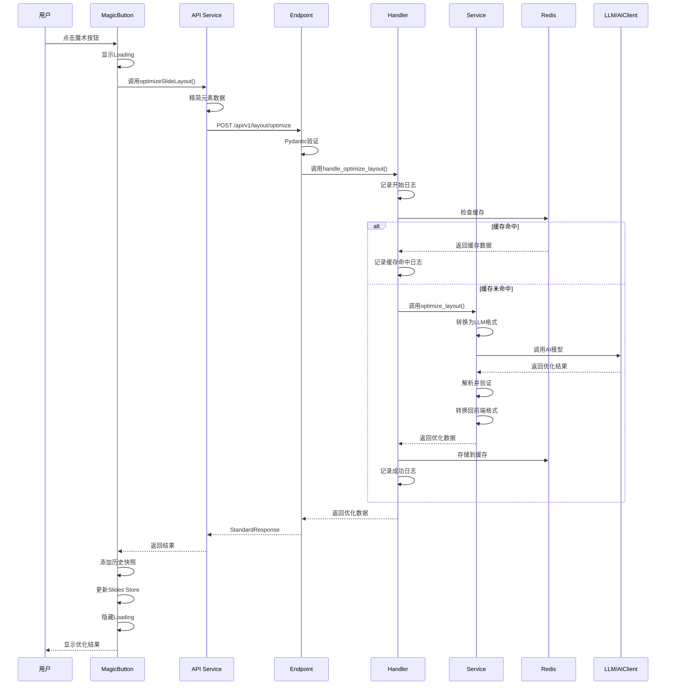

# PPT内容排版优化功能架构设计 - 完善版

> **文档版本**: v1.1 (评审后完善版)  
> **创建日期**: 2025-10-28  
> **最后更新**: 2025-10-28  
> **状态**: 已评审，待开发

## 文档说明

本文档基于评审报告的建议和项目既有规范，对原架构设计进行了完善：

### 主要调整
1. ✅ **接口契约统一**：全面采用 `StandardResponse(status/message/data)` 格式
2. ✅ **分层架构完善**：增加Handler层（网络层逻辑）+ Service层（业务逻辑）
3. ✅ **路由规范对齐**：遵循项目路由管理规范（endpoint使用空字符串，router.py统一管理prefix）
4. ✅ **日志规范统一**：使用log_messages和结构化日志
5. ✅ **错误码体系**：使用统一的错误码分类
6. ✅ **代码示例更新**：所有代码示例符合项目规范

---

## 目录
1. [整体架构设计框架](#1-整体架构设计框架)
2. [数据格式设计](#2-数据格式设计)
3. [核心实现流程](#3-核心实现流程)
4. [前端实现方案](#4-前端实现方案)
5. [后端实现方案](#5-后端实现方案)
6. [错误处理和容错](#6-错误处理和容错)
7. [性能优化方案](#7-性能优化方案)
8. [测试方案](#8-测试方案)
9. [实施路线图](#9-实施路线图)

---

## 1. 整体架构设计框架

### 1.1 系统架构图

```
┌─────────────────────────────────────────────────────────────┐
│                       前端层 (Vue 3)                        │
├─────────────────────────────────────────────────────────────┤
│  ┌───────────────┐  ┌───────────────┐  ┌──────────────┐    │
│  │ 魔术按钮组件  │  │ 数据收集服务  │  │ 状态管理     │    │
│  │ MagicButton   │  │ Optimization  │  │ Slides Store │    │
│  └───────────────┘  └───────────────┘  └──────────────┘    │
│                            │                                │
│                            ▼                                │
│  ┌─────────────────────────────────────────────────────┐   │
│  │          API Service (optimization.ts)               │   │
│  │  • 请求构建   • 状态管理   • 错误处理               │   │
│  └─────────────────────────────────────────────────────┘   │
└──────────────────────────────┬──────────────────────────────┘
                                │
                                │ HTTP POST /api/v1/layout/optimize
                                ▼
┌─────────────────────────────────────────────────────────────┐
│                       后端层 (FastAPI)                      │
├─────────────────────────────────────────────────────────────┤
│  ┌─────────────────────────────────────────────────────┐   │
│  │     Endpoint: layout_optimization.py (轻路由)        │   │
│  │  • 参数验证   • 调用Handler   • 返回StandardResponse│   │
│  └─────────────────────┬───────────────────────────────┘   │
│                        │                                    │
│                        ▼                                    │
│  ┌─────────────────────────────────────────────────────┐   │
│  │     Handler: LayoutOptimizationHandler (重处理)     │   │
│  │  • 网络层逻辑  • 日志记录  • 异常处理  • 缓存检查 │   │
│  └─────────────────────┬───────────────────────────────┘   │
│                        │                                    │
│                        ▼                                    │
│  ┌─────────────────────────────────────────────────────┐   │
│  │     Service: LayoutOptimizationService (核心业务)   │   │
│  │  • 数据转换  • LLM调用  • 结果解析  • 数据验证    │   │
│  └──────────────┬──────────────────────┬─────────────────  │
│                 │                      │                    │
│                 ▼                      ▼                    │
│  ┌──────────────────────┐  ┌─────────────────────────┐   │
│  │   数据转换工具       │  │  结果验证工具           │   │
│  │  • LLM格式转换      │  │  • 元素ID一致性         │   │
│  │  • 前端格式转换      │  │  • 内容不变校验         │   │
│  └──────────────────────┘  └─────────────────────────┘   │
└──────────────────────────────┬──────────────────────────────┘
                                │
                                ▼
┌─────────────────────────────────────────────────────────────┐
│                        LLM服务层                            │
├─────────────────────────────────────────────────────────────┤
│  ┌─────────────┐  ┌─────────────┐  ┌─────────────┐         │
│  │ AIClient    │  │ OpenAI API  │  │ Azure OpenAI│         │
│  │ (封装)      │──▶│             │  │             │         │
│  └─────────────┘  └─────────────┘  └─────────────┘         │
└─────────────────────────────────────────────────────────────┘
                                │
                                ▼
┌─────────────────────────────────────────────────────────────┐
│                        支撑服务层                           │
├─────────────────────────────────────────────────────────────┤
│  ┌─────────────┐  ┌─────────────┐  ┌─────────────┐         │
│  │ Redis缓存   │  │ MLflow追踪  │  │ 日志服务    │         │
│  │ (内容哈希)  │  │ (AI追踪)    │  │ (结构化)    │         │
│  └─────────────┘  └─────────────┘  └─────────────┘         │
└─────────────────────────────────────────────────────────────┘
```

### 1.2 分层职责说明

#### Endpoint 层（轻路由）
- ✅ 处理HTTP请求和响应
- ✅ Pydantic参数验证
- ✅ 调用Handler处理业务
- ✅ 返回StandardResponse

#### Handler 层（重处理）
- ✅ 网络层异常处理
- ✅ 结构化日志记录
- ✅ 缓存检查和管理
- ✅ 调用Service执行业务

#### Service 层（核心业务）
- ✅ 业务逻辑实现
- ✅ LLM模型调用
- ✅ 数据转换和验证
- ✅ 结果处理和返回

---

## 2. 数据格式设计

### 2.1 前端数据结构

#### 优化请求接口

```typescript
// frontend/src/types/optimization.ts

/**
 * 优化请求数据
 */
export interface OptimizationRequest {
  slide_id: string;
  elements: SimplifiedElement[];
  canvas_size: {
    width: number;
    height: number;
  };
  options?: {
    keep_colors?: boolean;
    keep_fonts?: boolean;
    style?: 'professional' | 'creative' | 'minimal';
  };
}

/**
 * 精简元素数据（仅传输必要字段）
 */
export interface SimplifiedElement {
  id: string;
  type: string;
  left: number;
  top: number;
  width: number;
  height: number;
  rotate: number;
  // 类型特定字段
  content?: string;  // text类型
  defaultFontName?: string;
  defaultColor?: string;
  fill?: string;  // shape类型
  src?: string;  // image类型
}

/**
 * 优化响应（符合StandardResponse规范）
 */
export interface OptimizationResponse {
  status: 'success' | 'error' | 'warning';
  message: string;
  data?: {
    slide_id: string;
    elements: SimplifiedElement[];
    description?: string;
    duration?: number;
  };
  error_code?: string;
  error_details?: any;
}
```

### 2.2 后端数据结构

#### Pydantic模型定义

```python
# backend/app/schemas/layout_optimization.py

from typing import List, Optional, Dict, Any
from pydantic import BaseModel, Field

class CanvasSize(BaseModel):
    """画布尺寸"""
    width: float = Field(..., gt=0, description="画布宽度")
    height: float = Field(..., gt=0, description="画布高度")

class OptimizationOptions(BaseModel):
    """优化选项"""
    keep_colors: bool = Field(default=False, description="保持原有颜色")
    keep_fonts: bool = Field(default=False, description="保持原有字体")
    style: str = Field(
        default="professional",
        pattern="^(professional|creative|minimal)$",
        description="优化风格"
    )

class ElementData(BaseModel):
    """元素数据"""
    id: str = Field(..., description="元素ID")
    type: str = Field(..., description="元素类型：text/shape/image等")
    left: float = Field(..., description="X坐标")
    top: float = Field(..., description="Y坐标")
    width: float = Field(..., gt=0, description="宽度")
    height: float = Field(..., gt=0, description="高度")
    rotate: float = Field(default=0, description="旋转角度")
    
    # 可选属性（根据type不同而不同）
    content: Optional[str] = None
    defaultFontName: Optional[str] = None
    defaultColor: Optional[str] = None
    lineHeight: Optional[float] = None
    fill: Optional[str] = None
    outline: Optional[Dict[str, Any]] = None
    text: Optional[Dict[str, Any]] = None
    src: Optional[str] = None
    fixedRatio: Optional[bool] = None

class LayoutOptimizationRequest(BaseModel):
    """布局优化请求"""
    slide_id: str = Field(..., description="幻灯片ID")
    elements: List[ElementData] = Field(
        ..., 
        min_length=1,
        max_length=50,
        description="元素列表（1-50个）"
    )
    canvas_size: CanvasSize = Field(..., description="画布尺寸")
    options: Optional[OptimizationOptions] = Field(
        default=None,
        description="优化选项"
    )

class LayoutOptimizationResponseData(BaseModel):
    """布局优化响应数据（data字段内容）"""
    slide_id: str = Field(..., description="幻灯片ID")
    elements: List[ElementData] = Field(..., description="优化后的元素列表")
    description: Optional[str] = Field(
        default=None,
        description="优化说明"
    )
    duration: Optional[float] = Field(
        default=None,
        description="优化耗时（秒）"
    )
```

### 2.3 LLM交互格式

#### LLM输入格式

```json
{
  "canvas": {
    "width": 1000,
    "height": 562.5
  },
  "elements": [
    {
      "id": "el_001",
      "type": "text",
      "position": { "x": 100, "y": 50 },
      "size": { "width": 600, "height": 80 },
      "content": "幻灯片标题",
      "style": {
        "font": "Microsoft YaHei",
        "color": "#333333"
      }
    }
  ],
  "constraints": {
    "keep_content": true,
    "keep_colors": false,
    "keep_fonts": false
  }
}
```

#### LLM输出格式

```json
{
  "optimized_elements": [
    {
      "id": "el_001",
      "position": { "x": 150, "y": 80 },
      "size": { "width": 700, "height": 100 },
      "style": {
        "font": "Microsoft YaHei",
        "fontSize": 42,
        "fontWeight": "bold",
        "color": "#1a1a1a"
      }
    }
  ],
  "optimization_notes": "标题字体增大并加粗，提升视觉层次；整体布局居中对齐，留白合理。"
}
```

---

## 3. 核心实现流程

### 3.1 完整时序图



---

## 4. 前端实现方案

### 4.1 API配置

首先在 `frontend/src/configs/api.ts` 中添加布局优化API配置：

```typescript
// frontend/src/configs/api.ts

export const API_CONFIG = {
  // ... 其他API配置
  
  // 布局优化相关API
  LAYOUT: {
    // 优化幻灯片布局
    OPTIMIZE: '/api/v1/layout/optimize',
  },
  
  // ...
} as const
```

### 4.2 API服务模块

```typescript
// frontend/src/services/optimization.ts

import { api } from './api';
import API_CONFIG from '@/configs/api';
import type { PPTElement } from '@/types/slides';
import type { 
  OptimizationRequest,
  OptimizationResponse,
  SimplifiedElement 
} from '@/types/optimization';

/**
 * 精简元素数据（仅传输必要字段）
 */
function simplifyElement(element: PPTElement): SimplifiedElement {
  const base = {
    id: element.id,
    type: element.type,
    left: element.left,
    top: element.top,
    width: element.width,
    height: element.height,
    rotate: element.rotate,
  };

  // 根据元素类型添加特定字段
  switch (element.type) {
    case 'text':
      return {
        ...base,
        content: element.content,
        defaultFontName: element.defaultFontName,
        defaultColor: element.defaultColor,
        lineHeight: element.lineHeight,
      };
    case 'shape':
      return {
        ...base,
        fill: element.fill,
        outline: element.outline,
        text: element.text,
      };
    case 'image':
      return {
        ...base,
        src: element.src,
        fixedRatio: element.fixedRatio,
      };
    default:
      return base;
  }
}

/**
 * 优化幻灯片布局
 */
export async function optimizeSlideLayout(
  slideId: string,
  elements: PPTElement[],
  canvasSize: { width: number; height: number },
  options?: OptimizationRequest['options']
): Promise<OptimizationResponse> {
  try {
    // 精简元素数据
    const simplifiedElements = elements.map(simplifyElement);

    // 构建请求
    const request: OptimizationRequest = {
      slide_id: slideId,
      elements: simplifiedElements,
      canvas_size: canvasSize,
      options,
    };

    // 使用API_CONFIG统一管理的端点
    const response = await api.post<OptimizationResponse>(
      API_CONFIG.LAYOUT.OPTIMIZE,
      request
    );

    return response.data;

  } catch (error: any) {
    console.error('优化请求失败:', error);
    
    // 返回符合StandardResponse格式的错误
    return {
      status: 'error',
      message: error.response?.data?.message || error.message || '网络请求失败',
      error_code: error.response?.data?.error_code || 'NETWORK_ERROR',
      error_details: error.response?.data?.error_details,
    };
  }
}
```

### 4.3 魔术按钮组件

```vue
<!-- frontend/src/views/Editor/Toolbar/MagicButton.vue -->
<template>
  <div class="magic-button-wrapper">
    <el-tooltip
      content="智能优化当前幻灯片排版"
      placement="bottom"
      :disabled="loading"
    >
      <el-button
        class="magic-button"
        :class="{ 'is-loading': loading }"
        :disabled="loading || disabled"
        @click="handleOptimize"
      >
        <svg-icon
          name="magic-wand"
          class="magic-icon"
          :class="{ 'rotating': loading }"
        />
        <span v-if="!loading">优化排版</span>
        <span v-else>优化中...</span>
      </el-button>
    </el-tooltip>
  </div>
</template>

<script lang="ts" setup>
import { ref, computed } from 'vue';
import { storeToRefs } from 'pinia';
import { useSlidesStore } from '@/store';
import { message } from '@/utils/message';
import { optimizeSlideLayout } from '@/services/optimization';
import { useHistorySnapshot } from '@/hooks/useHistorySnapshot';

const slidesStore = useSlidesStore();
const { currentSlide, viewportSize, viewportRatio } = storeToRefs(slidesStore);
const { addHistorySnapshot } = useHistorySnapshot();

const loading = ref(false);

// 禁用条件：没有元素或正在加载
const disabled = computed(() => {
  return !currentSlide.value || 
         currentSlide.value.elements.length === 0;
});

// 处理优化请求
const handleOptimize = async () => {
  if (!currentSlide.value) {
    message.error('请先选择一个幻灯片');
    return;
  }

  if (currentSlide.value.elements.length === 0) {
    message.error('当前幻灯片没有可优化的元素');
    return;
  }

  loading.value = true;

  try {
    // 调用优化服务
    const response = await optimizeSlideLayout(
      currentSlide.value.id,
      currentSlide.value.elements,
      {
        width: viewportSize.value,
        height: viewportSize.value * viewportRatio.value
      }
    );

    // 检查StandardResponse的status字段
    if (response.status === 'success' && response.data) {
      // 添加历史快照（支持撤销）
      addHistorySnapshot();

      // 更新幻灯片元素
      slidesStore.updateSlide({
        elements: response.data.elements
      });

      message.success(response.message || '排版优化完成！');
    } else {
      throw new Error(response.message || '优化失败');
    }
  } catch (error: any) {
    console.error('优化失败:', error);
    message.error(`排版优化失败：${error.message}`);
  } finally {
    loading.value = false;
  }
};
</script>

<style lang="scss" scoped>
// 样式代码保持不变
</style>
```

---

## 5. 后端实现方案

### 5.1 路由注册

```python
# backend/app/api/v1/router.py

from fastapi import APIRouter
from app.api.v1.endpoints import (
    image_manager,
    image_search,
    image_upload,
    image_tags,
    tags,
    generation,
    ai_model,
    layout_optimization,  # 新增
)

api_router = APIRouter()

# 注册各模块路由 - 统一在此管理前缀
api_router.include_router(image_manager.router, prefix="/images", tags=["图片管理"])
api_router.include_router(image_upload.router, prefix="/images", tags=["图片上传"])
api_router.include_router(image_search.router, prefix="/images", tags=["图片搜索"])
api_router.include_router(image_tags.router, prefix="/images", tags=["图片标签"])
api_router.include_router(tags.router, prefix="/tags", tags=["标签管理"])
api_router.include_router(generation.router, prefix="/generate", tags=["AI Generation"])
api_router.include_router(ai_model.router, prefix="/models", tags=["AI Models"])
api_router.include_router(layout_optimization.router, prefix="/layout", tags=["布局优化"])  # 新增
```

### 5.2 Endpoint层实现

```python
# backend/app/api/v1/endpoints/layout_optimization.py

"""
布局优化API端点（轻路由）
负责参数验证、调用Handler、返回标准响应
"""

from fastapi import APIRouter, Depends, HTTPException
from sqlalchemy.ext.asyncio import AsyncSession

from app.db.database import get_db
from app.schemas.layout_optimization import (
    LayoutOptimizationRequest,
    LayoutOptimizationResponseData
)
from app.schemas.common import StandardResponse
from app.services.layout.layout_optimization_handler import LayoutOptimizationHandler
from app.core.log_utils import get_logger

logger = get_logger(__name__)

# 注意：使用空字符串""作为根路径，prefix在router.py中统一管理
router = APIRouter(tags=["布局优化"])


@router.post(
    "/optimize",  # 完整路径：/api/v1/layout/optimize
    response_model=StandardResponse,
    summary="优化幻灯片布局",
    description="使用LLM智能优化幻灯片的排版布局，保持内容不变"
)
async def optimize_slide_layout(
    request: LayoutOptimizationRequest,
    db: AsyncSession = Depends(get_db)
) -> StandardResponse:
    """
    优化幻灯片布局的API端点
    
    Args:
        request: 布局优化请求（Pydantic自动验证）
        db: 数据库会话
        
    Returns:
        StandardResponse: 标准响应格式
            - status: "success" | "error" | "warning"
            - message: 响应消息
            - data: LayoutOptimizationResponseData | None
            - error_code: 错误码（可选）
            - error_details: 错误详情（可选）
    """
    try:
        # 调用Handler处理业务
        handler = LayoutOptimizationHandler(db)
        result = await handler.handle_optimize_layout(request)
        
        # 返回标准响应
        return StandardResponse(
            status="success",
            message="布局优化完成",
            data=result
        )
        
    except HTTPException:
        # FastAPI会自动处理HTTPException
        raise
        
    except Exception as e:
        # 捕获未预期的异常
        logger.error(
            "布局优化端点异常",
            operation="optimize_slide_layout_endpoint",
            slide_id=request.slide_id if request else None,
            error=str(e),
            error_type=type(e).__name__
        )
        
        return StandardResponse(
            status="error",
            message="布局优化失败",
            error_code="LAYOUT_OPTIMIZATION_ERROR",
            error_details={"error": str(e)}
        )
```

### 5.3 Handler层实现

```python
# backend/app/services/layout/layout_optimization_handler.py

"""
布局优化Handler（重处理）
负责网络层逻辑、日志记录、异常处理、缓存管理
"""

import time
import hashlib
import json
from typing import Dict, Any, Optional
from fastapi import HTTPException, status
from sqlalchemy.ext.asyncio import AsyncSession

from app.services.layout.layout_optimization_service import LayoutOptimizationService
from app.schemas.layout_optimization import (
    LayoutOptimizationRequest,
    LayoutOptimizationResponseData
)
from app.core.log_utils import get_logger
from app.core.log_messages import log_messages

logger = get_logger(__name__)


class LayoutOptimizationHandler:
    """布局优化处理器"""
    
    def __init__(self, db: AsyncSession):
        self.db = db
        self.service = LayoutOptimizationService(db)
        
    def _generate_cache_key(self, request: LayoutOptimizationRequest) -> str:
        """生成缓存键（基于内容哈希）"""
        data = {
            "elements": [el.model_dump() for el in request.elements],
            "canvas_size": request.canvas_size.model_dump(),
            "options": request.options.model_dump() if request.options else {}
        }
        
        content_hash = hashlib.sha256(
            json.dumps(data, sort_keys=True).encode()
        ).hexdigest()
        
        return f"layout_opt:{content_hash[:16]}"
    
    async def handle_optimize_layout(
        self,
        request: LayoutOptimizationRequest
    ) -> LayoutOptimizationResponseData:
        """
        处理布局优化请求
        
        Args:
            request: 布局优化请求
            
        Returns:
            LayoutOptimizationResponseData: 优化结果
            
        Raises:
            HTTPException: HTTP异常
        """
        start_time = time.time()
        
        try:
            # 记录开始日志（使用log_messages）
            logger.info(
                log_messages.START_OPERATION,
                operation_name="布局优化",
                slide_id=request.slide_id,
                elements_count=len(request.elements)
            )
            
            # TODO: 检查Redis缓存（第二阶段实现）
            # cache_key = self._generate_cache_key(request)
            # cached_result = await self._get_from_cache(cache_key)
            # if cached_result:
            #     logger.info(log_messages.OPERATION_SUCCESS, 
            #                 operation_name="布局优化（缓存）",
            #                 cache_key=cache_key)
            #     return cached_result
            
            # 调用Service执行业务逻辑
            optimized_elements = await self.service.optimize_layout(
                slide_id=request.slide_id,
                elements=request.elements,
                canvas_size=request.canvas_size,
                options=request.options
            )
            
            # 构建响应数据
            duration = time.time() - start_time
            result = LayoutOptimizationResponseData(
                slide_id=request.slide_id,
                elements=optimized_elements,
                duration=duration
            )
            
            # TODO: 存储到Redis缓存（第二阶段实现）
            # await self._save_to_cache(cache_key, result)
            
            # 记录成功日志
            logger.info(
                log_messages.OPERATION_SUCCESS,
                operation_name="布局优化",
                slide_id=request.slide_id,
                duration_ms=int(duration * 1000),
                elements_count=len(optimized_elements)
            )
            
            return result
            
        except ValueError as e:
            # 业务验证异常
            logger.warning(
                "布局优化验证失败",
                operation="handle_optimize_layout",
                slide_id=request.slide_id,
                error=str(e)
            )
            raise HTTPException(
                status_code=status.HTTP_400_BAD_REQUEST,
                detail=str(e)
            )
            
        except Exception as e:
            # 其他异常
            duration = time.time() - start_time
            logger.error(
                log_messages.OPERATION_FAILED,
                operation_name="布局优化",
                slide_id=request.slide_id,
                duration_ms=int(duration * 1000),
                error=str(e),
                error_type=type(e).__name__
            )
            raise HTTPException(
                status_code=status.HTTP_500_INTERNAL_SERVER_ERROR,
                detail=f"布局优化失败：{str(e)}"
            )
```

### 5.4 Service层实现

```python
# backend/app/services/layout/layout_optimization_service.py

"""
布局优化Service（核心业务逻辑）
负责数据转换、LLM调用、结果解析、数据验证
"""

from typing import List, Optional, Dict, Any
import json
import re
from sqlalchemy.ext.asyncio import AsyncSession

from app.schemas.layout_optimization import (
    ElementData,
    CanvasSize,
    OptimizationOptions
)
from app.core.llm.client import AIClient
from app.core.log_utils import get_logger
from app.prompts.utils import load_prompt_template

logger = get_logger(__name__)


class LayoutOptimizationService:
    """布局优化服务（核心业务逻辑）"""
    
    def __init__(self, db: AsyncSession):
        self.db = db
        self.ai_client = AIClient()
        
    async def optimize_layout(
        self,
        slide_id: str,
        elements: List[ElementData],
        canvas_size: CanvasSize,
        options: Optional[OptimizationOptions] = None
    ) -> List[ElementData]:
        """
        优化幻灯片布局的核心方法
        
        Args:
            slide_id: 幻灯片ID
            elements: 元素列表
            canvas_size: 画布尺寸
            options: 优化选项
            
        Returns:
            List[ElementData]: 优化后的元素列表
            
        Raises:
            ValueError: 验证失败
            Exception: 其他异常
        """
        logger.info(
            "开始执行布局优化",
            operation="optimize_layout",
            slide_id=slide_id,
            elements_count=len(elements)
        )
        
        try:
            # 1. 转换为LLM格式
            llm_input = self._convert_to_llm_format(
                elements, canvas_size, options
            )
            
            # 2. 构建提示词
            system_prompt = self._build_system_prompt()
            user_prompt = self._build_user_prompt(llm_input, options)
            
            # 3. 调用LLM（使用现有AIClient）
            logger.info(
                "调用LLM进行优化",
                operation="optimize_layout_llm_call",
                slide_id=slide_id
            )
            
            llm_response = await self.ai_client.ai_call(
                system_prompt=system_prompt,
                user_prompt=user_prompt,
                temperature=0.7,
                max_tokens=2000
            )
            
            logger.info(
                "LLM响应接收完成",
                operation="optimize_layout_llm_response",
                response_length=len(llm_response)
            )
            
            # 4. 解析LLM响应
            optimized_data = self._parse_llm_response(llm_response)
            
            # 5. 转换回前端格式
            optimized_elements = self._convert_to_frontend_format(
                optimized_data, elements
            )
            
            # 6. 验证结果（确保内容不变、ID一致等）
            self._validate_optimized_elements(optimized_elements, elements)
            
            logger.info(
                "布局优化执行成功",
                operation="optimize_layout_success",
                slide_id=slide_id,
                optimized_count=len(optimized_elements)
            )
            
            return optimized_elements
            
        except Exception as e:
            logger.error(
                "布局优化执行失败",
                operation="optimize_layout_failed",
                slide_id=slide_id,
                error=str(e),
                error_type=type(e).__name__
            )
            raise
    
    def _convert_to_llm_format(
        self,
        elements: List[ElementData],
        canvas_size: CanvasSize,
        options: Optional[OptimizationOptions]
    ) -> Dict[str, Any]:
        """转换为LLM可理解的JSON格式"""
        return {
            "canvas": {
                "width": canvas_size.width,
                "height": canvas_size.height
            },
            "elements": [
                {
                    "id": el.id,
                    "type": el.type,
                    "position": {"x": el.left, "y": el.top},
                    "size": {"width": el.width, "height": el.height},
                    "rotate": el.rotate,
                    **({"content": el.content} if el.content else {}),
                    **({"style": {
                        "font": el.defaultFontName,
                        "color": el.defaultColor,
                        "lineHeight": el.lineHeight
                    }} if el.defaultFontName else {}),
                    **({"fill": el.fill} if el.fill else {})
                }
                for el in elements
            ],
            "constraints": {
                "keep_content": True,  # 始终保持内容不变
                "keep_colors": options.keep_colors if options else False,
                "keep_fonts": options.keep_fonts if options else False
            }
        }
    
    def _build_system_prompt(self) -> str:
        """构建系统提示词"""
        # TODO: 从prompts/layout_optimization/system_prompt.txt加载
        return """你是一位专业的演示文稿设计专家。你的任务是优化PowerPoint幻灯片的布局。

核心原则：
1. **内容绝对不变**：所有文字内容必须保持原样，不得修改
2. **视觉层次**：通过字体大小、位置、颜色建立清晰的视觉层次
3. **对齐原则**：确保元素之间的对齐关系
4. **留白空间**：合理利用留白，避免过度拥挤

输出要求：
返回JSON格式的优化结果，包含optimized_elements数组。"""
    
    def _build_user_prompt(
        self,
        llm_input: Dict[str, Any],
        options: Optional[OptimizationOptions]
    ) -> str:
        """构建用户提示词"""
        requirements = []
        if options:
            if options.keep_colors:
                requirements.append("- 保持原有颜色方案")
            if options.keep_fonts:
                requirements.append("- 保持原有字体")
            requirements.append(f"- 优化风格：{options.style}")
        else:
            requirements.append("- 遵循专业设计原则")
        
        requirements_text = "\n".join(requirements)
        
        return f"""请优化以下幻灯片的布局设计：

## 画布信息
- 宽度：{llm_input['canvas']['width']}px
- 高度：{llm_input['canvas']['height']}px

## 当前元素布局
```json
{json.dumps(llm_input['elements'], indent=2, ensure_ascii=False)}
```

## 优化要求
{requirements_text}

请返回JSON格式的优化结果：
```json
{{
  "optimized_elements": [
    {{
      "id": "元素ID（必须与原始ID一致）",
      "position": {{ "x": 数值, "y": 数值 }},
      "size": {{ "width": 数值, "height": 数值 }},
      "style": {{
        "font": "字体名称",
        "fontSize": 数值,
        "color": "#颜色值"
      }}
    }}
  ],
  "optimization_notes": "优化说明"
}}
```

注意：
1. 保持所有元素的ID不变
2. 确保元素不超出画布范围
3. 文字内容绝对不能修改
4. 返回有效的JSON格式"""
    
    def _parse_llm_response(self, response: str) -> Dict[str, Any]:
        """解析LLM响应"""
        try:
            # 1. 提取JSON代码块
            json_match = re.search(
                r'```json\s*(.*?)\s*```',
                response,
                re.DOTALL
            )
            
            if json_match:
                json_str = json_match.group(1)
            else:
                json_str = response
            
            # 2. 解析JSON
            parsed = json.loads(json_str)
            
            # 3. 验证必要字段
            if "optimized_elements" not in parsed:
                raise ValueError("响应中缺少optimized_elements字段")
            
            return parsed
            
        except json.JSONDecodeError as e:
            logger.error(
                "解析LLM响应失败",
                operation="parse_llm_response_failed",
                error=str(e),
                response_preview=response[:200]
            )
            raise ValueError(f"无法解析LLM响应：{str(e)}")
    
    def _convert_to_frontend_format(
        self,
        optimized_data: Dict[str, Any],
        original_elements: List[ElementData]
    ) -> List[ElementData]:
        """转换回前端格式"""
        # 创建原始元素的映射
        element_map = {el.id: el for el in original_elements}
        
        optimized_elements = []
        
        for opt_el in optimized_data["optimized_elements"]:
            el_id = opt_el["id"]
            if el_id not in element_map:
                logger.warning(
                    "优化结果中包含未知元素ID",
                    element_id=el_id
                )
                continue
            
            # 获取原始元素
            original_el = element_map[el_id]
            
            # 更新位置和尺寸
            updated_el = original_el.model_copy(update={
                "left": opt_el["position"]["x"],
                "top": opt_el["position"]["y"],
                "width": opt_el["size"]["width"],
                "height": opt_el["size"]["height"],
            })
            
            # 更新样式（如果有且未设置keep_fonts/keep_colors）
            if "style" in opt_el and original_el.type == "text":
                if "font" in opt_el["style"]:
                    updated_el.defaultFontName = opt_el["style"]["font"]
                if "color" in opt_el["style"]:
                    updated_el.defaultColor = opt_el["style"]["color"]
                if "lineHeight" in opt_el["style"]:
                    updated_el.lineHeight = opt_el["style"]["lineHeight"]
            
            # 更新填充色
            if "fill" in opt_el and original_el.type == "shape":
                updated_el.fill = opt_el["fill"]
            
            optimized_elements.append(updated_el)
        
        return optimized_elements
    
    def _validate_optimized_elements(
        self,
        optimized: List[ElementData],
        original: List[ElementData]
    ):
        """验证优化结果（确保内容不变、ID一致）"""
        # 1. 元素数量应该一致
        if len(optimized) != len(original):
            raise ValueError(
                f"优化后元素数量({len(optimized)})与原始数量({len(original)})不匹配"
            )
        
        # 2. 所有元素ID应该保持一致
        original_ids = {el.id for el in original}
        optimized_ids = {el.id for el in optimized}
        
        if original_ids != optimized_ids:
            missing = original_ids - optimized_ids
            extra = optimized_ids - original_ids
            raise ValueError(
                f"元素ID不匹配：缺失{missing}，多余{extra}"
            )
        
        # 3. 验证文本内容未被修改
        for orig_el in original:
            if orig_el.type == "text" and orig_el.content:
                opt_el = next((el for el in optimized if el.id == orig_el.id), None)
                if opt_el and opt_el.content != orig_el.content:
                    logger.warning(
                        "文本内容被修改，已恢复原始内容",
                        element_id=orig_el.id
                    )
                    # 强制恢复原始内容
                    opt_el.content = orig_el.content
```

---

## 6. 错误处理和容错

### 6.1 错误码定义

```python
# backend/app/core/error_codes.py

class LayoutOptimizationErrorCodes:
    """布局优化错误码"""
    
    # 参数验证错误
    INVALID_REQUEST = "LAYOUT_INVALID_REQUEST"
    TOO_MANY_ELEMENTS = "LAYOUT_TOO_MANY_ELEMENTS"
    INVALID_CANVAS_SIZE = "LAYOUT_INVALID_CANVAS_SIZE"
    
    # 业务逻辑错误
    OPTIMIZATION_FAILED = "LAYOUT_OPTIMIZATION_FAILED"
    LLM_CALL_FAILED = "LAYOUT_LLM_CALL_FAILED"
    PARSE_FAILED = "LAYOUT_PARSE_FAILED"
    VALIDATION_FAILED = "LAYOUT_VALIDATION_FAILED"
    
    # 系统错误
    TIMEOUT = "LAYOUT_TIMEOUT"
    CACHE_ERROR = "LAYOUT_CACHE_ERROR"
    INTERNAL_ERROR = "LAYOUT_INTERNAL_ERROR"
```

### 6.2 降级策略

```python
# Service层实现降级逻辑
async def optimize_layout_with_fallback(
    self,
    slide_id: str,
    elements: List[ElementData],
    canvas_size: CanvasSize,
    options: Optional[OptimizationOptions] = None
) -> List[ElementData]:
    """带降级策略的优化方法"""
    try:
        # 尝试LLM优化
        return await self.optimize_layout(slide_id, elements, canvas_size, options)
        
    except Exception as e:
        logger.warning(
            "LLM优化失败，返回原始元素",
            operation="optimize_layout_fallback",
            slide_id=slide_id,
            error=str(e)
        )
        
        # 降级：直接返回原始元素
        return elements
```

---

## 7. 性能优化方案

### 7.1 缓存策略（第二阶段实现）

```python
# Handler层实现
import redis.asyncio as redis

class LayoutOptimizationHandler:
    
    async def _get_from_cache(self, cache_key: str) -> Optional[LayoutOptimizationResponseData]:
        """从Redis获取缓存"""
        try:
            redis_client = await redis.from_url("redis://localhost")
            cached_json = await redis_client.get(cache_key)
            
            if cached_json:
                data = json.loads(cached_json)
                return LayoutOptimizationResponseData(**data)
                
        except Exception as e:
            logger.warning(
                "缓存读取失败",
                operation="cache_get_failed",
                cache_key=cache_key,
                error=str(e)
            )
        
        return None
    
    async def _save_to_cache(
        self,
        cache_key: str,
        result: LayoutOptimizationResponseData,
        ttl: int = 3600
    ):
        """存储到Redis缓存"""
        try:
            redis_client = await redis.from_url("redis://localhost")
            await redis_client.setex(
                cache_key,
                ttl,
                result.model_dump_json()
            )
            
        except Exception as e:
            logger.warning(
                "缓存存储失败",
                operation="cache_save_failed",
                cache_key=cache_key,
                error=str(e)
            )
```

### 7.2 并发控制（第二阶段实现）

```python
# Service层实现
import asyncio

# 全局信号量（限制并发LLM调用）
_llm_semaphore = asyncio.Semaphore(5)  # 最多5个并发

async def optimize_layout(self, ...):
    """优化布局（带并发控制）"""
    async with _llm_semaphore:
        # LLM调用逻辑
        ...
```

---

## 8. 测试方案

### 8.1 单元测试

```python
# tests/unit/test_layout_optimization_service.py

import pytest
from app.services.layout.layout_optimization_service import LayoutOptimizationService
from app.schemas.layout_optimization import ElementData, CanvasSize

class TestLayoutOptimizationService:
    
    @pytest.fixture
    async def service(self, db_session):
        return LayoutOptimizationService(db_session)
    
    async def test_convert_to_llm_format(self, service):
        """测试转换为LLM格式"""
        elements = [
            ElementData(
                id="el_001",
                type="text",
                left=100,
                top=50,
                width=600,
                height=80,
                rotate=0,
                content="Test Title"
            )
        ]
        
        llm_input = service._convert_to_llm_format(
            elements,
            CanvasSize(width=1000, height=562.5),
            None
        )
        
        assert llm_input["canvas"]["width"] == 1000
        assert len(llm_input["elements"]) == 1
        assert llm_input["elements"][0]["id"] == "el_001"
```

### 8.2 集成测试

```python
# tests/integration/test_layout_optimization_api.py

import pytest
from httpx import AsyncClient

class TestLayoutOptimizationAPI:
    
    async def test_optimize_layout_success(self, client: AsyncClient):
        """测试布局优化成功场景"""
        request_data = {
            "slide_id": "slide_001",
            "elements": [
                {
                    "id": "el_001",
                    "type": "text",
                    "left": 100,
                    "top": 50,
                    "width": 600,
                    "height": 80,
                    "rotate": 0,
                    "content": "Test Title"
                }
            ],
            "canvas_size": {
                "width": 1000,
                "height": 562.5
            }
        }
        
        response = await client.post(
            "/api/v1/layout/optimize",
            json=request_data
        )
        
        assert response.status_code == 200
        data = response.json()
        
        # 验证StandardResponse格式
        assert data["status"] == "success"
        assert "message" in data
        assert "data" in data
        assert "elements" in data["data"]
```

---

## 9. 实施路线图

### 9.1 第一阶段：MVP闭环（优先级最高）

**目标**：实现端到端的基本功能闭环

#### 前端任务
- [ ] 在 `src/configs/api.ts` 中添加 `LAYOUT.OPTIMIZE` 配置
- [ ] 创建 `src/types/optimization.ts` 类型定义
- [ ] 实现 `src/services/optimization.ts` API服务
- [ ] 创建 `src/views/Editor/Toolbar/MagicButton.vue` 组件
- [ ] 集成到编辑器工具栏
- [ ] 基础错误处理和Loading状态

#### 后端任务
- [ ] 创建 `app/schemas/layout_optimization.py` 数据模型
- [ ] 实现 `app/api/v1/endpoints/layout_optimization.py` 端点（轻路由）
- [ ] 实现 `app/services/layout/layout_optimization_handler.py` Handler层
- [ ] 实现 `app/services/layout/layout_optimization_service.py` Service层
- [ ] 创建 `app/prompts/layout_optimization/` 提示词模板
- [ ] 在 `app/api/v1/router.py` 注册路由

#### 验收标准
- ✅ 点击魔术按钮能触发优化
- ✅ 优化后元素位置和样式有变化
- ✅ 文本内容保持不变
- ✅ 元素ID和数量保持一致
- ✅ 支持撤销操作
- ✅ 错误信息友好提示

### 9.2 第二阶段：性能和可靠性增强

**目标**：提升性能和稳定性

#### 功能清单
- [ ] Redis缓存集成（内容哈希Key，TTL=1h）
- [ ] 并发控制（Semaphore限制≤5并发）
- [ ] MLflow追踪集成（记录模型调用和耗时）
- [ ] 重试机制（3次指数退避）
- [ ] 超时控制（30秒）

### 9.3 第三阶段：功能扩展（可选）

- [ ] 批量优化接口
- [ ] 更多优化风格选项
- [ ] 优化效果预览对比
- [ ] 用户偏好设置

---

## 附录

### A. 关键文件清单

#### 前端文件
- `frontend/src/configs/api.ts` - API端点配置（添加LAYOUT配置）
- `frontend/src/types/optimization.ts` - 类型定义
- `frontend/src/services/optimization.ts` - API服务
- `frontend/src/views/Editor/Toolbar/MagicButton.vue` - 魔术按钮组件

#### 后端文件
- `backend/app/schemas/layout_optimization.py` - Pydantic模型
- `backend/app/api/v1/endpoints/layout_optimization.py` - API端点
- `backend/app/services/layout/layout_optimization_handler.py` - Handler层
- `backend/app/services/layout/layout_optimization_service.py` - Service层
- `backend/app/prompts/layout_optimization/system_prompt.txt` - 系统提示词
- `backend/app/prompts/layout_optimization/user_prompt.txt` - 用户提示词模板

### B. API规范参考
- [API响应与日志规范](../../standard/API响应与日志规范.md)
- [API设计与实现规范](../../standard/API设计与实现规范.md)

### C. 评审报告
- [架构评审报告](./架构评审报告.md)

---

**文档维护者**: AI开发团队  
**最后更新**: 2025-10-28  
**文档版本**: v1.1 (评审后完善版)  
**状态**: 已评审，符合项目规范，可开始开发

