# 图片URL管理系统架构设计

## 1. 系统架构图

### 1.1 整体架构

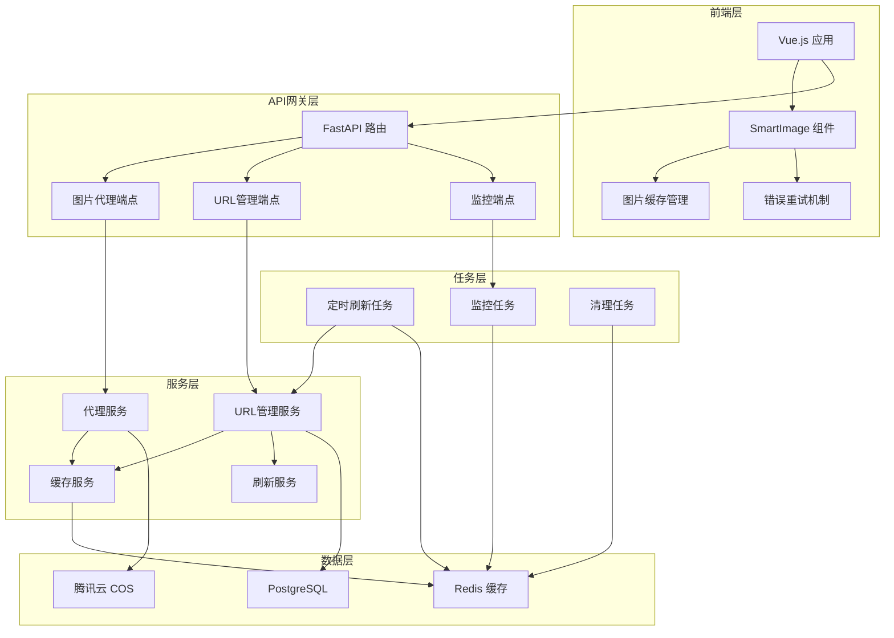

### 1.2 数据流架构

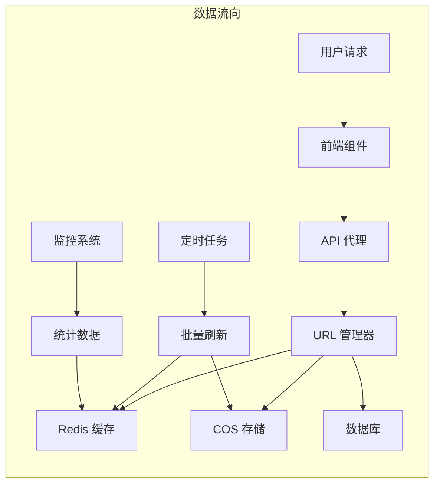

## 2. 组件设计图

### 2.1 URL管理服务架构

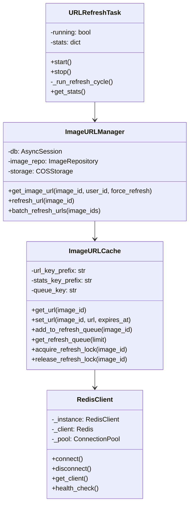

### 2.2 前端组件架构

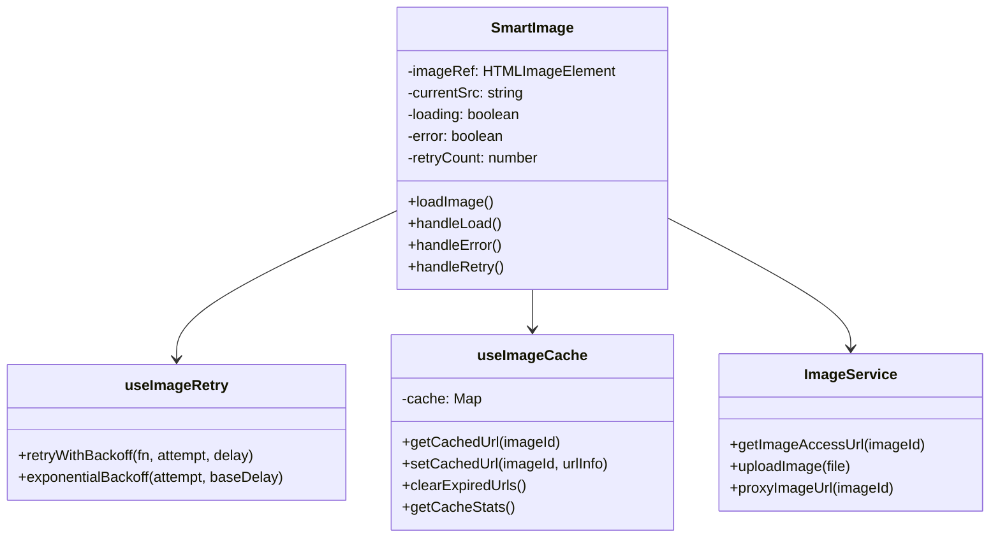

## 3. 数据模型设计

### 3.1 Redis数据结构

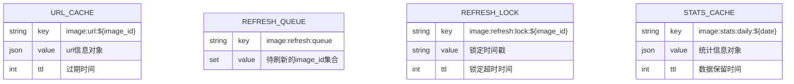

### 3.2 URL信息数据结构

```json
{
  "url": "https://bucket.cos.region.myqcloud.com/path/image.jpg?sign=...",
  "expires_at": 1699999999,
  "created_at": 1699996399,
  "access_count": 156,
  "cos_key": "images/user_001/2024/01/image.jpg",
  "last_access": 1699998888,
  "refresh_count": 3
}
```

### 3.3 统计数据结构

```json
{
  "date": "2024-01-15",
  "total_requests": 10000,
  "cache_hits": 8500,
  "cache_misses": 1500,
  "refresh_count": 150,
  "error_count": 25,
  "avg_response_time": 45.2,
  "unique_images": 2500
}
```

## 4. 流程设计图

### 4.1 图片访问完整流程

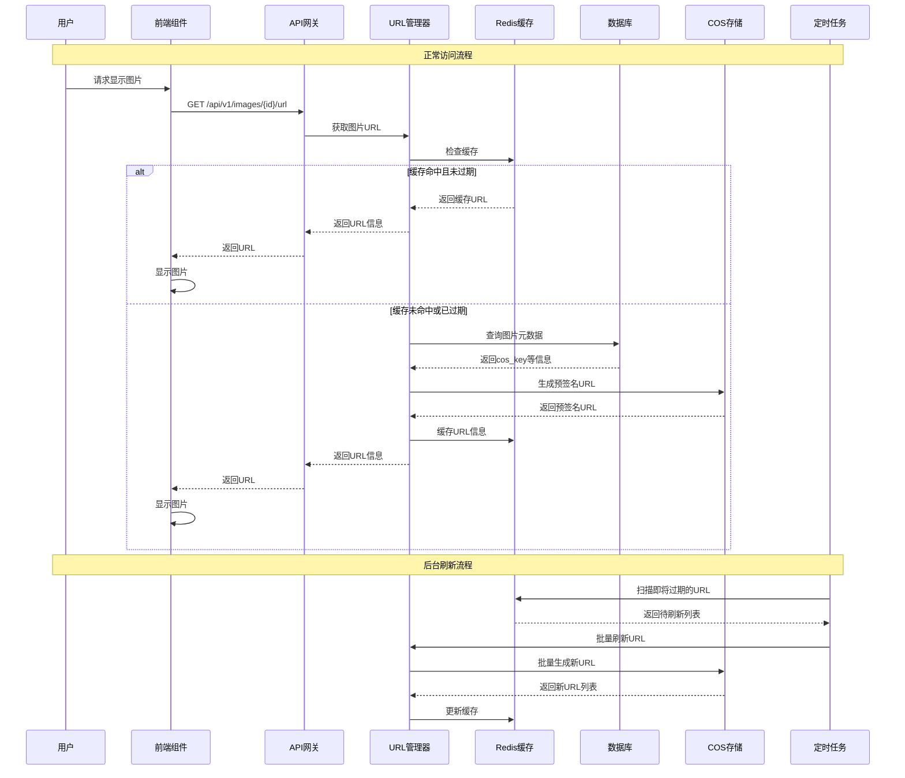

### 4.2 错误处理流程

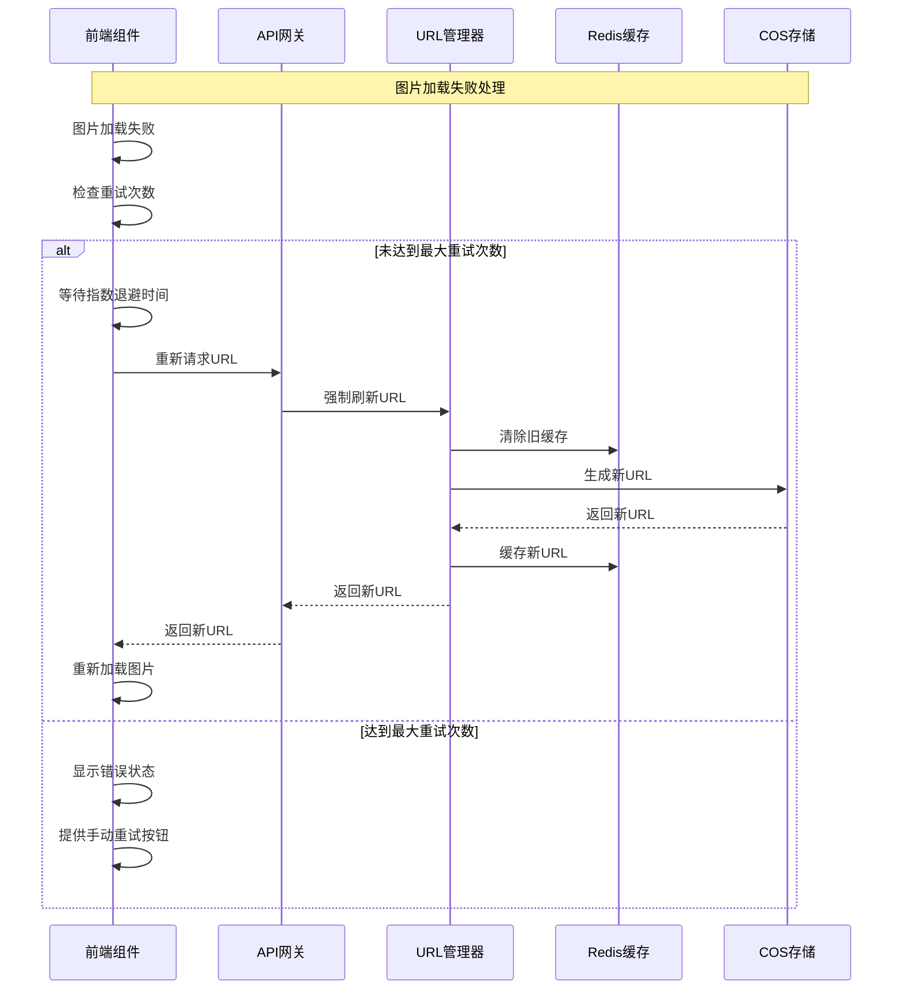

### 4.3 代理服务流程

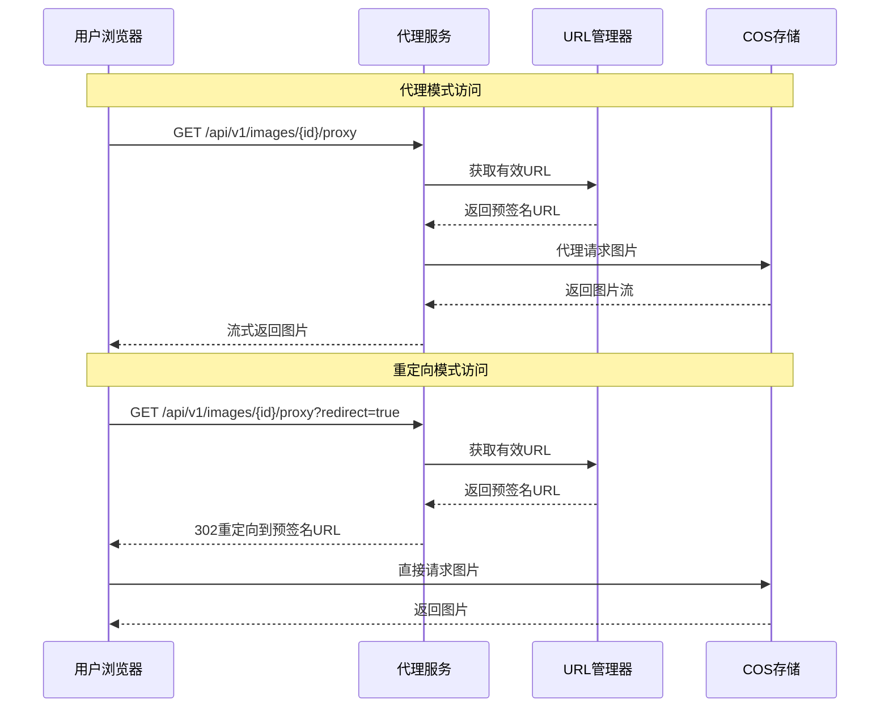

## 5. 性能优化设计

### 5.1 缓存策略

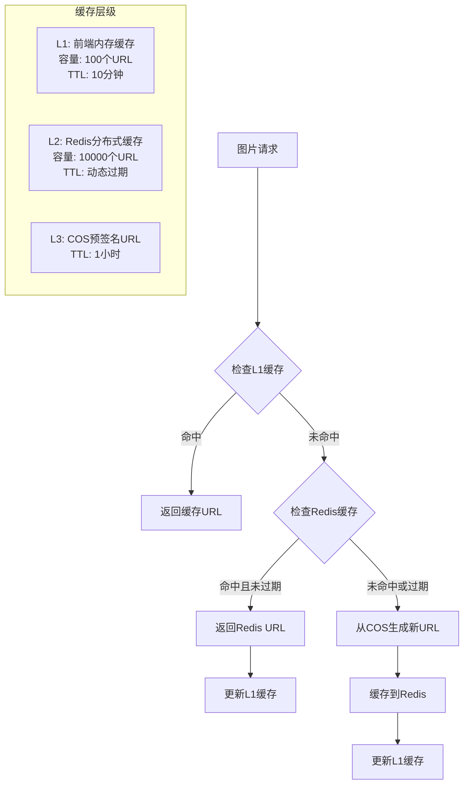

### 5.2 预刷新策略

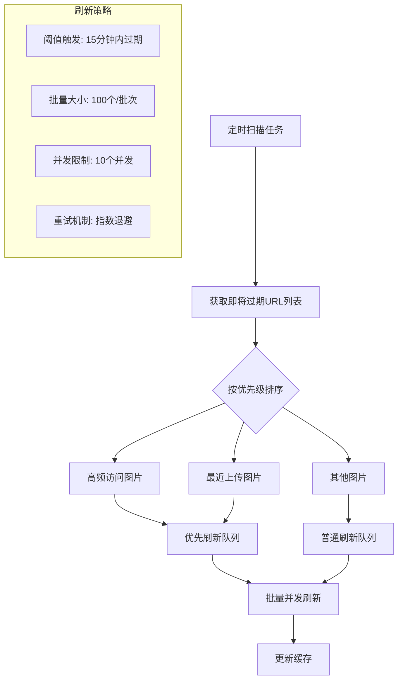

## 6. 监控与告警设计

### 6.1 监控指标体系

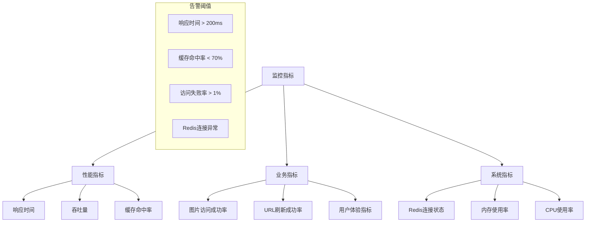

### 6.2 告警处理流程

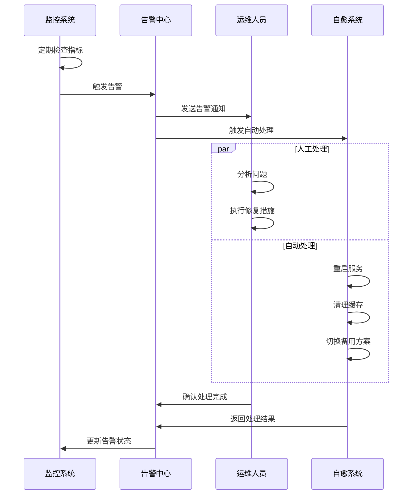

## 7. 扩展性设计

### 7.1 水平扩展

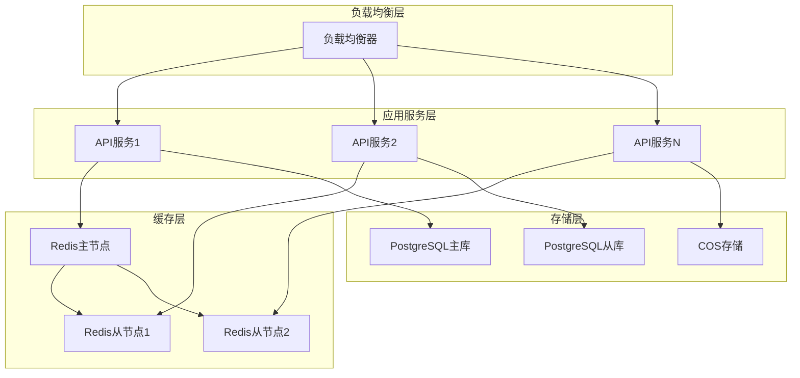

### 7.2 多地域部署

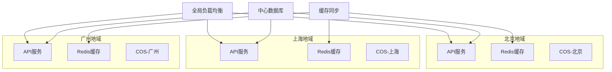

---

**文档版本**：v1.0  
**创建时间**：2024年12月  
**维护者**：AI开发团队  
