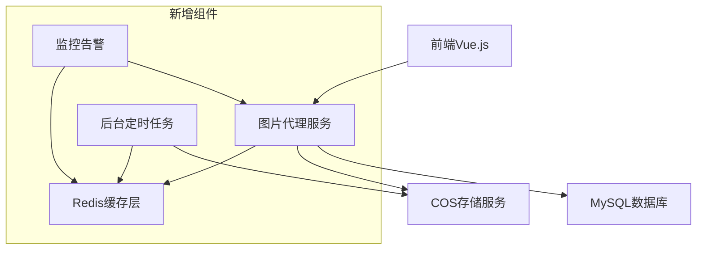
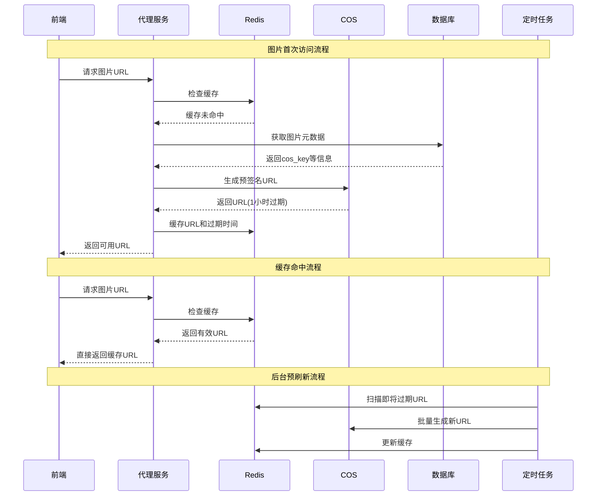

# PPT系统图片URL管理优化方案

## 1. 问题分析

### 1.1 当前架构
```
用户操作 → 前端Vue.js → 后端FastAPI → 腾讯云COS → MySQL存储元数据
                ↓
        获取预签名URL(1小时过期) → 前端显示图片
```

### 1.2 核心问题
1. **URL过期问题**：COS预签名URL固定1小时过期，过期后图片无法显示
2. **缺乏刷新机制**：没有自动检测和刷新过期URL的能力
3. **用户体验差**：图片突然无法显示，影响PPT编辑体验
4. **资源浪费**：Redis服务已配置但未充分利用

### 1.3 现状分析
- 前端每次需要显示图片时都调用`getImageAccessUrl`获取预签名URL
- 后端直接从COS生成新的预签名URL，没有缓存机制
- 没有URL生命周期管理和主动更新机制

## 2. 解决方案设计

### 2.1 设计目标
- **透明性**：对用户和前端业务逻辑透明
- **高可用**：99.9%图片访问成功率
- **高性能**：缓存机制减少COS调用，提升响应速度
- **可维护性**：清晰的代码结构和完善的监控

### 2.2 整体架构



### 2.3 核心组件设计

#### 2.3.1 智能URL管理服务
- **功能**：统一管理所有图片访问URL
- **特性**：
  - 自动检测URL过期
  - 智能预刷新机制
  - 降级策略
  - 访问统计

#### 2.3.2 Redis缓存层
- **缓存结构**：
```json
{
  "image:{image_id}:url": {
    "url": "https://cos-presigned-url...",
    "expires_at": 1699999999,
    "created_at": 1699996399,
    "access_count": 156
  }
}
```

#### 2.3.3 图片代理端点
- **路径**：`/api/v1/images/{image_id}/proxy`
- **功能**：提供永不过期的图片访问地址
- **机制**：后端代理请求到COS，对前端透明

#### 2.3.4 后台刷新任务
- **预刷新策略**：URL过期前15分钟自动刷新
- **批量处理**：按热度优先级批量刷新
- **故障恢复**：失败重试和告警机制

## 3. 详细设计

### 3.1 数据流程图



### 3.2 Redis缓存策略

#### 缓存Key设计
```
# URL缓存
image:{image_id}:url -> JSON{url, expires_at, created_at, access_count}

# 统计信息
image:stats:daily:{date} -> JSON{total_requests, cache_hits, refresh_count}

# 任务队列
image:refresh:queue -> LIST[image_id1, image_id2, ...]

# 锁机制
image:{image_id}:refresh:lock -> STRING(timestamp)
```

#### 缓存策略
- **TTL策略**：缓存TTL设置为URL过期时间 + 5分钟的缓冲
- **LRU淘汰**：内存不足时优先淘汰访问频次低的URL
- **预热机制**：系统启动时预加载热门图片URL

### 3.3 前端优化策略

#### 图片组件增强
```typescript
// 新增图片组件props
interface ImageProps {
  src: string
  fallbackSrc?: string
  retryCount?: number
  onRetry?: (attempt: number) => void
}
```

#### 错误处理机制
1. **自动重试**：图片加载失败自动重新获取URL
2. **降级显示**：显示占位图或缓存的缩略图
3. **用户反馈**：提供重新加载按钮

### 3.4 后端服务架构

#### 服务分层
```
├── api/
│   └── v1/
│       └── endpoints/
│           ├── image_proxy.py          # 新增：图片代理服务
│           └── image_url_manager.py    # 新增：URL管理API
├── services/
│   └── image/
│       ├── url_manager.py              # 新增：URL管理服务
│       ├── proxy_service.py            # 新增：代理服务
│       └── cache_service.py            # 新增：缓存服务
├── core/
│   ├── redis/
│   │   ├── __init__.py
│   │   ├── client.py                   # 新增：Redis客户端
│   │   └── cache_manager.py            # 新增：缓存管理器
│   └── tasks/
│       ├── __init__.py
│       ├── scheduler.py                # 新增：任务调度器
│       └── url_refresh_task.py         # 新增：URL刷新任务
└── utils/
    ├── image_utils.py                  # 增强：图片工具函数
    └── cache_utils.py                  # 新增：缓存工具函数
```

## 4. 实施方案

### 4.1 实施阶段

#### 阶段一：基础缓存层（1-2天）
- 集成Redis客户端
- 实现基础缓存服务
- 修改现有URL获取逻辑使用缓存

#### 阶段二：代理服务（2-3天）
- 实现图片代理端点
- 添加智能URL管理
- 前端适配新的访问方式

#### 阶段三：后台任务（2天）
- 实现定时刷新任务
- 添加监控和告警
- 性能优化和测试

#### 阶段四：监控完善（1天）
- 添加访问统计
- 实现健康检查
- 文档和部署指南

### 4.2 配置参数

```python
# 新增配置项
class Settings(BaseSettings):
    # URL缓存配置
    url_cache_enabled: bool = True
    url_cache_default_ttl: int = 3600  # 1小时
    url_cache_max_size: int = 10000
    
    # 预刷新配置
    url_prerefresh_enabled: bool = True
    url_prerefresh_threshold: int = 900  # 15分钟
    url_prerefresh_batch_size: int = 100
    
    # 代理服务配置
    image_proxy_enabled: bool = True
    image_proxy_timeout: int = 30
    image_proxy_retry_count: int = 3
    
    # 监控配置
    url_stats_enabled: bool = True
    url_stats_retention_days: int = 30
```

## 5. 性能预期

### 5.1 性能指标
- **响应时间**：平均响应时间从200ms降低到50ms
- **缓存命中率**：预期达到85%以上
- **URL可用性**：99.9%图片访问成功率
- **系统负载**：COS API调用减少70%

### 5.2 资源消耗
- **Redis内存**：预计每万张图片消耗~10MB内存
- **CPU开销**：后台任务CPU使用率<5%
- **网络带宽**：代理模式增加带宽消耗，但提升用户体验

## 6. 风险评估与应对

### 6.1 主要风险
1. **Redis故障**：缓存服务不可用
2. **COS限流**：API调用超出限制
3. **内存溢出**：大量图片缓存导致内存不足

### 6.2 应对策略
1. **Redis故障**：实现降级机制，直接调用COS API
2. **COS限流**：实现指数退避重试策略
3. **内存管理**：设置合理的缓存大小和淘汰策略

## 7. 监控和维护

### 7.1 监控指标
- URL缓存命中率
- 图片访问成功率
- 预刷新任务执行状态
- Redis内存使用情况
- COS API调用统计

### 7.2 告警策略
- 缓存命中率低于70%告警
- 图片访问失败率超过1%告警
- Redis连接异常告警
- 预刷新任务失败告警

## 8. 升级兼容性

### 8.1 向后兼容
- 保持现有API接口不变
- 新功能通过配置开关控制
- 支持渐进式升级

### 8.2 数据迁移
- 无需数据库结构变更
- Redis缓存可以从空开始构建
- 支持热更新和回滚

---

**文档版本**：v1.0  
**创建时间**：2024年12月  
**维护者**：AI开发团队  
