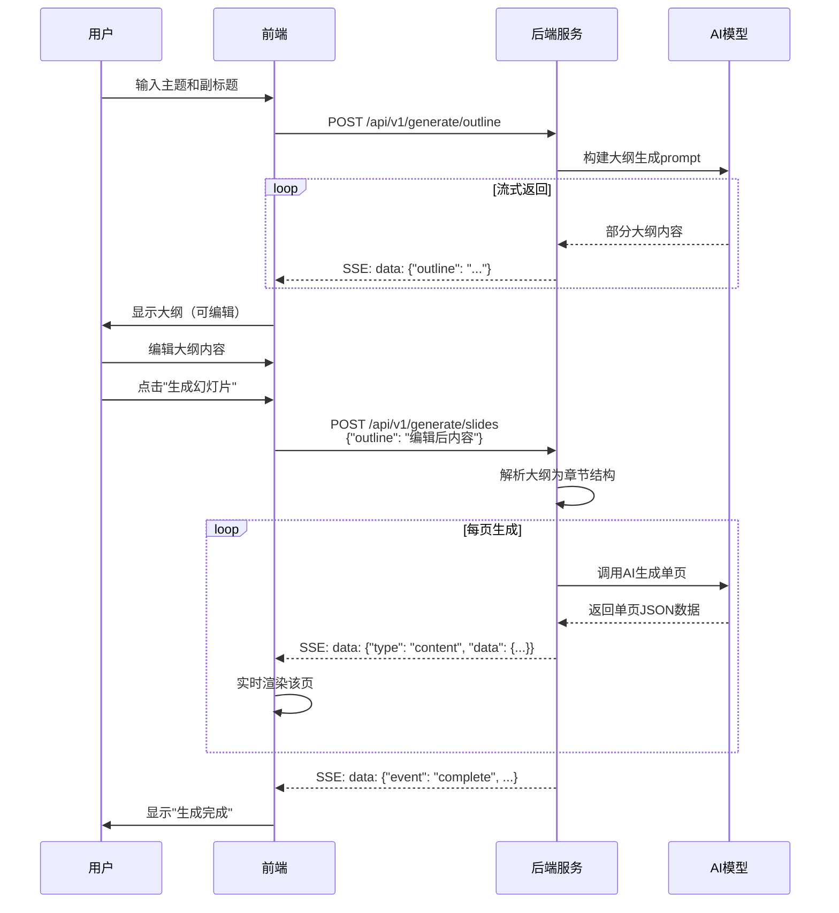
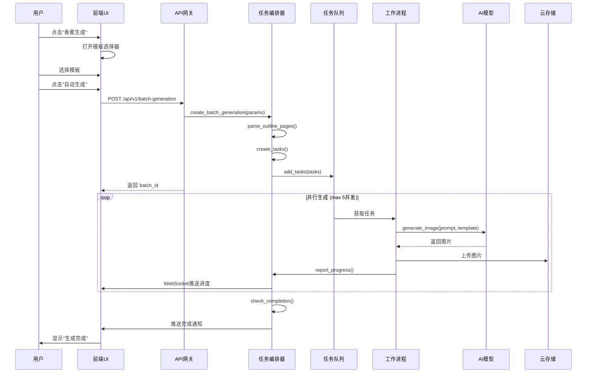

# Nano Banana Pro 集成架构设计文档

## 1. 项目背景与目标

### 1.1 业务背景
基于 nano banana pro 文生图模型的强大能力，实现从传统模板套内容到直接生成 PPT 图片的转变，显著提升 PPT 排版的视觉效果和美观度。

### 1.2 架构目标
- 无缝集成现有 AI PPTist 系统
- 提供高效的图片批量生成能力
- 确保生成过程的可观测性和可控制性
- 支持模板化生成和个性化定制
- 保证系统的可扩展性和稳定性

## 2. 系统架构设计

### 2.1 整体架构图

```
┌─────────────────────────────────────────────────────────────────────┐
│                          客户端层 (Vue 3)                           │
├─────────────────────────────────────────────────────────────────────┤
│  ┌─────────────┐ ┌──────────────┐ ┌──────────────────────────┐    │
│  │ AIPPT对话框  │ │ 模板选择器    │ │  幻灯片编辑界面           │    │
│  │ (大纲生成)   │ │ (🍌香蕉生成)  │ │  ┌──────┐ ┌──────────┐  │    │
│  └───v─────────┘ └───v──────────┘ │  │缩略图│ │ 进度浮窗  │  │    │
│       │                │           │  └───v──┘ └───v──────┘  │    │
│       │                │           │      │          │       │    │
│       └────────────────┴───────────┴──────┴──────────┴───────┤    │
└─────────────────────────────────v───────────────────────────────────┘
                                  │
                                  │ HTTP/HTTPS 
┌─────────────────────────────────v───────────────────────────────────┐
│                         API网关层 (FastAPI)                        │
├─────────────────────────────────────────────────────────────────────┤
│  ┌──────────┐  ┌──────────┐  ┌──────────┐  ┌──────────┐            │
│  │ 生成接口 │  │ 模板接口 │  │ 进度接口 │  │ 回调接口 │            │
│  │ (SSE)   │ │ (REST)   │ │ (REST)   ││ (WebHook)│            │
│  └────v─────┘  └────v─────┘  └────v─────┘  └────v─────┘            │
└─────────v────────────────v────────────v───────────v─────────────────┘
          │                │            │               │
          └────────────────┴────────────┴───────────────┘
┌─────────────────────────────────v───────────────────────────────────┐
│                       业务服务层 (Python)                          │
├─────────────────────────────────────────────────────────────────────┤
│  ┌──────────────────────────────────────────────────────────┐      │
│  │          Nano Banana 集成服务 (核心服务)                  │      │
│  ├──────────────────────────────────────────────────────────┤      │
│  │  - 模板管理服务                                           │      │
│  │  - 生成任务编排服务                                        │      │
│  │  - 进度管理服务                                           │      │
│  │  - 错误处理与重试机制                                      │      │
│  └──────────────────┬───────────────────────────────────────┘      │
│                      │                                              │
│  ┌───────────────────v───────────────────┐  ┌─────────────────┐    │
│  │      AI模型适配层 (Provider)           │  │    缓存服务     │    │
│  ├───────────────────────────────────────┤  │  (Redis)        │    │
│  │  - OpenAI Provider                    │  └─────────────────┘    │
│  │  - Gemini Provider                    │  ┌─────────────────┐    │
│  │  - Nano Banana Pro Provider           │  │   图片仓库      │    │
│  └──────────────┬───────────────────────┘  │  (腾讯云COS)    │    │
│                  │                        └─────────────────┘    │
└──────────────────┼────────────────────────────────────────────────┘
                   │
┌──────────────────v─────────────────────────────────────────────────┐
│                      数据存储层                                      │
├─────────────────────────────────────────────────────────────────────┤
│  ┌──────────┐  ┌──────────┐  ┌──────────┐  ┌──────────┐            │
│  │ PostgreSQL │   Redis    │   MinIO    │   向量DB    │            │
│  │ (业务数据) │  (缓存/锁) │  (源文件)  │ (模板索引) │            │
│  └──────────┘  └──────────┘  └──────────┘  └──────────┘            │
└─────────────────────────────────────────────────────────────────────┘
```

### 2.2 核心模块设计

#### 2.2.1 模板管理模块 (前端静态配置)

**职责**:
- 提供预设模板图片供用户选择
- 支持快速迭代的模板更新
- 无需后端数据库支持，便于快速DEMO验证

**实现方式 (参考现有系统)**:

1. **模板配置 (前端代码)**:
```typescript
// frontend/src/configs/nanoBananaTemplates.ts
export const NANO_BANANA_TEMPLATES: SlideTemplate[] = [
  {
    id: 'nano_banana_1',
    name: '专业商务风',
    cover: './imgs/nano_banana/business_pro.png',
    description: '适合商务汇报的蓝色主题',
    metadata: {
      style: 'professional',
      color_scheme: ['#2563eb', '#1e40af', '#1e3a8a'],
      recommended_for: ['business', 'presentation', 'report']
    }
  },
  {
    id: 'nano_banana_2',
    name: '科技未来感',
    cover: './imgs/nano_banana/tech_future.png',
    description: '科技感十足的深色主题',
    metadata: {
      style: 'tech',
      color_scheme: ['#0ea5e9', '#8b5cf6', '#ec4899'],
      recommended_for: ['tech', 'innovation', 'startup']
    }
  }
  // ... 更多模板
]
```

2. **模板图片存储**:
```
frontend/public/imgs/nano_banana/
├── business_pro.png
├── tech_future.png
├── education_green.png
├── marketing_orange.png
└── ... (更多模板图片)
```

3. **模板选择器组件**:
```vue
<!-- frontend/src/components/TemplateSelector.vue -->
<template>
  <div class="template-grid">
    <div
      v-for="template in templates"
      :key="template.id"
      class="template-item"
      :class="{ selected: selectedTemplate === template.id }"
      @click="selectTemplate(template.id)"
    >
      
      <div class="template-info">
        <h4>{{ template.name }}</h4>
        <p>{{ template.description }}</p>
      </div>
    </div>
  </div>
</template>

<script setup lang="ts">
import { NANO_BANANA_TEMPLATES } from '@/configs/nanoBananaTemplates'

const templates = NANO_BANANA_TEMPLATES
const selectedTemplate = defineModel<string>()
</script>
```

**优势**:
- ✅ 无需数据库，开发成本低
- ✅ 模板更新简单，直接替换图片
- ✅ 加载速度快，CDN缓存友好
- ✅ 与现有模板系统保持一致

**未来扩展**:
- 用户上传模板可扩展为文件上传+数据库存储
- 热门模板统计可接入埋点系统

#### 2.2.2 生成任务编排模块

**职责**:
- 接收批量生成请求
- 分解为单页生成任务
- 管理任务队列和并发控制
- 跟踪生成状态

**核心流程**:
```python
class BatchGenerationOrchestrator:
    def __init__(self):
        self.task_queue = TaskQueue()
        self.concurrency_limit = 5  # 最大并发数
        self.error_handler = ErrorHandler()

    async def generate_slides(self, params: GenerationParams):
        # 1. 创建生成批次记录
        batch_id = await self.create_batch(params)

        # 2. 分解为单页任务
        page_tasks = self.decompose_tasks(params)

        # 3. 提交到任务队列
        for task in page_tasks:
            await self.task_queue.add(task)

        # 4. 启动工作进程
        await self.start_workers(batch_id)

        return batch_id

    async def process_task(self, task: GenerationTask):
        try:
            # 生成图片
            image = await self.generate_page_image(task)

            # 上传图片
            image_url = await self.upload_image(image, task)

            # 更新幻灯片
            await self.update_slide(task.slide_id, image_url)

            # 上报进度
            await self.report_progress(task, 'completed')

        except Exception as e:
            await self.handle_error(task, e)
```

#### 2.2.3 AI模型适配层 (扩展现有模块)

**设计原则**: 复用现有 `backend/app/core/image_generation` 基础设施，新增 NanoBananaProvider 以支持特定逻辑

**现有架构**:
```
backend/app/core/image_generation/
├── base.py                          # BaseImageProvider 抽象基类
├── config.py                        # 模型配置
├── factory.py                       # 提供商工厂
└── providers/
    ├── __init__.py
    ├── openai_compatible.py         # OpenAI兼容提供商
    ├── gemini.py
    ├── qwen.py
    ├── volcengine_ark.py
    └── nano_banana.py               # [新增] nano banana pro 提供商
```

**实现方案**: 创建独立 NanoBananaProvider

```python
# backend/app/core/image_generation/providers/nano_banana.py

from typing import Optional, List, Dict, Any
import aiohttp
from app.core.log_utils import get_logger
from app.core.image_generation.base import BaseImageProvider, ImageGenerationResult

logger = get_logger(__name__)

class NanoBananaProvider(BaseImageProvider):
    """nano banana pro 图片生成提供商

    支持OpenAI兼容接口，针对nano banana pro特性进行优化
    """

    # 支持的模型列表
    SUPPORTED_MODELS = [
        "gemini-3-pro-image-preview",
        "gemini-3-flash-image-preview"
    ]

    # 支持的图片尺寸 (16:9 比例为主)
    SUPPORTED_SIZES = [
        "1536x1024",   # 16:10
        "1536x864",    # 16:9 (推荐)
        "1024x768",    # 4:3
    ]

    # 支持的质量选项
    SUPPORTED_QUALITIES = ["standard", "hd"]

    def __init__(self, model_config):
        super().__init__(model_config)
        self.api_key = model_config.api_key
        self.base_url = model_config.base_url or "https://api.nanobanana.com/v1"
        self.model = model_config.name

        # 验证配置
        if not self.api_key:
            raise ValueError("nano banana API 密钥未配置")

        if self.model not in self.SUPPORTED_MODELS:
            logger.warning(f"模型 {self.model} 可能不受支持，支持的模型: {self.SUPPORTED_MODELS}")

    async def _generate_image_internal(
        self,
        prompt: str,
        size: Optional[str] = None,
        quality: Optional[str] = None,
        ref_image_path: Optional[str] = None,
        additional_ref_images: Optional[List[Union[str, bytes]]] = None,
        **kwargs
    ) -> ImageGenerationResult:
        """实际生成图片 - nano banana pro 实现

        支持主参考图和额外参考图的传入，采用OpenAI Images API格式
        """

        import aiohttp
        import base64
        from PIL import Image
        from io import BytesIO

        # 准备API请求参数
        api_params = {
            "model": self.model,
            "prompt": prompt,
            "n": 1,
            "size": size or "1536x864",  # 默认16:9
            "quality": quality or "hd",  # 默认高质量
            "response_format": "b64_json"
        }

        # OpenAI Images API支持通过messages传参考图
        messages_content = []

        # 添加自定义头部
        headers = {
            "Authorization": f"Bearer {self.api_key}",
            "Content-Type": "application/json",
            "X-Provider": "nano-banana"
        }

        try:
            # 处理参考图片
            if ref_image_path or additional_ref_images:
                # 构建参考图片列表
                ref_images = []

                # 添加主参考图片（如果提供了路径）
                if ref_image_path:
                    if not os.path.exists(ref_image_path):
                        logger.warning(f"参考图片不存在: {ref_image_path}")
                    else:
                        main_ref_image = Image.open(ref_image_path)
                        ref_images.append(main_ref_image)
                        logger.debug(f"加载主参考图: {ref_image_path}")

                # 添加额外的参考图片
                if additional_ref_images:
                    for ref_img in additional_ref_images:
                        if isinstance(ref_img, Image.Image):
                            # 已经是 PIL Image 对象
                            ref_images.append(ref_img)
                        elif isinstance(ref_img, str):
                            # 可能是本地路径
                            if os.path.exists(ref_img):
                                # 本地路径
                                ref_images.append(Image.open(ref_img))
                            elif ref_img.startswith('http://') or ref_img.startswith('https://'):
                                # URL，需要下载
                                downloaded_img = await self._download_image_from_url(ref_img)
                                if downloaded_img:
                                    ref_images.append(downloaded_img)
                                else:
                                    logger.warning(f"下载图片失败: {ref_img}, 跳过...")
                            else:
                                logger.warning(f"无效的图片引用: {ref_img}, 跳过...")
                        else:
                            logger.warning(f"不支持图片类型: {type(ref_img)}, 跳过...")

                logger.debug(f"加载了 {len(ref_images)} 张参考图片")

                # 将参考图添加到消息内容中（OpenAI兼容格式）
                for ref_img in ref_images:
                    # 将PIL Image转为base64
                    buffered = BytesIO()
                    if ref_img.mode in ('RGBA', 'LA', 'P'):
                        ref_img = ref_img.convert('RGB')
                    ref_img.save(buffered, format="JPEG", quality=95)
                    img_base64 = base64.b64encode(buffered.getvalue()).decode('utf-8')

                    messages_content.append({
                        "type": "image_url",
                        "image_url": {
                            "url": f"data:image/jpeg;base64,{img_base64}"
                        }
                    })

            # 添加文本提示词
            messages_content.append({
                "type": "text",
                "text": prompt
            })

            # 构建OpenAI格式的messages
            messages = [{"role": "user", "content": messages_content}]

            logger.info(
                "调用nano banana pro图片生成API",
                extra={
                    "model": api_params["model"],
                    "size": api_params["size"],
                    "quality": api_params["quality"],
                    "ref_images_count": len(messages_content) - 1,
                    "prompt_length": len(prompt)
                }
            )

            # 调用API（使用Chat Completions格式，支持图片输入）
            api_payload = {
                "model": self.model,
                "messages": messages,
                "size": size or "1536x864",
                "quality": quality or "hd",
                "n": 1
            }

            async with aiohttp.ClientSession() as session:
                async with session.post(
                    f"{self.base_url}/chat/completions",
                    headers=headers,
                    json=api_payload,
                    timeout=aiohttp.ClientTimeout(total=120)
                ) as response:

                    if response.status != 200:
                        error_data = await response.text()
                        raise Exception(f"API调用失败: {response.status} - {error_data}")

                    result = await response.json()

                    # 从响应中提取图片数据
                    # OpenAI返回格式中的图片在message.content中
                    message = result.get("choices", [{}])[0].get("message", {})
                    content = message.get("content", [])

                    if isinstance(content, list):
                        # 查找图片内容
                        image_data = None
                        for item in content:
                            if item.get("type") == "image_url":
                                image_url = item.get("image_url", {}).get("url", "")
                                if image_url.startswith("data:image"):
                                    # 从data URL中提取base64数据
                                    b64_image = image_url.split(',', 1)[1]
                                    image_data = b64_image
                                    break
                    else:
                        # 兼容旧格式
                        image_data = result.get("data", [{}])[0].get("b64_json") or result.get("data", [{}])[0].get("b64_data")

                    if not image_data:
                        raise Exception("未找到图片数据")

                    logger.info("nano banana pro 图片生成成功")

                    # 返回结果
                    return ImageGenerationResult(
                        success=True,
                        image_url=f"data:image/png;base64,{image_data}",
                        metadata={
                            "provider": "nano_banana",
                            "model": self.model,
                            "size": size or "1536x864",
                            "quality": quality or "hd",
                            "ref_images_count": len(messages_content) - 1
                        }
                    )

        except Exception as e:
            logger.error(
                f"nano banana pro 图片生成失败: {str(e)}",
                exc_info=True,
                extra={"model": self.model}
            )

            return ImageGenerationResult(
                success=False,
                error_message=str(e),
                metadata={
                    "provider": "nano_banana",
                    "model": self.model
                }
            )

    def supports_model(self, model_name: str) -> bool:
        """检查是否支持指定模型"""
        return model_name in self.SUPPORTED_MODELS

    def get_supported_models(self) -> List[str]:
        """获取支持的模型列表"""
        return self.SUPPORTED_MODELS

    def get_supported_sizes(self) -> List[str]:
        """获取支持的图片尺寸列表"""
        return self.SUPPORTED_SIZES

    def get_supported_qualities(self) -> List[str]:
        """获取支持的图片质量列表"""
        return self.SUPPORTED_QUALITIES
```

**更新工厂函数**:

```python
# backend/app/core/image_generation/factory.py

from .providers.nano_banana import NanoBananaProvider

def get_image_provider(model_config):
    """获取图片生成提供商"""
    provider_type = getattr(model_config, 'provider_type', 'openai_compatible')

    if provider_type == "nano_banana":
        return NanoBananaProvider(model_config)
    elif provider_type == "openai_compatible":
        return OpenAICompatibleProvider(model_config)
    elif provider_type == "gemini":
        return GeminiProvider(model_config)
    elif provider_type == "qwen":
        return QwenProvider(model_config)
    elif provider_type == "volcengine_ark":
        return VolcengineArkProvider(model_config)
    else:
        raise ValueError(f"不支持的提供商类型: {provider_type}")
```

**配置示例**:

**在业务服务中使用**:

```python
# backend/app/services/nano_banana/batch_generation_service.py

from app.core.image_generation.factory import get_image_provider
from app.repositories.ai_model import AIModelRepository

class BatchGenerationService:
    """批量生成服务"""

    def __init__(self, db: AsyncSession):
        self.db = db
        self.model_repository = AIModelRepository(db)

    async def _get_nano_banana_provider(self):
        """获取 nano banana 提供商"""

        # 从数据库查询启用的图片生成模型
        models = await self.model_repository.list_models(
            enabled_only=True,
            supports_image_generation=True
        )

        # 找到 nano banana 模型（或使用默认模型）
        nano_banana_model = next(
            (m for m in models if m.provider_type == 'nano_banana'),
            models[0] if models else None
        )

        if not nano_banana_model:
            raise ValueError("未配置可用的图片生成模型")

        # 构建模型配置
        model_config = type('ModelConfig', (), {
            'provider_type': 'nano_banana',
            'api_key': nano_banana_model.get_decrypted_key(),
            'base_url': nano_banana_model.config.get('base_url'),
            'name': nano_banana_model.ai_model_name,
            'timeout': nano_banana_model.config.get('timeout', 120),
            'max_retries': nano_banana_model.config.get('max_retries', 2)
        })()

        # 通过工厂获取提供商实例
        return get_image_provider(model_config)

    async def generate_single_slide(self, task: GenerationTask):
        """生成单页幻灯片"""

        # 调用图片生成，自动获得 MLflow 追踪
        result = await self.image_provider.generate_image(
            prompt=task.prompt,
            size=task.image_size or "1536x864",
            quality=task.quality or "hd"
        )

        if result.success:
            # 上传到 COS
            image_url = await self.upload_to_cos(result.image_url, task)
            return image_url
        else:
            raise GenerationError(result.error_message)
```

**优势**:
- ✅ 独立实现，清晰表达 nano banana pro 的特定逻辑
- ✅ 继承现有基础设施（MLflow追踪、错误处理、日志）
- ✅ 支持 nano banana 特有的参数和功能
- ✅ 符合开闭原则，易于扩展
- ✅ 避免重复代码，复用抽象基类

**MLflow 追踪集成**:
自动继承 BaseImageProvider 的 MLflow 追踪功能，无需额外配置：
- 模型调用参数记录
- 响应时间统计
- 成功率/失败率
- 错误追踪
- 执行链路追踪

#### 2.2.4 进度管理模块 (Demo阶段简化实现)

**实现方案**: **HTTP 轮询** (Simple Polling)

**选择轮询的原因**:
- ✅ 实现简单，前端后端都容易实现
- ✅ 无需额外依赖（WebSocket需要维护长连接）
- ✅ 兼容性好，所有浏览器都支持
- ✅ 足够满足 Demo 阶段需求

**轮询工作原理**:

```
时间线:
0s          5s          10s         15s         20s
|           |           |           |           |
客户端: 发起请求 → 获取进度(15%) → 获取进度(30%) → 获取进度(45%) → 完成
服务器: 查询状态 → 返回15%    → 返回30%    → 返回45%    → 返回100%
```

**Demo阶段的简单实现**:

```python
# 后端 API - 查询进度
@app.get("/api/v1/slide-generations/batches/{batch_id}/progress")
async def get_generation_progress(batch_id: str):
    """查询生成进度 (轮询接口)"""

    # 从 Redis 或数据库查询进度
    progress = await progress_manager.get_progress(batch_id)

    return {
        "batch_id": batch_id,
        "status": progress.status,
        "progress": {
            "current_page": progress.current,
            "total_pages": progress.total,
            "completed_pages": progress.completed,
            "failed_pages": progress.failed,
            "percentage": (progress.completed / progress.total) * 100
        },
        "results": progress.results,
        "estimated_remaining_time": progress.eta
    }
```

```javascript
// 前端 - 轮询实现
async function pollProgress(batchId, interval = 2000) {
  const poll = async () => {
    try {
      const response = await fetch(
        `/api/v1/slide-generations/batches/${batchId}/progress`
      );
      const data = await response.json();

      // 更新UI
      updateProgressBar(data.progress.percentage);
      updateThumbnails(data.results);

      // 检查是否完成
      if (data.status === 'completed' || data.status === 'failed') {
        clearInterval(timer);
        handleCompletion(data);
        return;
      }
    } catch (error) {
      console.error('轮询失败:', error);
      clearInterval(timer);
    }
  };

  // 立即执行一次
  await poll();

  // 定时轮询
  const timer = setInterval(poll, interval);

  return timer;
}

// 使用示例
const timer = pollProgress('batch_123', 2000);  // 每2秒查询一次

// 页面卸载时清理
cleanup = () => {
  if (timer) clearInterval(timer);
};
```

**轮询参数建议**:
- **间隔时间**: 2-3秒（平衡实时性和服务器压力）
- **超时设置**: 单次请求超时10秒
- **重试次数**: 失败重试3次
- **轮询停止条件**: 状态为 completed/failed 或用户手动取消

**Demo阶段优势**:
- ✅ 代码简单，1小时即可实现
- ✅ 无需学习WebSocket API
- ✅ 调试方便，可直接用浏览器访问测试
- ✅ 无连接管理问题（断线、重连）
- ✅ 服务器资源占用少

## 3. 数据结构设计

### 3.1 当前实现的数据流转

基于现有的流式生成架构，数据流转主要分为两个阶段：

#### 3.1.1 大纲生成阶段

```
前端请求
  ↓ POST /api/v1/generate/outline
  ↓ {
  ↓   "topic": "有理数比较",
  ↓   "content": "《七年级上...》"
  ↓ }
  ↓
后端处理
  ↓
流式返回大纲数据
  ↓ data: {"status": "generating"}
  ↓ data: {"outline": "1. 情境引入..."}
  ↓ data: {"status": "complete", "outline": "完整大纲内容"}
  ↓
前端暂存 (不存数据库)
  ↓ 存储在组件状态或Pinia Store中
  ↓
用户编辑大纲
  ↓ 在前端直接修改大纲内容
  ↓
调用slides生成
  ↓ POST /api/v1/generate/slides
  ↓ {
  ↓   "outline": "编辑后的大纲内容",
  ↓   "language": "中文",
  ↓   "style": "通用"
  ↓ }
```

#### 3.1.2 幻灯片生成阶段（流式输出）

```
前端请求 /api/v1/generate/slides
  ↓
后端接收大纲内容
  ↓
逐页调用AI生成
  ↓ 每页生成后通过SSE返回
  ↓
流式响应格式:
  ├─ data: {"event": "start", "data": {...}}
  ├─ data: {"type": "cover", "data": {...}}
  ├─ data: {"type": "contents", "data": {...}}
  ├─ data: {"type": "transition", "data": {...}}
  ├─ data: {"type": "content", "data": {...}}
  └─ data: {"event": "complete", "data": {...}}
```

### 3.2 数据模型说明

#### 3.2.1 为什么不需要额外的数据库表

在Demo验证阶段，采用轻量级实现策略：

1. **无大纲存储**
   - 大纲只在前端临时存储
   - 用户编辑后直接发送到slides生成接口
   - 无需持久化（简化实现、快速验证）

2. **无批次管理**
   - 一次slides请求即一个完整批次
   - 状态管理在前端通过SSE事件完成
   - 无需后端批次状态追踪

3. **无模板表**
   - 模板配置在前端静态配置文件中
   - 通过配置文件管理模板列表
   - 无需数据库支持（未来可扩展）

4. **流式输出中间状态不存储**
   - partial_content 只在生成流中临时使用
   - 最终完整内容返回给前端后流结束
   - 无需额外的slides表存储中间结果

#### 3.2.2 未来演进方向

当需要支持以下场景时，再引入数据库表：

- **历史记录查询** → 需要 slides 历史表
- **断点续传** → 需要批次状态表
- **多人协作** → 需要大纲版本管理
- **模板市场** → 需要模板表

### 3.3 核心数据结构（代码层面）

#### 3.3.1 大纲数据结构

```python
@dataclass
class OutlineData:
    """大纲数据结构"""
    topic: str                    # 主题
    content: str                  # 副标题/内容描述
    outline: str                  # 生成的大纲内容（文本格式）
    language: str = "中文"        # 语言
    style: str = "通用"           # 风格
```

#### 3.3.2 幻灯片返回数据结构

```python
@dataclass
class SlideEvent:
    """SSE事件数据结构"""

    # 事件类型：start, cover, contents, transition, content, complete
    event: str

    # 事件数据
    data: Dict[str, Any]

    # 不同事件的data结构示例：
    # start: {"content_length", "language", "style", "mock_mode", "timestamp"}
    # cover: {"title", "text"}
    # contents: {"items": [...]}
    # transition: {"title", "text"}
    # content: {"title", "semanticFeatures", "items": [...]}
    # complete: {"total_slides", "generation_time", "operation_type"}
```

#### 3.3.3 内容项数据结构

```python
@dataclass
class ContentItem:
    """内容项数据结构"""
    title: str                    # 标题
    text: str                     # 内容文本
    metadata: Dict[str, Any] = None  # 元数据（分类、步骤等）
```

#### 3.3.4 语义特征结构

```python
@dataclass
class SemanticFeatures:
    """语义特征用于指导布局和生成"""
    logicType: str               # 逻辑类型：sequential, classification, hierarchical, comparison, problem_solution
    contentType: str             # 内容类型：lesson_introduction, concept_explanation, comparison_analysis, problem_discussion
    phase: Optional[str] = None  # 阶段：creative_thinking等
```

## 4. 核心实现流程

### 4.1 生成流程图（基于当前流式实现）



### 4.2 详细流程说明

#### 4.2.1 大纲生成流程

**前端请求**：
```javascript
// 请求示例
const response = await fetch('/api/v1/generate/outline', {
  method: 'POST',
  headers: { 'Content-Type': 'application/json' },
  body: JSON.stringify({
    topic: '有理数比较',
    content: '《七年级上·第一章 有理数·技术思维模块》'
  })
})
```

**后端处理**：
```python
# 主要逻辑（简化）
async def generate_outline(request):
    # 1. 接收参数
    topic = request.topic
    content = request.content

    # 2. 构建prompt
    prompt = f"""
    请为以下主题生成PPT大纲：
    主题：{topic}
    内容：{content}

    要求：
    - 生成8-12页的详细大纲
    - 包含封面、目录、过渡页、内容页、结束页
    - 按照教学逻辑组织
    """

    # 3. 调用AI生成
    async for chunk in ai_client.stream_generate(prompt):
        yield f"data: {json.dumps({'outline': chunk})}\\n\\n"

    # 4. 发送完成事件
    yield 'data: {"status": "complete"}\\n\\n'
```

**前端处理流式响应**：
```javascript
const reader = response.body.getReader()
const decoder = new TextDecoder()

while (true) {
  const { done, value } = await reader.read()
  if (done) break

  const chunk = decoder.decode(value)
  const lines = chunk.split('\\n')

  for (const line of lines) {
    if (line.startsWith('data: ')) {
      const data = JSON.parse(line.slice(6))

      if (data.status === 'complete') {
        // 生成完成
        break
      } else if (data.outline) {
        // 累加大纲内容
        outline.value += data.outline
      }
    }
  }
}
```

#### 4.2.2 幻灯片生成流程（核心）

**前端请求**：
```javascript
// 发送生成请求
const response = await fetch('/api/v1/generate/slides', {
  method: 'POST',
  headers: { 'Content-Type': 'application/json' },
  body: JSON.stringify({
    outline: outline.value,      // 编辑后的大纲
    language: '中文',
    style: '通用',
    mock_mode: true              // 可选：mock模式
  })
})
```

**后端流式处理**：
```python
# 简化的流式处理逻辑
async def generate_slides_stream(request):
    outline = request.outline

    # 1. 发送开始事件
    yield f"data: {json.dumps({
        'event': 'start',
        'data': {
            'content_length': len(outline),
            'language': request.language,
            'style': request.style,
            'mock_mode': request.mock_mode,
            'timestamp': time.time(),
            'operation_type': 'slides_generation'
        }
    })}\\n\\n"

    # 2. 解析大纲为章节
    sections = parse_outline_to_sections(outline)

    # 3. 逐页生成
    for idx, section in enumerate(sections):
        if request.mock_mode:
            # Mock模式：直接返回固定格式
            slide_data = generate_mock_slide(section, idx)
        else:
            # 真实模式：调用AI
            slide_data = await generate_slide_with_ai(section, idx)

        # 发送该页数据
        yield f"data: {json.dumps(slide_data)}\\n\\n"

    # 4. 发送完成事件
    yield f"data: {json.dumps({
        'event': 'complete',
        'data': {
            'total_slides': len(sections),
            'generation_time': time.time() - start_time,
            'mock_mode': request.mock_mode
        }
    })}\\n\\n"
```

**流式响应格式说明**：

| 事件类型 | 说明 | 数据结构 |
|---------|------|---------|
| `start` | 生成开始 | `{content_length, language, style, mock_mode}` |
| `prompt_ready` | Prompt准备就绪 | `{system_prompt_length, user_prompt_length}` |
| `cover` | 封面页 | `{title, text}` |
| `contents` | 目录页 | `{items: [...]}` |
| `transition` | 过渡页 | `{title, text}` |
| `content` | 内容页 | `{title, semanticFeatures, items: [...]}` |
| `complete` | 完成事件 | `{total_slides, generation_time}` |

#### 4.2.3 前端实时渲染流程

```javascript
import { useSlidesStore } from '@/store/slides'

// 流式接收并实时渲染
async function streamGenerateSlides() {
  const store = useSlidesStore()
  const response = await fetch('/api/v1/generate/slides', {
    method: 'POST',
    body: JSON.stringify({ outline: outline.value })
  })

  const reader = response.body.getReader()
  const decoder = new TextDecoder()

  while (true) {
    const { done, value } = await reader.read()
    if (done) break

    const lines = decoder.decode(value).split('\n')
    for (const line of lines) {
      if (!line.startsWith('data: ')) continue

      const event = JSON.parse(line.slice(6))

      // 根据事件类型处理
      switch (event.event || event.type) {
        case 'start':
          // 显示加载状态
          store.setGenerating(true)
          break

        case 'cover':
        case 'contents':
        case 'transition':
        case 'content':
          // 添加到幻灯片列表（实时显示）
          store.addSlide({
            type: event.type,
            data: event.data
          })
          break

        case 'complete':
          // 生成完成
          store.setGenerating(false)
          store.setComplete(true)
          break
      }
    }
  }
}
```

### 4.3 前端数据结构示例

前端接收到的完整幻灯片数据结构：

```typescript
interface SlideData {
  type: 'cover' | 'contents' | 'transition' | 'content'
  data: {
    // 通用字段
    title?: string
    text?: string

    // content类型特有
    semanticFeatures?: {
      logicType: 'sequential' | 'classification' | 'hierarchical'
      contentType: 'lesson_introduction' | 'concept_explanation'
    }
    items?: Array<{
      title: string
      text: string
      metadata?: Record<string, any>
    }>
  }
}

// 使用示例
const slides: SlideData[] = [
  {
    type: 'cover',
    data: {
      title: '构思比较的"直接"法则',
      text: '《七年级上·第一章 有理数·技术思维模块》'
    }
  },
  {
    type: 'contents',
    data: {
      items: [
        '情境引入：心算挑战',
        '探究建构：分类与比较',
        '技术方案：直接法则',
        '测评验证：基础与应用',
        '思考表达：创新与应用'
      ]
    }
  }
]
```

## 4. 核心实现流程

### 4.1 生成流程图



### 4.2 详细流程说明（以生成4张幻灯片为例）

#### 4.2.1 请求阶段 (0-2秒)

**前端操作**:
1. **用户在大纲页面点击"香蕉生成"按钮**
2. **弹出模板选择对话框**
   - 展示8-12个预设模板图片网格
   - 用户点击选择一个模板（例如："专业商务风"）
3. **点击"自动生成"按钮**
4. **前端收集参数**
   ```javascript
   // 前端发送的请求参数
   {
     "outline_id": "outline_123",           // 大纲ID
     "template_id": "nano_banana_1",        // 选择的模板
     "options": {
       "resolution": "1536x864",            // 16:9 比例
       "quality": "hd"                       // 高质量
     }
   }
   ```
5. **显示进度浮窗并启动轮询**

**后端处理**:
1. **接收批量生成请求**
   ```python
   POST /api/v1/slide-generations/batches
   ```
2. **系统验证**
   - 验证 outline_id 是否存在
   - 验证 template_id 是否有效
   - 验证用户权限（是否有足够API调用额度）
3. **创建批次记录**
   ```python
   batch_id = "batch_20241220_001"
   status = "pending"
   total_pages = 4  // 根据大纲解析得到
   ```
4. **返回批次ID**
   ```json
   {
     "batch_id": "batch_20241220_001",
     "status": "pending",
     "total_pages": 4,
     "estimated_time": 30
   }
   ```

#### 4.2.2 初始化阶段 (2-5秒)

**后端处理**:
1. **大纲解析** (耗时2-3秒)
   ```python
   # 从数据库获取大纲内容
   outline = await db.get_outline(outline_id)

   # AI解析大纲为4个页面结构
   pages = await ai_service.parse_outline_to_pages(outline)
   # 返回结果示例:
   [
     {"page_number": 1, "title": "封面", "content": "..."},
     {"page_number": 2, "title": "问题分析", "content": "..."},
     {"page_number": 3, "title": "解决方案", "content": "..."},
     {"page_number": 4, "title": "总结", "content": "..."}
   ]
   ```
2. **创建生成任务** (耗时0.5秒)
   ```python
   # 为每个页面创建任务
   tasks = []
   for page in pages:
       task = {
           "batch_id": "batch_20241220_001",
           "page_number": page["page_number"],
           "slide_id": f"slide_{page['page_number']}",
           "prompt": build_image_prompt(page, template),  // 构建图片生成提示词
           "status": "pending",
           "retry_count": 0
       }
       tasks.append(task)
   ```
3. **提交到Redis队列** (耗时0.1秒)
   ```python
   for task in tasks:
       await redis.lpush("generation_queue", task.to_json())
   ```
4. **更新批次状态为 "generating"**

#### 4.2.3 生成阶段 (5-60秒) - 核心流程

**后端并行生成**:

```python
# Worker进程并行处理（最多5个并发）
class GenerationWorker:
    async def process_task(self, task):
        # 1. 获取任务
        task = await redis.brpop("generation_queue")

        # 2. 更新任务状态为 "generating"
        await db.update_task_status(task.id, "generating")

        # 3. 调用nano banana API生成图片
        try:
            # 构建调用参数
            prompt = task.prompt
            ref_image = load_template_image(task.template_id)  // 加载模板作为参考图

            # 调用NanoBananaProvider
            result = await nano_banana_provider.generate_image(
                prompt=prompt,
                ref_image_path=ref_image,        // 主参考图（模板）
                additional_ref_images=None,     // 额外参考图（可选）
                aspect_ratio="16:9",
                resolution="2K"
            )

            # 4. 上传到COS
            image_url = await cos.upload(result.image, f"slides/{task.slide_id}.png")

            # 5. 生成缩略图
            thumbnail_url = await generate_thumbnail(result.image, "300x169")

            # 6. 更新任务和幻灯片
            await db.update_task_result(task.id, {
                "status": "completed",
                "image_url": image_url,
                "thumbnail_url": thumbnail_url
            })

            # 7. 更新批次进度
            await batch_progress_manager.increment_completed(task.batch_id)

        except Exception as e:
            # 错误处理：重试3次后标记为失败
            if task.retry_count < 3:
                task.retry_count += 1
                await redis.lpush("generation_queue", task.to_json())
            else:
                await db.update_task_status(task.id, "failed", str(e))
                await batch_progress_manager.increment_failed(task.batch_id)
```

**前端轮询查询进度**:

```javascript
// 前端轮询实现
async function pollProgress(batchId) {
  const timer = setInterval(async () => {
    try {
      const response = await fetch(
        `/api/v1/slide-generations/batches/${batchId}/progress`
      );
      const data = await response.json();

      // 第1页完成时更新（约5-8秒）
      if (data.progress.completed_pages >= 1) {
        updateThumbnail(1, data.results[0].thumbnail_url);
        updateProgressBar(25);
      }

      // 第2页完成时更新（约10-15秒）
      if (data.progress.completed_pages >= 2) {
        updateThumbnail(2, data.results[1].thumbnail_url);
        updateProgressBar(50);
      }

      // 第3页完成时更新（约15-22秒）
      if (data.progress.completed_pages >= 3) {
        updateThumbnail(3, data.results[2].thumbnail_url);
        updateProgressBar(75);
      }

      // 检查是否完成
      if (data.status === 'completed') {
        clearInterval(timer);

        // 第4页完成，更新最后一张
        updateThumbnail(4, data.results[3].thumbnail_url);
        updateProgressBar(100);

        // 显示完成通知
        showNotification('幻灯片生成完成！', 'success');

        // 如果是全部成功
        if (data.progress.failed_pages === 0) {
          showSuccessDialog();
        } else {
          showPartialSuccessDialog(data.progress.failed_pages);
        }
      }

      if (data.status === 'failed') {
        clearInterval(timer);
        showErrorDialog(data.error_message);
      }

    } catch (error) {
      console.error('轮询失败:', error);
      clearInterval(timer);
    }
  }, 2000);  // 每2秒查询一次

  return timer;
}

// 使用示例
const progressTimer = pollProgress('batch_20241220_001');
```

**并行生成优化**:

```python
# 并发控制（最多5个同时生成）
class ConcurrencyLimiter:
    def __init__(self, max_concurrent=5):
        self.semaphore = asyncio.Semaphore(max_concurrent)

    async def generate_with_limit(self, task):
        async with self.semaphore:
            return await self.generate_single_slide(task)

# Worker进程池
workers = [GenerationWorker() for _ in range(5)]
await asyncio.gather(
    *[worker.start() for worker in workers]
)
```

#### 4.2.4 完成阶段 (60-65秒)

**后端处理**:
1. **检测批次完成**
   ```python
   batch = await db.get_batch(batch_id)
   if batch.completed_pages + batch.failed_pages >= batch.total_pages:
       # 批次完成
       batch.status = "completed"
       batch.completed_at = datetime.now()
       await db.commit()
   ```

2. **清理过期数据**
   ```python
   # 删除Redis中的临时进度数据（保留24小时）
   await redis.expire(f"progress:{batch_id}", 86400)
   ```

3. **可选：生成完整PPT文件**
   ```python
   # 将所有生成的图片合并为PPTX文件
   pptx_url = await generate_pptx_file(batch.results)
   ```

**前端处理**:
1. **显示完成通知**
   ```javascript
   showNotification({
     title: '幻灯片生成完成',
     message: `成功生成 ${completed} 页，失败 ${failed} 页`,
     type: 'success'
   });
   ```

2. **关闭进度浮窗**
   ```javascript
   setTimeout(() => {
     hideProgressFloatWindow();
   }, 3000);
   ```

3. **全屏预览（可选）**
   ```javascript
   if (user_settings.auto_preview) {
     openPreviewMode(batch.slides);
   }
   ```

#### 4.2.5 最佳实践与优化

**1. 用户体验优化**:
- 第一张图片生成后立即显示，减少用户等待感
- 使用骨架屏作为占位符，避免空白页面
- 生成过程中允许用户预览已完成的幻灯片

**2. 性能优化**:
- 使用Redis排行榜记录生成速度，自动调整并发数
- 实现智能重试：失败的页面在批次完成后自动重试
- 使用CDN缓存生成的图片，提高加载速度

**3. 错误处理**:
- 记录详细日志（页面编号、错误类型、重试次数）
- 提供手动重试按钮，用户可以重试失败的页面
- 如果超过50%页面失败，建议用户检查大纲或更换模板

### 4.3 错误处理机制

```python
class ErrorHandler:
    """错误处理和重试机制"""

    def __init__(self):
        self.max_retries = 3
        self.retry_delay = [1, 2, 5]  # 指数退避

    async def handle_generation_error(self, task: GenerationTask, error: Exception):
        """处理生成错误"""

        if task.retry_count >= self.max_retries:
            # 达到最大重试次数，标记为失败
            await self.mark_failed(task, error)
            return False

        # 判断错误类型
        if isinstance(error, RateLimitError):
            # 速率限制，等待后重试
            delay = self.retry_delay[task.retry_count]
            await asyncio.sleep(delay)

        elif isinstance(error, APIConnectionError):
            # 连接错误，立即重试
            pass

        else:
            # 其他错误，等待后重试
            delay = self.retry_delay[task.retry_count]
            await asyncio.sleep(delay)

        # 增加重试计数并重新入队
        task.retry_count += 1
        await self.requeue_task(task)

        return True
```

## 5. API接口设计（基于实际实现）

### 5.1 流式API接口

#### 5.1.1 大纲生成接口

```http
POST /api/v1/generate/outline
Content-Type: application/json

Request Body:
{
  "topic": "有理数比较",
  "content": "《七年级上·第一章 有理数·技术思维模块》"
}

Response: text/event-stream

data: {"status": "generating"}

data: {"outline": "1. 情境引入"}
data: {"outline": "情境引入：心算挑战"}

data: {"outline": "2. 探究建构"}

data: {"status": "complete", "outline": "完整大纲"}
```

**前端处理示例**：
```javascript
const reader = response.body.getReader()
const decoder = new TextDecoder()
let fullOutline = ''

while (true) {
  const { done, value } = await reader.read()
  if (done) break

  const lines = decoder.decode(value).split('\n')
  for (const line of lines) {
    if (line.startsWith('data: ')) {
      const data = JSON.parse(line.slice(6))
      if (data.outline) {
        fullOutline += data.outline
      }
    }
  }
}
```

#### 5.1.2 幻灯片生成接口（流式）

```http
POST /api/v1/generate/slides
Content-Type: application/json

Request Body:
{
  "outline": "编辑后的大纲内容（文本格式）",
  "language": "中文",
  "style": "通用",
  "mock_mode": true  // 可选，是否使用mock数据
}

Response: text/event-stream

data: {"event": "start", "data": {...}}

data: {"type": "cover", "data": {"title": "...", "text": "..."}}

data: {"type": "contents", "data": {"items": [...]}}

data: {"type": "transition", "data": {"title": "...", "text": "..."}}

data: {"type": "content", "data": {"title": "...", "items": [...]}}

data: {"event": "complete", "data": {"total_slides": 14, "generation_time": 5.23}}
```

**重要说明**：
- 当前实现不需要 `outline_id`，而是直接传递大纲内容
- 不需要 `template_id`，模板选择在前端静态配置中管理
- 不需要 `batch_id`，流式响应中没有批次ID追踪
- 状态管理在**前端完成**，通过SSE事件实现实时渲染

#### 5.1.3 响应数据格式

**开始事件（start）**：
```json
{
  "event": "start",
  "data": {
    "content_length": 1036,
    "language": "中文",
    "style": "通用",
    "mock_mode": true,
    "timestamp": 1766229144.456243,
    "operation_type": "slides_generation"
  }
}
```

**封面页（cover）**：
```json
{
  "type": "cover",
  "data": {
    "title": "构思比较的直接法则",
    "text": "《七年级上·第一章 有理数·技术思维模块》"
  }
}
```

**目录页（contents）**：
```json
{
  "type": "contents",
  "data": {
    "items": ["情境引入", "探究建构", "技术方案", "测评验证", "思考表达"]
  }
}
```

**过渡页（transition）**：
```json
{
  "type": "transition",
  "data": {
    "title": "情境引入：心算挑战",
    "text": "通过生活情境引入有理数比较的挑战"
  }
}
```

**内容页（content）**：
```json
{
  "type": "content",
  "data": {
    "title": "脑力大比拼",
    "semanticFeatures": {
      "logicType": "sequential",
      "contentType": "lesson_introduction"
    },
    "items": [
      {
        "title": "",
        "text": "报出一组数，-5℃和-12℃，你能立刻判定哪个更大吗？",
        "metadata": {}
      }
    ]
  }
}
```

**完成事件（complete）**：
```json
{
  "event": "complete",
  "data": {
    "total_slides": 14,
    "generation_time": 5.227701902389526,
    "mock_mode": true,
    "operation_type": "slides_generation"
  }
}
```

### 6.1 提示词生成策略

参考 banana-slides 的实现，提示词分为三层架构：

#### 6.1.1 大纲转页面描述

```python
PAGE_DESCRIPTION_PROMPT = """
基于以下PPT大纲的JSON结构，为第{page_index}页生成详细的页面描述。

大纲结构:
{outline}

本页大纲:
{page_outline}

要求:
1. 描述应为纯文本，不包含Markdown格式
2. 详细说明页面的内容、布局和视觉元素
3. 包括标题、副标题、正文、图表、图片位置等
4. 字数控制在200-400字之间
5. 描述要具体，便于AI理解生成

输出格式:
{{"description": "详细的页面描述"}}
"""
```

#### 6.1.2 描述转图片生成提示词

```python
IMAGE_GENERATION_PROMPT = """
你是一名专业的PPT设计师，请根据以下描述生成高质量的幻灯片图片。

描述内容:
{page_description}

当前章节:
{current_section}

整体大纲:
{outline_text}

风格要求:
1. 使用{style}风格，参考模板:{template_name}
2. 配色方案: {color_scheme}
3. 分辨率: {resolution}
4. 长宽比: {aspect_ratio}

布局要求:
1. 严格按照16:9比例
2. 标题在上方居中或左对齐
3. 内容区域在下方，合理留白
4. 如需图表，使用清晰的数据可视化

文字渲染:
1. 所有文字必须清晰可读，不模糊
2. 字体大小适中，标题24-36pt，正文18-24pt
3. 中英文混排时保持美观

输出要求:
直接生成完整的幻灯片图片，不要有任何边框或水印。
"""
```

#### 6.1.3 模板增强提示词

```python
TEMPLATE_ENHANCEMENT_PROMPT = """
基于以下模板风格生成类似的幻灯片:

参考模板图片：{template_image}

模板特征分析:
- 配色方案: {palette}
- 字体风格: {typography}
- 布局特点: {layout_style}
- 装饰元素: {decorative_elements}

请根据以上风格特征，生成新的幻灯片页面：
{page_description}

要求保持风格一致性的同时，展示新的内容。
"""
```

### 6.2 提示词优化技巧

参考 banana-slides 的最佳实践：

1. **结构化输出**: 使用JSON格式确保输出一致性
2. **思考过程**: 添加thinking_budget参数控制思考深度
3. **多语言支持**: 根据用户选择自动适配语言提示词
4. **上下文增强**: 包含前后文信息提高连贯性

```python
def optimize_prompt_for_nano_banana(base_prompt: str) -> str:
    """
    专为nano banana pro优化的提示词
    """

    enhancements = [
        "使用最佳质量",
        "超高分辨率",
        "专业设计",
        "清晰的文本渲染",
        "精确的排版",
        "无水印",
        "无装饰边框"
    ]

    optimized = f"""
{base_prompt}

风格质量要求:
{', '.join(enhancements)}

注意:
生成的图片必须能直接用于PPT，所有文字内容必须完整呈现且清晰。
"""

    return optimized
```

## 7. 性能优化策略

### 7.1 并发控制

```python
from asyncio import Semaphore

class ConcurrencyLimiter:
    """并发限制器"""

    def __init__(self, max_concurrent: int = 5):
        self.semaphore = Semaphore(max_concurrent)
        self.max_concurrent = max_concurrent

    async def acquire(self):
        await self.semaphore.acquire()

    def release(self):
        self.semaphore.release()

    async def __aenter__(self):
        await self.acquire()
        return self

    async def __aexit__(self, exc_type, exc_val, exc_tb):
        self.release()
```

### 7.2 缓存策略

```python
class GenerationCache:
    """生成结果缓存"""

    def __init__(self):
        self.redis = RedisClient()
        self.ttl = 3600 * 24  # 24小时

    async def get_cached_result(self, cache_key: str) -> Optional[str]:
        """获取缓存结果"""
        return await self.redis.get(f"generation:{cache_key}")

    async def cache_result(self, cache_key: str, image_url: str):
        """缓存生成结果"""
        await self.redis.setex(
            f"generation:{cache_key}",
            self.ttl,
            image_url
        )

    def generate_cache_key(self, params: dict) -> str:
        """生成缓存键"""
        import hashlib
        import json

        sorted_params = dict(sorted(params.items()))
        params_str = json.dumps(sorted_params, ensure_ascii=False)
        return hashlib.md5(params_str.encode()).hexdigest()
```

### 7.3 队列管理

```python
from celery import Celery

app = Celery('slide_generation')
app.conf.update(
    task_serializer='json',
    accept_content=['json'],
    result_serializer='json',
    timezone='UTC',
    enable_utc=True,
    broker_url='redis://localhost:6379/0',
    result_backend='redis://localhost:6379/0',
    task_routes={
        'nano_banana.generate_slide': {'queue': 'generation'},
    },
    task_annotations={
        'nano_banana.generate_slide': {
            'rate_limit': '10/m',  # 每分钟最多10个
        },
    }
)
```

## 8. 监控与日志

### 8.2 日志规范

```python
import structlog

logger = structlog.get_logger()

async def generate_slide(self, task: GenerationTask):
    """带结构化日志的生成方法"""

    logger.info(
        "slide_generation_started",
        batch_id=task.batch_id,
        slide_id=task.slide_id,
        page_number=task.page_number,
        template_id=task.template_id,
        prompt_length=len(task.prompt)
    )

    try:
        # 生成逻辑...

        logger.info(
            "slide_generation_completed",
            batch_id=task.batch_id,
            slide_id=task.slide_id,
            duration=duration,
            image_size=image_size
        )

    except Exception as e:
        logger.error(
            "slide_generation_failed",
            batch_id=task.batch_id,
            slide_id=task.slide_id,
            error_type=type(e).__name__,
            error_message=str(e),
            retry_count=task.retry_count
        )
        raise

## 9. 代码目录组织结构

本节说明为实现 nano banana pro 集成，项目中新增的代码文件及其位置。

### 9.1 后端代码结构

```
backend/
├── app/
│   ├── api/
│   │   └── v1/
│   │       └── endpoints/
│   │           ├── __init__.py
│   │           ├── slide_generation.py           # [新增] 幻灯片生成API
│   │           └── ai_model.py                   # [扩展] AI模型管理API
│   │
│   ├── core/
│   │   ├── image_generation/
│   │   │   ├── __init__.py
│   │   │   ├── base.py                           # [已有] 图片生成基类
│   │   │   ├── factory.py                        # [扩展] 添加nano banana支持
│   │   │   └── providers/
│   │   │       ├── __init__.py
│   │   │       ├── nano_banana.py                # [新增] NanoBananaProvider
│   │   │       ├── openai_compatible.py          # [已有]
│   │   │       ├── gemini.py                     # [已有]
│   │   │       ├── qwen.py                       # [已有]
│   │   │       └── volcengine_ark.py            # [已有]
│   │   │
│   │   └── config.py                            # [扩展] 添加nano banana配置
│   │
│   ├── models/
│   │   ├── __init__.py
│   │   ├── ai_model.py                          # [已有] AI模型表
│   │   ├── generation_batch.py                  # [新增] 生成批次模型
│   │   ├── generation_task.py                   # [新增] 生成任务模型
│   │   └── slide_template.py                    # [新增] 幻灯片模板模型（可选）
│   │
│   ├── repositories/
│   │   ├── __init__.py
│   │   ├── ai_model.py                          # [已有] AI模型仓库
│   │   ├── generation_batch.py                  # [新增] 批次仓库
│   │   └── generation_task.py                   # [新增] 任务仓库
│   │
│   ├── services/
│   │   ├── __init__.py
│   │   ├── nano_banana/
│   │   │   ├── __init__.py
│   │   │   ├── batch_generation_service.py      # [新增] 批次生成服务
│   │   │   ├── generation_orchestrator.py       # [新增] 生成编排器（BatchGenerationOrchestrator）
│   │   │   └── progress_manager.py              # [新增] 进度管理服务
│   │   │
│   │   └── ai_service.py                        # [扩展] 添加图片生成方法
│   │
│   └── utils/
│       ├── cos_uploader.py                      # [新增] COS上传工具
│       ├── image_processor.py                   # [新增] 图片处理工具（生成缩略图等）
│       └── download.py                          # [新增] 图片下载工具
│
├── tests/
│   ├── unit/
│   │   ├── test_nano_banana_provider.py         # [新增] NanoBananaProvider单元测试
│   │   └── test_batch_generation.py             # [新增] 批次生成服务单元测试
│   │
│   └── integration/
│       └── test_slide_generation_flow.py        # [新增] 集成测试
│
└── migrations/
    └── versions/
        └── 003_add_generation_tables.py         # [新增] 数据库迁移脚本
```

### 9.2 前端代码结构

```
frontend/
├── src/
│   ├── components/
│   │   ├── TemplateSelector.vue               # [新增] 模板选择器组件
│   │   ├── GenerationProgressFloat.vue        # [新增] 生成进度浮窗
│   │   └── BatchGenerationDialog.vue          # [新增] 批量生成对话框
│   │
│   ├── views/
│   │   └── Editor/
│   │       ├── AIPPTDialog.vue                # [已有] 大纲生成对话框
│   │       └── index.vue                      # [扩展] 添加香蕉生成按钮
│   │
│   ├── configs/
│   │   └── nanoBananaTemplates.ts             # [新增] nano banana模板配置
│   │
│   ├── hooks/
│   │   └── useBatchGeneration.ts              # [新增] 批量生成组合函数
│   │
│   ├── store/
│   │   └── slides.ts                          # [扩展] 添加生成状态管理
│   │
│   ├── api/
│   │   └── client.ts                          # [扩展] 添加生成相关API
│   │
│   └── types/
│       └── index.ts                           # [扩展] 添加生成相关类型定义
│
├── public/
│   └── imgs/
│       └── nano_banana/                       # [新增] 模板图片存储目录
│           ├── business_pro.png
│           ├── tech_future.png
│           └── ... (更多模板图片)
│
└── tests/
    ├── unit/
    │   └── TemplateSelector.spec.ts           # [新增] 模板选择器测试
    │
    └── integration/
        └── generate_slides.spec.ts            # [新增] 生成流程集成测试
```

### 9.3 关键代码文件说明

#### 9.3.1 BatchGenerationOrchestrator 位置说明

`BatchGenerationOrchestrator` 属于**生成编排服务**，位于：

```
backend/app/services/nano_banana/generation_orchestrator.py
```

**职责**: 负责任务调度、并发控制、进度管理、错误处理等核心编排逻辑。

**与 Banana-Slides 对比**:
- banana-slides: `backend/services/task_manager.py` (负责任务队列管理)
- ai-pptist: `generation_orchestrator.py` (更完整的编排逻辑)

**为什么不复用 ai_service.py?**

参考代码 `banana-slides/backend/services/ai_service.py` 的 `generate_image` 方法虽然有参考图处理逻辑，但：

1. **架构差异**：banana-slides是单体服务，直接调用提供商；ai-pptist采用分层架构（API层→服务层→提供商层），更解耦
2. **功能差异**：ai-pptist需要支持批量生成、进度管理、并发控制等复杂场景
3. **扩展性**：独立实现更便于后续添加A/B测试、多模型并行等功能
4. **API兼容性**：nano banana pro使用OpenAI格式，但返回处理有差异，需要定制

**实现策略**:
- **复用基础设施**：继承 `BaseImageProvider`，自动获得 MLflow 追踪、错误处理、日志
- **复制核心逻辑**：参考参考代码的参考图处理方式，在 `_generate_image_internal` 中实现
- **增强功能**：添加并发限制、智能重试、进度追踪等企业级特性

#### 9.3.2 NanoBananaProvider 实现说明

- **位置**: `backend/app/core/image_generation/providers/nano_banana.py`
- **设计**: 继承 `BaseImageProvider`，实现 `ImageProvider` 接口
- **核心方法**: `_generate_image_internal` (与参考代码一致，支持参考图)
- **追踪**: 通过基类自动获得 MLflow 追踪、成本统计、响应时间监控

#### 9.3.3 前端模板管理

- **配置位置**: `frontend/src/configs/nanoBananaTemplates.ts`
- **图片位置**: `frontend/public/imgs/nano_banana/`
- **特点**: 静态配置，无需后端支持，适合快速DEMO验证

### 9.4 数据库表结构变化

**新增表**:
```sql
-- 生成批次表
CREATE TABLE generation_batches (
    id VARCHAR(36) PRIMARY KEY,
    user_id VARCHAR(36) NOT NULL,
    outline_id VARCHAR(36) NOT NULL,
    template_id VARCHAR(36) NOT NULL,
    status VARCHAR(20) NOT NULL,
    total_pages INTEGER NOT NULL DEFAULT 0,
    completed_pages INTEGER NOT NULL DEFAULT 0,
    failed_pages INTEGER NOT NULL DEFAULT 0,
    created_at TIMESTAMP NOT NULL,
    updated_at TIMESTAMP NOT NULL,
    completed_at TIMESTAMP,
    INDEX idx_user_outline (user_id, outline_id)
);

-- 生成任务表
CREATE TABLE generation_tasks (
    id VARCHAR(36) PRIMARY KEY,
    batch_id VARCHAR(36) NOT NULL,
    slide_id VARCHAR(36) NOT NULL,
    page_number INTEGER NOT NULL,
    prompt TEXT NOT NULL,
    status VARCHAR(20) NOT NULL,
    retry_count INTEGER NOT NULL DEFAULT 0,
    image_url VARCHAR(500),
    thumbnail_url VARCHAR(500),
    error_message TEXT,
    created_at TIMESTAMP NOT NULL,
    updated_at TIMESTAMP NOT NULL,
    FOREIGN KEY (batch_id) REFERENCES generation_batches(id)
);
```

**扩展表**:
```sql
-- ai_models 表（已有，添加新字段）
ALTER TABLE ai_models ADD COLUMN supports_image_generation BOOLEAN DEFAULT false;
ALTER TABLE ai_models ADD COLUMN config JSONB DEFAULT '{}';
```

### 9.5 环境变量配置

```bash
# .env
# ========== Nano Banana Pro 配置 ==========
# 图片生成配置
NANO_BANANA_API_BASE=https://api.nanobanana.com/v1
NANO_BANANA_TIMEOUT=120

# 生成任务限制
MAX_CONCURRENT_GENERATIONS=5      # 最大并发生成数
DEFAULT_IMAGE_SIZE=1536x864       # 默认图片尺寸（16:9）
DEFAULT_IMAGE_QUALITY=hd         # 默认图片质量
IMAGE_THUMBNAIL_SIZE=300x169     # 缩略图尺寸

# 存储配置
COS_BUCKET_SLIDES=pptist-slides  # COS存储桶（幻灯片图片）
CDN_IMAGE_URL=https://cdn.pptist.com  # CDN加速域名
```

### 9.6 启动文件变化

**新增Worker服务**:
```python
# backend/app/worker.py

from app.services.nano_banana.batch_generation_service import BatchGenerationService

if __name__ == "__main__":
    # 启动生成工作进程
    service = BatchGenerationService()
    asyncio.run(service.start_workers())
```

**启动方式**:
```bash
# 主API服务
uvicorn main:app --host 0.0.0.0 --port 8000

# 生成Worker服务（独立进程）
python backend/app/worker.py --concurrency 5
```

### 9.7 文件变更汇总

| 类别 | 数量 | 说明 |
|------|------|------|
| 后端新增文件 | 9个 | API端点、服务、模型、仓库等 |
| 后端修改文件 | 3个 | config.py、factory.py等 |
| 前端新增文件 | 6个 | 组件、配置、hooks等 |
| 前端修改文件 | 3个 | 现有文件扩展 |
| 数据库迁移 | 1个 | 新增2张表，扩展1张表 |
| 测试文件 | 4个 | 单元测试和集成测试 |

**总计**: 26个文件变更，其中19个新增文件，7个现有文件修改扩展。

---

**文档版本**: v2.0  
**最后更新**: 2025-12-20  17:45:00
**更新记录**:
- v2.0: 优化为Demo快速验证版本
  - 删除WebSocket，改为轮询
  - 补充详细前后端协作流程
  - 优化NanoBananaProvider支持参考图
  - 添加完整代码目录组织结构
- v1.0: 初始版本
