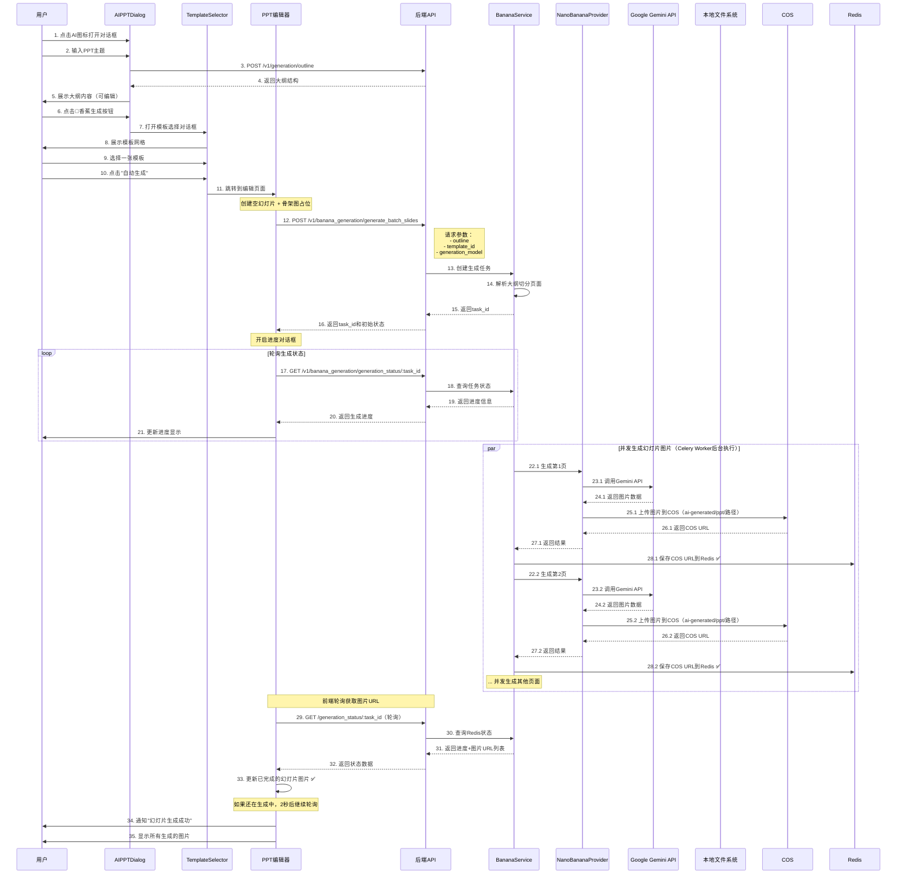

# Nano Banana Pro 文生图模型集成架构设计

## 文档说明

**版本**: v1.0  
**创建日期**: 2025-12-20  
**需求来源**: docs/requirement/需求文档v0.5.md  
**参考项目**: banana-slides (nano banana pro模型调用实现)

## 一、系统架构概览

### 1.1 整体架构图

```
┌─────────────────────────────────────────────────────────────────────────┐
│                              前端层 (Vue 3)                               │
├─────────────────────────────────────────────────────────────────────────┤
│                                                                           │
│  ┌──────────────────┐     ┌──────────────────┐    ┌──────────────────┐ │
│  │  AIPPTDialog.vue │────▶│ TemplateSelector │───▶│  ProgressDialog  │ │
│  │  (大纲生成界面)   │     │  (模板选择对话框) │    │  (生成进度显示)  │ │
│  └──────────────────┘     └──────────────────┘    └──────────────────┘ │
│                                    │                        │            │
│                                    ▼                        ▼            │
│  ┌──────────────────────────────────────────────────────────────────┐  │
│  │                    Editor/index.vue                               │  │
│  │                  (PPT编辑器主界面)                                │  │
│  │  ┌───────────┐  ┌──────────────┐  ┌──────────────────────────┐ │  │
│  │  │ Thumbnail │  │ Canvas       │  │ API调用 & 状态管理        │ │  │
│  │  │ 缩略图列表 │  │ 画布内容区   │  │ - slidesStore             │ │  │
│  │  └───────────┘  └──────────────┘  │ - apiService              │ │  │
│  │                                    │ - 轮询生成状态            │ │  │
│  │                                    └──────────────────────────┘ │  │
│  └──────────────────────────────────────────────────────────────────┘  │
│                                    │                                    │
└────────────────────────────────────┼────────────────────────────────────┘
                                     │ HTTP/API
┌────────────────────────────────────┼────────────────────────────────────┐
│                                    ▼                                    │
│                            API层 (FastAPI)                              │
├─────────────────────────────────────────────────────────────────────────┤
│  ┌──────────────────────────────────────────────────────────────────┐  │
│  │           /api/v1/banana_generation (新增端点组)                  │  │
│  │  POST /generate_batch_slides     - 批量生成幻灯片图片            │  │
│  │  GET  /generation_status/:id     - 查询生成状态                 │  │
│  │  POST /stop_generation/:id       - 停止生成任务                 │  │
│  │  POST /regenerate_slide          - 重新生成单页                 │  │
│  └──────────────────────────────────────────────────────────────────┘  │
│                                    │                                    │
│                                    ▼                                    │
│  ┌──────────────────────────────────────────────────────────────────┐  │
│  │              BananaGenerationService (新增服务)                   │  │
│  │  - 大纲解析和页面切分逻辑                                         │  │
│  │  - 批量图片生成任务管理                                           │  │
│  │  - 生成状态跟踪和进度更新                                         │  │
│  │  - 错误处理和失败重试                                             │  │
│  └──────────────────────────────────────────────────────────────────┘  │
│                                    │                                    │
│                                    ▼                                    │
│  ┌──────────────────────────────────────────────────────────────────┐  │
│  │          NanoBananaProvider (新增图片生成提供商)                  │  │
│  │  - 继承自 BaseImageProvider                                       │  │
│  │  - Google GenAI SDK 集成                                          │  │
│  │  - 参考图片(模板)支持                                             │  │
│  │  - 图片比例和分辨率配置                                           │  │
│  └──────────────────────────────────────────────────────────────────┘  │
│                                    │                                    │
└────────────────────────────────────┼────────────────────────────────────┘
                                     │
┌────────────────────────────────────┼────────────────────────────────────┐
│                                    ▼                                    │
│                           基础设施层                                    │
├─────────────────────────────────────────────────────────────────────────┤
│  ┌──────────────┐  ┌──────────────┐  ┌──────────────┐                 │
│  │  PostgreSQL  │  │    Redis     │  │ 腾讯云 COS   │                 │
│  │  数据存储    │  │ 任务状态/队列│  │ 图片存储     │                 │
│  └──────────────┘  └──────────────┘  └──────────────┘                 │
│  ┌──────────────┐  ┌──────────────┐  ┌──────────────┐                 │
│  │ Google GenAI │  │   MLflow     │  │ Celery Worker│                 │
│  │  API 服务    │  │ 追踪和日志   │  │ 异步任务执行 │                 │
│  └──────────────┘  └──────────────┘  └──────────────┘                 │
└─────────────────────────────────────────────────────────────────────────┘
```

### 1.2 核心设计原则

1. **MVP快速实现**：基于现有架构扩展，避免重复造轮子
2. **模块化设计**：新功能作为独立模块集成到现有系统
3. **异步任务处理**：基于 Celery 实现可靠的异步任务执行，支持分布式批量处理
4. **渐进式体验**：骨架图占位 → 逐页生成 → 实时更新
5. **错误容忍**：单页失败不影响其他页面，自动重试机制

## 二、核心流程设计

### 2.0 异步生成流程概览 ⭐

**核心机制：前端轮询 + Redis状态同步**

```
┌──────────────────────────────────────────────────────────────────┐
│                     完整的异步生成流程                            │
└──────────────────────────────────────────────────────────────────┘

第1步：前端发起请求
  POST /generate_batch_slides
  ↓
  立即返回 task_id（不等待生成完成）
  ↓
第2步：前端开始轮询
  每2秒调用 GET /generation_status/:task_id
  ↓
第3步：Celery Worker 后台生成
  ┌─────────────────────────────────────┐
  │ Worker 1: 生成第1页                 │
  │   ├─ 调用 Gemini API               │
  │   ├─ 上传图片到COS                 │
  │   └─ 保存COS URL到Redis ✅         │
  ├─────────────────────────────────────┤
  │ Worker 2: 生成第2页                 │
  │   ├─ 调用 Gemini API               │
  │   ├─ 上传图片到COS                 │
  │   └─ 保存COS URL到Redis ✅         │
  ├─────────────────────────────────────┤
  │ Worker 3-5: 并发生成其他页...       │
  └─────────────────────────────────────┘
  ↓
第4步：前端获取图片URL
  轮询返回：
  {
    "slides": [
      {"index": 0, "status": "completed", "image_url": "https://{bucket}.cos.{region}.myqcloud.com/ai-generated/ppt/task_abc/slide_0.png"},
      {"index": 1, "status": "completed", "image_url": "https://{bucket}.cos.{region}.myqcloud.com/ai-generated/ppt/task_abc/slide_1.png"},
      {"index": 2, "status": "processing", "image_url": null},
      ...
    ]
  }
  ↓
第5步：前端更新幻灯片
  遍历 slides 数组，对于 status=completed 的页面：
    updateSlideImage(slide.index, slide.image_url)
  ↓
  用户看到幻灯片从骨架图变成实际图片 ✨
  
注：图片直接从COS访问（CDN加速），无需经过后端服务
```

**关键数据流**：

```
Celery Worker              COS                      Redis                    前端
     │                      │                        │                        │
     │ 生成图片完成          │                        │                        │
     ├─────────────────────>│                        │                        │
     │ 上传到COS             │                        │                        │
     │<──────────────────────┤                        │                        │
     │ 返回COS URL           │                        │                        │
     ├───────────────────────────────────────────────>│                        │
     │ 保存 image_url 到Redis │                        │                        │
     │                      │                        │                        │
     │                      │                        │<───────────────────────┤
     │                      │                        │   轮询查询状态          │
     │                      │                        │                        │
     │                      │                        ├───────────────────────>│
     │                      │                        │   返回 image_url        │
     │                      │                        │                        │
     │                      │<──────────────────────────────────────────────────┤
     │                      │                        │                        │ 从COS加载图片
     │                      │                        │                        ├─> 更新幻灯片
```

### 2.1 用户交互流程图



### 2.2 详细功能流程

#### 2.2.1 大纲生成阶段（复用现有功能）

**位置**: `frontend/src/views/Editor/AIPPTDialog.vue` (步骤: setup → outline)

**流程**:
1. 用户输入 PPT 主题
2. 调用现有的大纲生成 API
3. 展示可编辑的大纲内容

**现有实现**: 已完成，无需修改

#### 2.2.2 模板选择功能（新增）

**位置**: 新增 `TemplateSelector` 组件

**UI设计**:
```
┌────────────────────────────────────────────────────┐
│  选择模板样式                                      [X]│
├────────────────────────────────────────────────────┤
│                                                     │
│  ┌────────┐  ┌────────┐  ┌────────┐  ┌────────┐  │
│  │ 模板1  │  │ 模板2  │  │ 模板3  │  │ 模板4  │  │
│  │  ☑️选中 │  │        │  │        │  │        │  │
│  └────────┘  └────────┘  └────────┘  └────────┘  │
│                                                     │
│  ┌────────┐  ┌────────┐  ┌────────┐  ┌────────┐  │
│  │ 模板5  │  │ 模板6  │  │  ...   │  │ 上传    │  │
│  │        │  │        │  │        │  │ 本地    │  │
│  └────────┘  └────────┘  └────────┘  └────────┘  │
│                                                     │
│                             ┌────────┐  ┌────────┐│
│                             │ 自动生成│  │ 取 消  ││
│                             └────────┘  └────────┘│
└────────────────────────────────────────────────────┘
```

**数据流**:
```typescript
// 模板数据结构
interface Template {
  id: string
  name: string
  cover: string  // 缩略图URL
  image_url: string  // 完整图片URL
  type: 'system' | 'user'
}

// 选择模板后的状态
{
  selectedTemplate: Template,
  outline: OutlineData
}
```

#### 2.2.3 批量图片生成流程（核心新增）

**API端点**: `POST /api/v1/banana_generation/generate_batch_slides`

**请求参数**:
```json
{
  "outline": {
    "title": "PPT主标题",
    "slides": [
      {
        "title": "页面1标题",
        "points": ["要点1", "要点2", "要点3"]
      },
      {
        "title": "页面2标题",
        "points": ["要点1", "要点2"]
      }
    ]
  },
  "template_id": "template_001",
  "generation_model": "gemini-3-pro-image-preview",
  "canvas_size": {
    "width": 1920,
    "height": 1080
  }
}
```

**响应数据**:
```json
{
  "success": true,
  "data": {
    "task_id": "task_uuid_xxx",
    "total_slides": 10,
    "status": "processing",
    "slides": [
      {
        "index": 0,
        "title": "页面1标题",
        "status": "pending",
        "image_url": null,
        "error": null
      }
    ]
  }
}
```

**后端处理逻辑**:
```python
# backend/app/services/generation/banana_generation_service.py

class BananaGenerationService:
    async def generate_batch_slides(
        self,
        outline: Dict[str, Any],
        template_id: str,
        generation_model: str,
        canvas_size: Dict[str, int]
    ) -> Dict[str, Any]:
        """
        批量生成幻灯片图片
        
        流程：
        1. 创建生成任务记录（PostgreSQL）
        2. 解析大纲结构，切分为页面列表
        3. 获取模板图片URL
        4. 提交 Celery 任务到队列
        5. 返回task_id供前端轮询
        """
        
        # 1. 创建任务记录
        task = await self.create_generation_task(outline, template_id)
        
        # 2. 解析大纲切分页面
        slides = self.parse_outline_to_slides(outline)
        
        # 3. 获取模板图片URL
        template_url = await self.get_template_url(template_id)
        
        # 4. 提交到 Celery 队列（异步执行）
        from app.services.tasks.banana_generation_tasks import generate_batch_slides_task
        
        celery_result = generate_batch_slides_task.apply_async(
            kwargs={
                "task_id": task.id,
                "slides": slides,
                "template_image_url": template_url,
                "generation_model": generation_model,
                "canvas_size": canvas_size
            },
            queue="banana"  # 使用专用队列
        )
        
        # 保存 Celery 任务ID
        await self.update_task_celery_id(task.id, celery_result.id)
        
        # 5. 返回任务信息
        return {
            "task_id": task.id,
            "celery_task_id": celery_result.id,
            "total_slides": len(slides),
            "status": "processing"
        }
```

#### 2.2.4 生成进度跟踪（轮询机制）⭐

**核心流程说明**：

由于采用 Celery 异步任务架构，前端发起生成请求后会立即收到 `task_id`，此时图片还未生成。前端需要通过**轮询机制**获取生成进度和图片URL。

**完整交互流程**：

```
┌─────────┐                 ┌─────────┐                 ┌────────────┐
│  前端   │                 │  后端   │                 │Celery Worker│
└────┬────┘                 └────┬────┘                 └─────┬──────┘
     │                           │                            │
     │ POST /generate_batch      │                            │
     ├──────────────────────────>│                            │
     │                           │ 提交任务到队列              │
     │                           ├───────────────────────────>│
     │ 返回 task_id              │                            │
     │<──────────────────────────┤                            │
     │                           │                            │
     │                           │                     开始生成第1页
     │                           │                            │
     │ GET /status/:task_id (轮询)│                           │
     ├──────────────────────────>│ 查询 Redis               │
     │                           ├──────┐                     │
     │                           │      │                     │
     │ 返回状态（0页完成）         │<─────┘                     │
     │<──────────────────────────┤                            │
     │                           │                     第1页完成，上传COS
     │ 等待2秒...                 │                            │
     │                           │                     更新Redis状态
     │                           │<───────────────────────────┤
     │                           │                            │
     │ GET /status/:task_id (轮询)│                           │
     ├──────────────────────────>│ 查询 Redis               │
     │                           ├──────┐                     │
     │ 返回状态（1页完成+URL）     │<─────┘                     │
     │<──────────────────────────┤                            │
     │                           │                            │
     │ 更新幻灯片图片              │                            │
     ├──────┐                    │                     继续生成其他页...
     │      │                    │                            │
     │<─────┘                    │                            │
     │                           │                            │
     │ 继续轮询...                │                            │
```

**API端点**: `GET /api/v1/banana_generation/generation_status/:task_id`

**响应数据**:
```json
{
  "success": true,
  "data": {
    "task_id": "task_uuid_xxx",
    "status": "processing",  // pending | processing | completed | failed
    "progress": {
      "total": 10,
      "completed": 3,
      "failed": 1,
      "pending": 6
    },
    "slides": [
      {
        "index": 0,
        "title": "页面1",
        "status": "completed",
        "image_path": "/api/v1/banana_generation/image/task_xxx/slide_0.png",  // ✅ 前端用这个路径访问图片
        "generation_time": 5.2,
        "error": null
      },
      {
        "index": 1,
        "title": "页面2",
        "status": "failed",
        "image_path": null,
        "error": "生成超时"
      },
      {
        "index": 2,
        "title": "页面3",
        "status": "processing",  // 正在生成中
        "image_path": null,
        "error": null
      },
      {
        "index": 3,
        "title": "页面4",
        "status": "pending",  // 还未开始
        "image_path": null,
        "error": null
      }
    ]
  }
}
```

**前端轮询逻辑**:
```typescript
// frontend/src/hooks/useBananaGeneration.ts

export function useBananaGeneration() {
  const pollGenerationStatus = async (taskId: string) => {
    try {
      // 1. 调用后端API查询状态
      const response = await apiService.getBananaGenerationStatus(taskId)
      const { status, slides, progress } = response.data
      
      // 2. 更新进度显示
      updateProgressUI(progress)  // 显示：已完成 3/10
      
      // 3. 遍历所有幻灯片，更新已完成的图片
      slides.forEach((slide: any) => {
        if (slide.status === 'completed' && slide.image_path) {
          // ✅ 关键步骤：用图片路径更新对应的幻灯片
          updateSlideImage(slide.index, slide.image_path)
          // 内部会调用：slidesStore.updateSlideImageFromUrl(index, path)
        }
        
        if (slide.status === 'failed') {
          // 标记失败的页面，显示错误提示
          markSlideFailed(slide.index, slide.error)
        }
      })
      
      // 4. 判断是否继续轮询
      if (status === 'processing') {
        // 还在生成中，2秒后继续轮询
        setTimeout(() => pollGenerationStatus(taskId), 2000)
      } else if (status === 'completed') {
        // 全部完成
        showSuccessNotification('幻灯片生成成功！')
        stopLoading()
      } else if (status === 'failed') {
        // 任务失败
        showErrorNotification('幻灯片生成失败')
        stopLoading()
      }
      
    } catch (error) {
      console.error('查询生成状态失败:', error)
      // 继续重试
      setTimeout(() => pollGenerationStatus(taskId), 2000)
    }
  }
  
  return { pollGenerationStatus }
}
```

**关键点说明**：

1. **轮询频率**：每2秒查询一次状态（可配置）
2. **渐进式更新**：每次轮询都检查所有页面，只要有新完成的就立即更新
3. **图片存储方式**：
   - Celery Worker 生成图片后上传到腾讯云 COS
   - 使用独立路径前缀 `ai-generated/ppt/` 与普通上传图片区分
   - 将 COS URL 保存到 Redis
   - 前端直接从 COS 加载图片（CDN加速）
   - COS路径示例：`ai-generated/ppt/task_abc/slide_0.png`
   - COS URL示例：`https://{bucket}.cos.{region}.myqcloud.com/ai-generated/ppt/task_abc/slide_0.png`
   - **关键优势**：`ai-generated/ppt/` 路径可被 metainsight 搜索排除，不会检索到这些生成图片
4. **停止条件**：
   - `status === 'completed'`: 所有页面生成完成
   - `status === 'failed'`: 任务失败（但部分页面可能已完成）
   - 用户主动停止

## 三、数据结构设计

### 3.1 大纲数据结构

```typescript
// frontend/src/types/banana-generation.ts

/**
 * PPT大纲结构
 */
export interface OutlineData {
  title: string  // PPT主标题
  slides: SlideOutline[]
}

/**
 * 单页大纲
 */
export interface SlideOutline {
  title: string  // 页面标题
  points: string[]  // 要点列表
}
```

### 3.2 生成任务数据结构

**数据库表**: `banana_generation_tasks`（在 `docker/database/init-scripts/05_banana_generation_tables.sql` 中定义）

**Python 模型文件**: `backend/app/models/banana_generation_task.py` (新增)

```python
# backend/app/models/banana_generation_task.py (新增)

from sqlalchemy import Column, String, Integer, Text, Boolean
from sqlalchemy.dialects.postgresql import JSONB, ENUM, TIMESTAMP
from app.db.database import Base
from datetime import datetime
import enum

class TaskStatus(str, enum.Enum):
    """任务状态枚举（对应数据库中的 banana_task_status 枚举类型）"""
    PENDING = "pending"
    PROCESSING = "processing"
    COMPLETED = "completed"
    FAILED = "failed"
    CANCELLED = "cancelled"

class BananaGenerationTask(Base):
    """
    Banana生成任务模型
    
    对应数据库表：banana_generation_tasks
    SQL脚本：docker/database/init-scripts/05_banana_generation_tables.sql
    """
    __tablename__ = "banana_generation_tasks"
    
    # 主键
    id = Column(String(50), primary_key=True)
    
    # 用户信息
    user_id = Column(String(36), nullable=True)
    
    # 任务配置
    outline = Column(JSONB, nullable=False)  # 大纲数据
    template_id = Column(String(50), nullable=False)  # 模板ID
    template_image_url = Column(Text, nullable=True)  # 模板图片URL（COS或本地）
    generation_model = Column(String(100), nullable=False)  # 生成模型名称
    canvas_size = Column(JSONB, nullable=False)  # 画布尺寸
    
    # 任务状态（使用数据库中定义的枚举类型）
    status = Column(
        ENUM('pending', 'processing', 'completed', 'failed', 'cancelled', 
             name='banana_task_status', create_type=False),
        nullable=False,
        server_default='pending'
    )
    
    # 进度信息
    total_slides = Column(Integer, nullable=False, server_default='0')
    completed_slides = Column(Integer, nullable=False, server_default='0')
    failed_slides = Column(Integer, nullable=False, server_default='0')
    
    # 生成结果
    slides_data = Column(JSONB, nullable=True)  # 每页生成结果
    
    # 错误信息
    error_message = Column(Text, nullable=True)
    
    # Celery任务信息
    celery_task_id = Column(String(100), nullable=True)  # Celery任务ID
    celery_group_id = Column(String(100), nullable=True)  # Celery任务组ID
    
    # 时间戳（数据库触发器自动更新 updated_at）
    created_at = Column(TIMESTAMP(timezone=True), nullable=False, server_default='CURRENT_TIMESTAMP')
    updated_at = Column(TIMESTAMP(timezone=True), nullable=False, server_default='CURRENT_TIMESTAMP')
    started_at = Column(TIMESTAMP(timezone=True), nullable=True)
    completed_at = Column(TIMESTAMP(timezone=True), nullable=True)


class BananaTemplate(Base):
    """
    Banana模板模型
    
    对应数据库表：banana_templates
    SQL脚本：docker/database/init-scripts/05_banana_generation_tables.sql
    """
    __tablename__ = "banana_templates"
    
    # 主键
    id = Column(String(50), primary_key=True)
    name = Column(String(255), nullable=False)
    description = Column(Text, nullable=True)
    
    # 图片信息
    cover_url = Column(Text, nullable=False)  # 缩略图URL
    full_image_url = Column(Text, nullable=False)  # 完整图片URL
    
    # 模板配置
    type = Column(String(20), nullable=False, server_default='system')  # system | user
    aspect_ratio = Column(String(10), nullable=False, server_default='16:9')
    
    # 用户信息
    user_id = Column(String(36), nullable=True)
    
    # 使用统计
    usage_count = Column(Integer, nullable=False, server_default='0')
    
    # 状态
    is_active = Column(Boolean, nullable=False, server_default='true')
    
    # 时间戳
    created_at = Column(TIMESTAMP(timezone=True), nullable=False, server_default='CURRENT_TIMESTAMP')
    updated_at = Column(TIMESTAMP(timezone=True), nullable=False, server_default='CURRENT_TIMESTAMP')
```

**重要说明**：
1. **数据库优先**：表结构在 SQL 脚本中定义，Python 模型需要与之保持一致
2. **枚举类型**：使用 `create_type=False` 避免 SQLAlchemy 尝试创建已存在的枚举类型
3. **时间戳**：使用 `server_default` 让数据库处理默认值和触发器更新
4. **JSONB vs JSON**：PostgreSQL 推荐使用 JSONB 以获得更好的性能

### 3.3 单页生成结果结构

```python
# 存储在 slides_data 字段中的JSON结构

{
    "slides": [
        {
            "index": 0,
            "title": "页面标题",
            "status": "completed",  # pending | processing | completed | failed
            "image_url": "https://cos.xxx.com/image.png",
            "cos_key": "banana_gen/task_xxx/slide_0.png",
            "prompt": "生成图片使用的提示词",
            "generation_time": 5.2,  # 生成耗时（秒）
            "error": null,
            "created_at": "2025-12-20T10:30:00Z"
        }
    ]
}
```

### 3.4 模板数据结构

```typescript
// frontend/src/types/template.ts

export interface BananaTemplate {
  id: string
  name: string
  description?: string
  cover_url: string  // 缩略图URL
  full_image_url: string  // 完整图片URL（用于生成参考）
  type: 'system' | 'user'  // 系统模板 | 用户上传模板
  aspect_ratio: '16:9' | '4:3'
  created_at: string
}
```

## 四、API接口设计

### 4.1 批量生成幻灯片图片

**端点**: `POST /api/v1/banana_generation/generate_batch_slides`

**请求体**:
```json
{
  "outline": {
    "title": "PPT主标题",
    "slides": [
      {
        "title": "页面1标题",
        "points": ["要点1", "要点2"]
      }
    ]
  },
  "template_id": "template_001",
  "generation_model": "gemini-3-pro-image-preview",
  "canvas_size": {
    "width": 1920,
    "height": 1080
  }
}
```

**响应**:
```json
{
  "success": true,
  "data": {
    "task_id": "uuid",
    "total_slides": 10,
    "status": "processing"
  },
  "error": null,
  "timestamp": "2025-12-20T10:30:00Z",
  "request_id": "req_xxx"
}
```

### 4.2 查询生成状态

**端点**: `GET /api/v1/banana_generation/generation_status/{task_id}`

**查询参数**: 无

**响应**: 见 2.2.4 节

### 4.3 停止生成任务

**端点**: `POST /api/v1/banana_generation/stop_generation/{task_id}`

**响应**:
```json
{
  "success": true,
  "data": {
    "task_id": "uuid",
    "status": "stopped",
    "completed_slides": 3,
    "total_slides": 10
  }
}
```

### 4.6 COS 路径设计 ⭐

**说明**: 生成的 PPT 图片使用独立的 COS 路径前缀，与普通上传图片区分

**路径结构**:
```
普通上传图片：    images/{uuid}.{ext}
PPT生成图片：     ai-generated/ppt/{task_id}/slide_{index}.png
```

**路径示例**:
```
ai-generated/ppt/task_abc/slide_0.png
ai-generated/ppt/task_abc/slide_1.png
ai-generated/ppt/task_abc/slide_2.png
...
```

**完整 COS URL**:
```
https://{bucket}.cos.{region}.myqcloud.com/ai-generated/ppt/task_abc/slide_0.png
```

**设计优势**:
1. **路径隔离**：`ai-generated/ppt/` 前缀明确标识 AI 生成内容
2. **搜索排除**：metainsight 搜索可配置排除 `ai-generated/` 路径
3. **组织清晰**：按 task_id 分组，便于管理和清理
4. **未来扩展**：可添加 `ai-generated/avatar/`、`ai-generated/logo/` 等其他 AI 生成类型

### 4.4 重新生成单页

**端点**: `POST /api/v1/banana_generation/regenerate_slide`

**请求体**:
```json
{
  "task_id": "uuid",
  "slide_index": 5
}
```

**响应**:
```json
{
  "success": true,
  "data": {
    "slide_index": 5,
    "status": "processing"
  }
}
```

### 4.5 获取模板列表

**端点**: `GET /api/v1/banana_generation/templates`

**响应**:
```json
{
  "success": true,
  "data": {
    "templates": [
      {
        "id": "template_001",
        "name": "学术报告风格",
        "cover_url": "/api/v1/templates/001_cover.jpg",
        "full_image_url": "/api/v1/templates/001_full.png",
        "type": "system",
        "aspect_ratio": "16:9"
      }
    ]
  }
}
```

## 五、Nano Banana Pro 模型集成

### 5.1 Provider 实现

**文件**: `backend/app/core/image_generation/providers/nano_banana.py` (新增)

```python
"""
Nano Banana Pro (Gemini 3 Pro Image Preview) 图片生成提供商
基于 Google GenAI SDK 实现
"""

from typing import Optional, List
from PIL import Image
from google import genai
from google.genai import types

from app.core.image_generation.base import BaseImageProvider, ImageGenerationResult
from app.core.log_utils import get_logger

logger = get_logger(__name__)


class NanoBananaProvider(BaseImageProvider):
    """Nano Banana Pro 图片生成提供商"""
    
    # 支持的模型
    SUPPORTED_MODELS = [
        "gemini-3-pro-image-preview",
        "google/gemini-3-pro-image-preview",
        "nano-banana-pro"
    ]
    
    # 支持的比例
    SUPPORTED_ASPECT_RATIOS = ["16:9", "9:16", "1:1", "4:3", "3:4"]
    
    # 支持的分辨率
    SUPPORTED_RESOLUTIONS = ["1K", "2K", "4K"]
    
    def __init__(self, model_config):
        """
        初始化Nano Banana提供商
        
        Args:
            model_config: AI模型配置对象
                - api_key: Google API密钥
                - api_base: API基础URL（可选，用于代理）
                - name: 模型名称
        """
        super().__init__(model_config)
        
        # 初始化Google GenAI客户端
        http_options = None
        if hasattr(model_config, 'api_base') and model_config.api_base:
            http_options = types.HttpOptions(base_url=model_config.api_base)
        
        self.client = genai.Client(
            api_key=model_config.api_key,
            http_options=http_options
        )
        
        # 模型名称（使用配置中的名称或默认值）
        self.model = getattr(model_config, 'name', 'gemini-3-pro-image-preview')
        
        logger.info("NanoBananaProvider初始化成功", extra={
            "model": self.model,
            "has_api_base": bool(http_options)
        })
    
    async def _generate_image_internal(
        self,
        prompt: str,
        size: Optional[str] = None,
        quality: Optional[str] = None,
        **kwargs
    ) -> ImageGenerationResult:
        """
        生成图片（内部实现）
        
        Args:
            prompt: 图片生成提示词
            size: 图片尺寸（格式：宽x高，如 "1920x1080"）
            quality: 图片质量（暂不支持，保留参数用于接口统一）
            **kwargs: 额外参数
                - ref_images: List[Image.Image] 参考图片列表（如模板图）
                - aspect_ratio: str 图片比例（如 "16:9"）
                - resolution: str 分辨率（如 "2K"）
        
        Returns:
            ImageGenerationResult: 生成结果
        """
        try:
            # 解析参数
            ref_images = kwargs.get('ref_images', [])
            aspect_ratio = kwargs.get('aspect_ratio', '16:9')
            resolution = kwargs.get('resolution', '2K')
            
            # 从size参数推导aspect_ratio（如果未提供）
            if size and not kwargs.get('aspect_ratio'):
                aspect_ratio = self._size_to_aspect_ratio(size)
            
            # 构建生成内容
            contents = []
            
            # 添加参考图片（模板图）
            if ref_images:
                for ref_img in ref_images:
                    if isinstance(ref_img, Image.Image):
                        contents.append(ref_img)
                    else:
                        logger.warning("跳过无效的参考图片类型", extra={
                            "type": type(ref_img).__name__
                        })
            
            # 添加文本提示词
            contents.append(prompt)
            
            logger.info("调用Gemini API生成图片", extra={
                "model": self.model,
                "prompt_length": len(prompt),
                "ref_images_count": len(ref_images),
                "aspect_ratio": aspect_ratio,
                "resolution": resolution
            })
            
            # 调用Google GenAI API
            response = self.client.models.generate_content(
                model=self.model,
                contents=contents,
                config=types.GenerateContentConfig(
                    response_modalities=['TEXT', 'IMAGE'],
                    image_config=types.ImageConfig(
                        aspect_ratio=aspect_ratio,
                        image_size=resolution
                    ),
                )
            )
            
            logger.debug("Gemini API响应完成", extra={
                "parts_count": len(response.parts) if response.parts else 0
            })
            
            # 提取图片
            for i, part in enumerate(response.parts):
                if part.text is not None:
                    logger.debug(f"响应部分 {i}: 文本", extra={
                        "text_preview": part.text[:100] if len(part.text) > 100 else part.text
                    })
                else:
                    try:
                        image = part.as_image()
                        if image:
                            logger.info("成功提取图片", extra={
                                "part_index": i,
                                "image_size": image.size
                            })
                            
                            # 图片将在上层服务中上传到COS
                            # 这里返回PIL Image对象，由ImageGenerationResult处理
                            return ImageGenerationResult(
                                success=True,
                                image_url=None,  # 上层会处理上传
                                metadata={
                                    "provider": "nano_banana",
                                    "model": self.model,
                                    "aspect_ratio": aspect_ratio,
                                    "resolution": resolution,
                                    "prompt_length": len(prompt),
                                    "image_size": image.size,
                                    "pil_image": image  # 传递PIL对象
                                }
                            )
                    except Exception as e:
                        logger.debug(f"响应部分 {i}: 无法提取图片", extra={
                            "error": str(e)
                        })
            
            # 未找到图片
            error_msg = "API响应中未找到图片数据"
            if response.parts:
                error_msg += f"，响应包含 {len(response.parts)} 个部分但都不是图片"
            
            logger.warning("图片生成失败", extra={"reason": error_msg})
            
            return ImageGenerationResult(
                success=False,
                error_message=error_msg,
                metadata={
                    "provider": "nano_banana",
                    "model": self.model
                }
            )
            
        except Exception as e:
            error_msg = f"Nano Banana图片生成异常: {type(e).__name__}: {str(e)}"
            logger.error(error_msg, exc_info=True)
            
            return ImageGenerationResult(
                success=False,
                error_message=error_msg,
                metadata={
                    "provider": "nano_banana",
                    "model": self.model
                }
            )
    
    def _size_to_aspect_ratio(self, size: str) -> str:
        """
        从尺寸字符串推导比例
        
        Args:
            size: 尺寸字符串，如 "1920x1080"
        
        Returns:
            比例字符串，如 "16:9"
        """
        try:
            parts = size.lower().split('x')
            if len(parts) == 2:
                width = int(parts[0])
                height = int(parts[1])
                
                # 常见比例映射
                if width / height == 16 / 9:
                    return "16:9"
                elif width / height == 9 / 16:
                    return "9:16"
                elif width == height:
                    return "1:1"
                elif width / height == 4 / 3:
                    return "4:3"
                elif width / height == 3 / 4:
                    return "3:4"
        except:
            pass
        
        # 默认返回16:9
        return "16:9"
    
    def supports_model(self, model_name: str) -> bool:
        """检查是否支持指定模型"""
        return model_name.lower() in [m.lower() for m in self.SUPPORTED_MODELS]
    
    def get_supported_models(self) -> List[str]:
        """获取支持的模型列表"""
        return self.SUPPORTED_MODELS.copy()
    
    def get_supported_sizes(self) -> List[str]:
        """获取支持的图片尺寸列表"""
        # Nano Banana通过aspect_ratio控制，这里返回常见尺寸供参考
        return [
            "1920x1080",  # 16:9 - 2K
            "1080x1920",  # 9:16
            "1024x1024",  # 1:1
            "1600x1200",  # 4:3
            "1200x1600",  # 3:4
            "3840x2160",  # 16:9 - 4K
        ]
    
    def get_supported_qualities(self) -> List[str]:
        """获取支持的图片质量列表"""
        # Nano Banana通过resolution控制
        return self.SUPPORTED_RESOLUTIONS.copy()
```

### 5.2 工厂函数更新

**文件**: `backend/app/core/image_generation/factory.py`

```python
# 在工厂函数中注册新提供商

from app.core.image_generation.providers.nano_banana import NanoBananaProvider

def create_image_provider(model_config) -> Optional[BaseImageProvider]:
    """
    根据模型配置创建图片生成提供商
    
    Args:
        model_config: AI模型配置对象
    
    Returns:
        BaseImageProvider: 图片生成提供商实例
    """
    provider_type = getattr(model_config, 'provider_type', '').lower()
    model_name = getattr(model_config, 'name', '').lower()
    
    # Nano Banana Provider
    if provider_type == 'nano_banana' or 'gemini-3-pro-image' in model_name or 'nano-banana' in model_name:
        return NanoBananaProvider(model_config)
    
    # ... 其他提供商
    
    return None
```

### 5.3 提示词生成

**文件**: `backend/app/prompts/presentation/banana_image_generation.yml` (新增)

```yaml
# Nano Banana Pro图片生成提示词模板

version: "1.0"
name: "banana_image_generation"
description: "为PPT页面生成图片的提示词模板"

# 主提示词模板
template: |
  你是一位专家级UI/UX演示设计师，专注于生成设计良好的PPT页面。
  
  当前PPT页面的信息如下：
  <page_info>
  页面标题：{title}
  
  页面要点：
  {points}
  </page_info>
  
  <ppt_context>
  PPT整体主题：{ppt_title}
  当前页面位置：第 {page_index} 页 / 共 {total_pages} 页
  </ppt_context>
  
  <design_guidelines>
  - 画面要求：4K分辨率，16:9比例，文字清晰锐利
  - 风格要求：配色和设计语言与提供的模板图片保持严格一致
  - 内容要求：根据页面标题和要点设计最佳构图，不重不漏地渲染所有文本内容
  - 文字要求：避免出现markdown格式符号（如 # 和 * 等）
  - 参考说明：只参考模板的风格设计，禁止出现模板中的文字内容
  - 美化要求：使用适当的装饰性图形或插画填补空白位置
  </design_guidelines>
  
  <output_requirements>
  - 输出一张完整的PPT页面图片
  - 图片中必须包含页面标题和所有要点
  - 文字布局清晰，层次分明
  - 整体风格与模板保持一致
  </output_requirements>

# 参数说明
parameters:
  - name: title
    type: string
    required: true
    description: "PPT页面标题"
  
  - name: points
    type: string
    required: true
    description: "页面要点列表（已格式化为字符串）"
  
  - name: ppt_title
    type: string
    required: true
    description: "PPT整体主题/标题"
  
  - name: page_index
    type: integer
    required: true
    description: "当前页面序号（从1开始）"
  
  - name: total_pages
    type: integer
    required: true
    description: "PPT总页数"

# 示例
examples:
  - input:
      title: "人工智能的发展历程"
      points: |
        - 1950年：图灵测试提出
        - 1956年：人工智能概念诞生
        - 1997年：深蓝击败国际象棋冠军
        - 2016年：AlphaGo战胜围棋冠军
      ppt_title: "AI技术简史"
      page_index: 2
      total_pages: 10
```

**提示词生成服务**:

```python
# backend/app/services/generation/banana_prompt_service.py (新增)

from typing import Dict, Any
from app.prompts.utils import load_prompt_template

class BananaPromptService:
    """Banana图片生成提示词服务"""
    
    def __init__(self):
        self.template = load_prompt_template('presentation/banana_image_generation.yml')
    
    def generate_slide_prompt(
        self,
        title: str,
        points: list[str],
        ppt_title: str,
        page_index: int,
        total_pages: int
    ) -> str:
        """
        生成单页幻灯片的图片生成提示词
        
        Args:
            title: 页面标题
            points: 页面要点列表
            ppt_title: PPT整体标题
            page_index: 当前页面序号（从1开始）
            total_pages: PPT总页数
        
        Returns:
            str: 格式化后的提示词
        """
        # 格式化要点列表
        points_str = "\n".join([f"- {point}" for point in points])
        
        # 使用模板生成提示词
        prompt = self.template.format(
            title=title,
            points=points_str,
            ppt_title=ppt_title,
            page_index=page_index,
            total_pages=total_pages
        )
        
        return prompt
```

## 六、异步任务实现（Celery）

### 6.1 任务设计架构

**选择 Celery 的理由**：
1. ✅ 项目已集成 Celery 基础设施，可直接复用
2. ✅ 支持分布式执行和任务持久化
3. ✅ 内置重试机制和任务监控
4. ✅ 适合长时间运行的图片生成任务

**任务分层设计**：
```
┌─────────────────────────────────────────┐
│        API 层 (FastAPI)                  │
│  - 接收请求，创建任务记录                 │
│  - 提交 Celery 任务到队列                │
│  - 立即返回 task_id                      │
└──────────────┬──────────────────────────┘
               │ apply_async()
┌──────────────▼──────────────────────────┐
│     Celery Task 协调层                   │
│  generate_batch_slides_task              │
│  - 创建并发任务组                        │
│  - 分发到多个 worker                     │
└──────────────┬──────────────────────────┘
               │ group()
┌──────────────▼──────────────────────────┐
│     Celery Task 执行层                   │
│  generate_single_slide_task (多个并发)   │
│  - 调用 NanoBananaProvider 生成图片      │
│  - 上传图片到 COS                        │
│  - 更新任务状态（Redis）                 │
│  - 自动重试（失败时）                    │
└─────────────────────────────────────────┘
```

### 6.2 Celery 任务实现

**文件**: `backend/app/services/tasks/banana_generation_tasks.py` (新增)

```python
"""
Banana 生成 Celery 任务
实现幻灯片图片的异步生成
"""

from celery import group
from app.services.tasks.celery_app import celery_app
from app.core.log_utils import get_logger

logger = get_logger(__name__)


@celery_app.task(
    bind=True,
    max_retries=3,
    retry_backoff=True,
    time_limit=180,  # 3分钟硬超时
    soft_time_limit=150,  # 2.5分钟软超时
    queue="banana"
)
def generate_single_slide_task(
    self,
    task_id: str,
    slide_index: int,
    slide_data: dict,
    template_image_url: str,
    generation_model: str,
    canvas_size: dict
):
    """
    生成单张幻灯片图片的 Celery 任务
    
    Args:
        self: Celery task 实例（bind=True时注入）
        task_id: 生成任务ID
        slide_index: 幻灯片索引
        slide_data: 幻灯片数据（标题和要点）
        template_image_url: 模板图片URL
        generation_model: 生成模型名称
        canvas_size: 画布尺寸 {"width": 1920, "height": 1080}
    
    Returns:
        Dict: 生成结果
        
    Raises:
        Retry: 任务失败时自动重试
    """
    try:
        logger.info("开始生成幻灯片", extra={
            "task_id": task_id,
            "slide_index": slide_index,
            "celery_task_id": self.request.id
        })
        
        # 导入服务（在 worker 中执行）
        from app.services.generation.banana_slide_generator import BananaSlideGenerator
        
        generator = BananaSlideGenerator()
        
        # 更新状态为处理中
        generator.update_slide_status(task_id, slide_index, "processing")
        
        # 生成图片
        result = generator.generate_single_slide(
            slide_index=slide_index,
            slide_data=slide_data,
            template_image_url=template_image_url,
            generation_model=generation_model,
            canvas_size=canvas_size
        )
        
        # 上传图片到腾讯云 COS（使用独立路径前缀）
        image_url = await generator.upload_image_to_cos(
            task_id=task_id,
            slide_index=slide_index,
            image=result["pil_image"]
        )
        # 返回示例 COS URL: https://{bucket}.cos.{region}.myqcloud.com/ai-generated/ppt/task_abc/slide_0.png
        # 路径结构: ai-generated/ppt/{task_id}/slide_{index}.png
        # 注意：使用 ai-generated/ppt/ 前缀与用户上传图片区分，便于 metainsight 搜索时排除
        
        # 保存结果到 Redis
        generator.save_slide_result(task_id, slide_index, {
            "status": "completed",
            "image_url": image_url,  # COS 图片URL
            "generation_time": result["generation_time"]
        })
        
        logger.info("幻灯片生成成功", extra={
            "task_id": task_id,
            "slide_index": slide_index,
            "image_path": image_path
        })
        
        return {
            "slide_index": slide_index,
            "status": "completed",
            "image_path": image_path
        }
        
    except Exception as exc:
        logger.error("幻灯片生成失败", extra={
            "task_id": task_id,
            "slide_index": slide_index,
            "error": str(exc),
            "retry_count": self.request.retries
        })
        
        # 重试逻辑
        if self.request.retries < self.max_retries:
            # 指数退避：5秒、10秒、20秒
            countdown = 5 * (2 ** self.request.retries)
            raise self.retry(exc=exc, countdown=countdown)
        else:
            # 达到最大重试次数，标记为失败
            from app.services.generation.banana_slide_generator import BananaSlideGenerator
            generator = BananaSlideGenerator()
            
            generator.save_slide_result(task_id, slide_index, {
                "status": "failed",
                "error": str(exc),
                "retry_count": self.request.retries
            })
            
            return {
                "slide_index": slide_index,
                "status": "failed",
                "error": str(exc)
            }


@celery_app.task(queue="banana")
def generate_batch_slides_task(
    task_id: str,
    slides: list,
    template_image_url: str,
    generation_model: str,
    canvas_size: dict
):
    """
    批量生成幻灯片图片的协调任务
    
    创建并发任务组，分发到多个 worker 执行
    
    Args:
        task_id: 生成任务ID
        slides: 幻灯片列表
        template_image_url: 模板图片URL
        generation_model: 生成模型名称
        canvas_size: 画布尺寸
    
    Returns:
        Dict: 任务组信息
    """
    logger.info("开始批量生成任务", extra={
        "task_id": task_id,
        "total_slides": len(slides)
    })
    
    # 创建并发任务组
    job = group(
        generate_single_slide_task.s(
            task_id=task_id,
            slide_index=i,
            slide_data=slide,
            template_image_url=template_image_url,
            generation_model=generation_model,
            canvas_size=canvas_size
        )
        for i, slide in enumerate(slides)
    )
    
    # 异步执行所有任务
    result = job.apply_async()
    
    logger.info("批量任务已提交", extra={
        "task_id": task_id,
        "celery_group_id": result.id,
        "total_slides": len(slides)
    })
    
    return {
        "task_id": task_id,
        "celery_group_id": result.id,
        "total_slides": len(slides),
        "status": "submitted"
    }
```

### 6.3 Celery 配置更新

**文件**: `backend/app/services/tasks/celery_app.py` (更新)

```python
# 在现有配置基础上添加

celery_app.conf.update(
    # ... 现有配置
    
    # 添加 banana 队列路由
    task_routes={
        # ... 现有路由
        "app.services.tasks.banana_generation_tasks.generate_single_slide_task": {"queue": "banana"},
        "app.services.tasks.banana_generation_tasks.generate_batch_slides_task": {"queue": "banana"},
    },
    
    # 添加 banana 队列
    task_queues=(
        # ... 现有队列
        Queue("banana", routing_key="banana"),
    ),
)
```

### 6.4 Worker 启动配置

**启动 Banana 专用 Worker**：

```bash
# 开发环境
celery -A app.services.tasks worker -Q banana -c 5 --loglevel=info

# 生产环境（使用 systemd 或 supervisor 管理）
celery -A app.services.tasks worker \
    -Q banana \
    -c 5 \
    --max-tasks-per-child=100 \
    --time-limit=300 \
    --soft-time-limit=240 \
    --loglevel=warning
```

**参数说明**：
- `-Q banana`: 只处理 banana 队列的任务
- `-c 5`: 5个并发worker进程
- `--max-tasks-per-child=100`: 每个worker最多执行100个任务后重启（防止内存泄漏）
- `--time-limit=300`: 硬超时5分钟
- `--soft-time-limit=240`: 软超时4分钟

### 6.5 任务状态管理（Redis）⭐ 前端轮询的数据源

**Redis 存储设计**：

这是前端轮询获取图片URL的关键！Celery Worker 在生成图片后，会将图片URL保存到 Redis，前端轮询时从这里读取。

```python
# Redis Key 设计
f"banana:task:{task_id}:progress"              # 任务总进度（聚合数据）
f"banana:task:{task_id}:slide:{slide_index}"   # 单页详细状态

# 单页状态数据结构
{
    "index": 0,
    "status": "completed",
    "image_url": "https://{bucket}.cos.{region}.myqcloud.com/ai-generated/ppt/task_abc/slide_0.png",  # ✅ COS图片URL
    "cos_path": "ai-generated/ppt/task_abc/slide_0.png",  # COS存储路径（ai-generated/ppt/前缀用于区分普通上传）
    "generation_time": 8.5,
    "updated_at": "2025-12-20T10:30:00Z"
}

# 任务总进度数据结构（前端轮询返回）
{
    "task_id": "task_abc",
    "status": "processing",  # pending | processing | completed | failed
    "total": 10,
    "completed": 3,
    "failed": 1,
    "pending": 6,
    "slides": [
        {
            "index": 0,
            "status": "completed",
            "image_url": "https://{bucket}.cos.{region}.myqcloud.com/ai-generated/ppt/task_abc/slide_0.png",
            "generation_time": 8.5
        },
        {
            "index": 1,
            "status": "completed",
            "image_url": "https://{bucket}.cos.{region}.myqcloud.com/ai-generated/ppt/task_abc/slide_1.png",
            "generation_time": 6.3
        },
        {
            "index": 2,
            "status": "processing",
            "image_url": null
        },
        // ...
    ]
}
```

**状态更新服务**（由 Celery Worker 调用）：

```python
# backend/app/services/generation/banana_task_manager.py (新增)

import json
from datetime import datetime
from typing import Dict, Optional
from app.core.log_utils import get_logger

logger = get_logger(__name__)


class BananaTaskManager:
    """
    Banana任务状态管理器
    
    职责：
    1. Celery Worker 生成图片后，保存图片URL到Redis
    2. 前端轮询时，聚合所有页面状态返回
    """
    
    def __init__(self, redis_client):
        self.redis = redis_client
    
    async def update_slide_status(
        self,
        task_id: str,
        slide_index: int,
        status: str,
        image_url: Optional[str] = None,
        **kwargs
    ):
        """
        更新单页状态（由 Celery Worker 调用）
        
        Args:
            task_id: 任务ID
            slide_index: 幻灯片索引
            status: 状态 (pending | processing | completed | failed)
            image_url: COS图片URL（生成完成后传入）✅
            **kwargs: 其他信息（generation_time, cos_path, error等）
        """
        key = f"banana:task:{task_id}:slide:{slide_index}"
        
        data = {
            "index": slide_index,
            "status": status,
            "image_url": image_url,  # ✅ 保存COS图片URL
            "updated_at": datetime.utcnow().isoformat(),
            **kwargs
        }
        
        # 保存到 Redis（1小时过期）
        await self.redis.set(
            key,
            json.dumps(data),
            expire=3600
        )
        
        logger.info("更新幻灯片状态", extra={
            "task_id": task_id,
            "slide_index": slide_index,
            "status": status,
            "has_image_url": bool(image_url)
        })
        
        # 更新任务总进度
        await self._update_task_progress(task_id)
    
    async def _update_task_progress(self, task_id: str):
        """
        更新任务总进度（聚合所有页面状态）
        """
        # 从 PostgreSQL 获取任务信息（总页数等）
        from app.repositories.banana_generation import BananaGenerationRepository
        repo = BananaGenerationRepository(db)
        task = await repo.get_task(task_id)
        
        if not task:
            return
        
        total_slides = task.total_slides
        
        # 查询所有幻灯片的状态
        slides_data = []
        completed_count = 0
        failed_count = 0
        processing_count = 0
        
        for i in range(total_slides):
            key = f"banana:task:{task_id}:slide:{i}"
            slide_data_str = await self.redis.get(key)
            
            if slide_data_str:
                slide_data = json.loads(slide_data_str)
                slides_data.append(slide_data)
                
                if slide_data["status"] == "completed":
                    completed_count += 1
                elif slide_data["status"] == "failed":
                    failed_count += 1
                elif slide_data["status"] == "processing":
                    processing_count += 1
            else:
                # 还未开始的页面
                slides_data.append({
                    "index": i,
                    "status": "pending",
                    "image_url": None
                })
        
        # 判断总任务状态
        if completed_count + failed_count == total_slides:
            overall_status = "completed"  # 全部完成（包括失败的）
        elif processing_count > 0 or completed_count > 0:
            overall_status = "processing"  # 有页面正在处理或已完成
        else:
            overall_status = "pending"  # 都还没开始
        
        # 保存总进度
        progress_key = f"banana:task:{task_id}:progress"
        progress_data = {
            "task_id": task_id,
            "status": overall_status,
            "total": total_slides,
            "completed": completed_count,
            "failed": failed_count,
            "pending": total_slides - completed_count - failed_count - processing_count,
            "slides": slides_data,  # ✅ 包含所有页面的状态和COS图片URL
            "updated_at": datetime.utcnow().isoformat()
        }
        
        await self.redis.set(
            progress_key,
            json.dumps(progress_data),
            expire=3600
        )
    
    async def get_task_progress(self, task_id: str) -> Optional[Dict]:
        """
        获取任务进度（前端轮询时调用）
        
        Returns:
            包含所有页面状态和COS图片URL的字典
        """
        key = f"banana:task:{task_id}:progress"
        data = await self.redis.get(key)
        
        if data:
            return json.loads(data)
        else:
            # 如果 Redis 中没有，返回初始状态
            return {
                "task_id": task_id,
                "status": "pending",
                "total": 0,
                "completed": 0,
                "failed": 0,
                "pending": 0,
                "slides": []
            }
```

**Celery Worker 中的使用**：

```python
# 在 generate_single_slide_task 中

@celery_app.task
def generate_single_slide_task(task_id, slide_index, ...):
    try:
        # 1. 更新状态为处理中
        task_manager.update_slide_status(
            task_id, slide_index, "processing"
        )
        
        # 2. 生成图片
        image = generate_image(...)
        
        # 3. 上传到腾讯云 COS（使用独立路径前缀）
        cos_path = f"ai-generated/ppt/{task_id}/slide_{slide_index}.png"
        image_url = upload_to_cos(cos_path, image)
        # image_url 示例: https://{bucket}.cos.{region}.myqcloud.com/ai-generated/ppt/task_abc/slide_0.png
        # 注意：使用 ai-generated/ppt/ 前缀与用户上传图片（images/路径）区分
        
        # 4. 更新状态为完成，保存COS图片URL ✅ 关键步骤
        task_manager.update_slide_status(
            task_id=task_id,
            slide_index=slide_index,
            status="completed",
            image_url=image_url,  # COS图片URL
            cos_path=cos_path,    # COS存储路径（可选）
            generation_time=5.2
        )
        
        return {"status": "completed", "image_url": image_url}
        
    except Exception as e:
        # 失败时也要更新状态
        task_manager.update_slide_status(
            task_id, slide_index, "failed",
            error=str(e)
        )
```

## 七、代码文件组织结构变更

### 7.1 后端新增文件

```
backend/app/
├── api/v1/endpoints/
│   └── banana_generation.py                    # 新增：Banana生成API端点
├── core/image_generation/providers/
│   └── nano_banana.py                           # 新增：Nano Banana提供商
├── models/
│   └── banana_generation_task.py                # 新增：生成任务模型
├── repositories/
│   └── banana_generation.py                     # 新增：生成任务仓库
├── services/
│   ├── generation/
│   │   ├── banana_generation_service.py         # 新增：Banana生成服务（协调层）
│   │   ├── banana_slide_generator.py            # 新增：幻灯片生成器（执行层）
│   │   ├── banana_task_manager.py               # 新增：任务状态管理
│   │   └── banana_prompt_service.py             # 新增：提示词生成服务
│   └── tasks/
│       └── banana_generation_tasks.py           # 新增：Celery任务定义
├── schemas/
│   ├── banana_generation_request.py             # 新增：请求模式
│   └── banana_generation_response.py            # 新增：响应模式
└── prompts/presentation/
    └── banana_image_generation.yml              # 新增：提示词模板
```

### 7.2 前端新增文件

```
frontend/src/
├── views/Editor/
│   └── BananaGenerationDialog.vue               # 新增：香蕉生成对话框（可选）
├── components/
│   ├── BananaTemplateSelector.vue               # 新增：模板选择器
│   └── BananaProgressDialog.vue                 # 新增：生成进度对话框
├── hooks/
│   └── useBananaGeneration.ts                   # 新增：生成逻辑Hook
├── types/
│   └── banana-generation.ts                     # 新增：类型定义
├── services/
│   └── bananaGenerationService.ts               # 新增：API服务
└── configs/
    └── api.ts                                   # 更新：添加新API端点
```

### 7.3 数据库迁移

**文件**: `backend/alembic/versions/xxx_add_banana_generation_tasks.py` (新增)

```python
"""Add banana generation tasks table

Revision ID: xxx
Revises: xxx
Create Date: 2025-12-20

"""
from alembic import op
import sqlalchemy as sa
from sqlalchemy.dialects.postgresql import JSON

# revision identifiers
revision = 'xxx'
down_revision = 'xxx'
branch_labels = None
depends_on = None


def upgrade():
    op.create_table(
        'banana_generation_tasks',
        sa.Column('id', sa.String(36), primary_key=True),
        sa.Column('user_id', sa.String(36), nullable=True),
        sa.Column('outline', JSON, nullable=False),
        sa.Column('template_id', sa.String(50), nullable=False),
        sa.Column('generation_model', sa.String(100), nullable=False),
        sa.Column('canvas_size', JSON, nullable=False),
        sa.Column('status', sa.Enum('pending', 'processing', 'completed', 'failed', 'stopped', name='task_status'), nullable=False),
        sa.Column('total_slides', sa.Integer, default=0),
        sa.Column('completed_slides', sa.Integer, default=0),
        sa.Column('failed_slides', sa.Integer, default=0),
        sa.Column('slides_data', JSON, nullable=True),
        sa.Column('error_message', sa.String(500), nullable=True),
        sa.Column('created_at', sa.DateTime, nullable=False),
        sa.Column('updated_at', sa.DateTime, nullable=False),
        sa.Column('completed_at', sa.DateTime, nullable=True),
    )
    
    # 创建索引
    op.create_index('ix_banana_tasks_user_id', 'banana_generation_tasks', ['user_id'])
    op.create_index('ix_banana_tasks_status', 'banana_generation_tasks', ['status'])
    op.create_index('ix_banana_tasks_created_at', 'banana_generation_tasks', ['created_at'])


def downgrade():
    op.drop_index('ix_banana_tasks_created_at', table_name='banana_generation_tasks')
    op.drop_index('ix_banana_tasks_status', table_name='banana_generation_tasks')
    op.drop_index('ix_banana_tasks_user_id', table_name='banana_generation_tasks')
    op.drop_table('banana_generation_tasks')
    op.execute('DROP TYPE task_status')
```

## 八、前后端配合细节

### 8.1 前端状态管理

```typescript
// frontend/src/store/bananaGeneration.ts (新增)

import { defineStore } from 'pinia'
import type { OutlineData, BananaTemplate, GenerationTask } from '@/types/banana-generation'

export const useBananaGenerationStore = defineStore('bananaGeneration', {
  state: () => ({
    currentTask: null as GenerationTask | null,
    selectedTemplate: null as BananaTemplate | null,
    outline: null as OutlineData | null,
    isGenerating: false,
    generationProgress: {
      total: 0,
      completed: 0,
      failed: 0
    }
  }),
  
  actions: {
    async startGeneration(outline: OutlineData, templateId: string) {
      this.isGenerating = true
      this.outline = outline
      
      try {
        // 调用API开始生成
        const response = await bananaGenerationService.generateBatchSlides({
          outline,
          template_id: templateId,
          generation_model: 'gemini-3-pro-image-preview',
          canvas_size: { width: 1920, height: 1080 }
        })
        
        this.currentTask = response.data
        
        // 开始轮询状态
        this.pollGenerationStatus()
      } catch (error) {
        this.isGenerating = false
        throw error
      }
    },
    
    async pollGenerationStatus() {
      if (!this.currentTask) return
      
      try {
        const response = await bananaGenerationService.getGenerationStatus(
          this.currentTask.task_id
        )
        
        const { status, progress, slides } = response.data
        
        // 更新进度
        this.generationProgress = progress
        
        // 更新每页的状态
        slides.forEach((slide: any) => {
          if (slide.status === 'completed' && slide.image_url) {
            // 更新幻灯片图片
            this.updateSlideImage(slide.index, slide.image_url)
          }
        })
        
        // 继续轮询或完成
        if (status === 'processing') {
          setTimeout(() => this.pollGenerationStatus(), 2000)
        } else {
          this.isGenerating = false
          this.handleGenerationComplete(status, slides)
        }
      } catch (error) {
        console.error('Failed to poll generation status:', error)
        setTimeout(() => this.pollGenerationStatus(), 2000)
      }
    },
    
    updateSlideImage(slideIndex: number, imageUrl: string) {
      // 调用slidesStore更新幻灯片图片
      const slidesStore = useSlidesStore()
      slidesStore.updateSlideImageFromUrl(slideIndex, imageUrl)
    },
    
    handleGenerationComplete(status: string, slides: any[]) {
      if (status === 'completed') {
        const failedCount = slides.filter(s => s.status === 'failed').length
        if (failedCount === 0) {
          message.success('幻灯片生成成功！')
        } else {
          message.warning(`幻灯片生成完成，${failedCount} 页生成失败`)
        }
      } else if (status === 'failed') {
        message.error('幻灯片生成失败')
      }
    },
    
    async stopGeneration() {
      if (!this.currentTask) return
      
      try {
        await bananaGenerationService.stopGeneration(this.currentTask.task_id)
        this.isGenerating = false
        message.info('已停止生成')
      } catch (error) {
        message.error('停止生成失败')
      }
    },
    
    async regenerateSlide(slideIndex: number) {
      if (!this.currentTask) return
      
      try {
        await bananaGenerationService.regenerateSlide(
          this.currentTask.task_id,
          slideIndex
        )
        
        // 重新开始轮询
        this.pollGenerationStatus()
      } catch (error) {
        message.error(`重新生成第 ${slideIndex + 1} 页失败`)
      }
    }
  }
})
```

### 8.2 幻灯片创建和更新

```typescript
// frontend/src/store/slides.ts (扩展)

export const useSlidesStore = defineStore('slides', {
  // ... 现有状态
  
  actions: {
    // ... 现有方法
    
    /**
     * 为Banana生成创建空幻灯片（带骨架图占位符）
     */
    createEmptySlidesForBanana(outline: OutlineData) {
      const newSlides: Slide[] = outline.slides.map((slideOutline, index) => ({
        id: nanoid(10),
        elements: [
          // 添加骨架图占位符元素
          {
            type: 'image',
            id: nanoid(10),
            src: '/imgs/skeleton-loading.gif',  // 骨架图
            width: 1920,
            height: 1080,
            left: 0,
            top: 0
          },
          // 添加加载文字
          {
            type: 'text',
            id: nanoid(10),
            content: '正在生成图片...',
            left: 860,
            top: 520,
            width: 200,
            height: 40
          }
        ],
        background: {
          type: 'solid',
          color: '#f5f5f5'
        }
      }))
      
      this.slides = newSlides
    },
    
    /**
     * 从URL更新幻灯片图片
     */
    updateSlideImageFromUrl(slideIndex: number, imageUrl: string) {
      if (slideIndex < 0 || slideIndex >= this.slides.length) return
      
      const slide = this.slides[slideIndex]
      
      // 替换所有元素为单个图片元素
      slide.elements = [
        {
          type: 'image',
          id: nanoid(10),
          src: imageUrl,
          width: 1920,
          height: 1080,
          left: 0,
          top: 0
        }
      ]
      
      // 可选：添加成功标记
      console.log(`Slide ${slideIndex + 1} image updated`)
    }
  }
})
```

### 8.3 API服务封装

```typescript
// frontend/src/services/bananaGenerationService.ts (新增)

import { apiClient } from '@/utils/request'
import type { 
  GenerateBatchSlidesRequest, 
  GenerateBatchSlidesResponse,
  GenerationStatusResponse,
  StopGenerationResponse,
  RegenerateSlideRequest
} from '@/types/banana-generation'

export const bananaGenerationService = {
  /**
   * 批量生成幻灯片图片
   */
  async generateBatchSlides(
    request: GenerateBatchSlidesRequest
  ): Promise<GenerateBatchSlidesResponse> {
    return apiClient.post('/v1/banana_generation/generate_batch_slides', request)
  },
  
  /**
   * 查询生成状态
   */
  async getGenerationStatus(taskId: string): Promise<GenerationStatusResponse> {
    return apiClient.get(`/v1/banana_generation/generation_status/${taskId}`)
  },
  
  /**
   * 停止生成任务
   */
  async stopGeneration(taskId: string): Promise<StopGenerationResponse> {
    return apiClient.post(`/v1/banana_generation/stop_generation/${taskId}`)
  },
  
  /**
   * 重新生成单页
   */
  async regenerateSlide(taskId: string, slideIndex: number): Promise<any> {
    return apiClient.post('/v1/banana_generation/regenerate_slide', {
      task_id: taskId,
      slide_index: slideIndex
    })
  },
  
  /**
   * 获取模板列表
   */
  async getTemplates(): Promise<any> {
    return apiClient.get('/v1/banana_generation/templates')
  }
}

export default bananaGenerationService
```

## 九、测试策略

### 9.1 单元测试

**后端测试** (`backend/tests/unit/test_nano_banana_provider.py`):

```python
import pytest
from unittest.mock import Mock, AsyncMock, patch
from PIL import Image

from app.core.image_generation.providers.nano_banana import NanoBananaProvider


class TestNanoBananaProvider:
    """NanoBananaProvider单元测试"""
    
    @pytest.fixture
    def model_config(self):
        """模拟模型配置"""
        config = Mock()
        config.api_key = "test_api_key"
        config.api_base = None
        config.name = "gemini-3-pro-image-preview"
        return config
    
    @pytest.fixture
    def provider(self, model_config):
        """创建提供商实例"""
        with patch('app.core.image_generation.providers.nano_banana.genai.Client'):
            provider = NanoBananaProvider(model_config)
            return provider
    
    def test_supports_model(self, provider):
        """测试模型支持检查"""
        assert provider.supports_model("gemini-3-pro-image-preview")
        assert provider.supports_model("nano-banana-pro")
        assert not provider.supports_model("dall-e-3")
    
    def test_size_to_aspect_ratio(self, provider):
        """测试尺寸到比例转换"""
        assert provider._size_to_aspect_ratio("1920x1080") == "16:9"
        assert provider._size_to_aspect_ratio("1080x1920") == "9:16"
        assert provider._size_to_aspect_ratio("1024x1024") == "1:1"
        assert provider._size_to_aspect_ratio("invalid") == "16:9"
    
    @pytest.mark.asyncio
    async def test_generate_image_success(self, provider):
        """测试图片生成成功"""
        # 模拟API响应
        mock_image = Mock(spec=Image.Image)
        mock_image.size = (1920, 1080)
        
        mock_part = Mock()
        mock_part.text = None
        mock_part.as_image.return_value = mock_image
        
        mock_response = Mock()
        mock_response.parts = [mock_part]
        
        provider.client.models.generate_content = AsyncMock(return_value=mock_response)
        
        # 调用生成
        result = await provider._generate_image_internal(
            prompt="生成一张PPT图片",
            size="1920x1080"
        )
        
        # 验证结果
        assert result.success is True
        assert result.metadata['image_size'] == (1920, 1080)
        assert result.metadata['pil_image'] == mock_image
```

**前端测试** (`frontend/tests/unit/bananaGenerationStore.spec.ts`):

```typescript
import { describe, it, expect, beforeEach, vi } from 'vitest'
import { setActivePinia, createPinia } from 'pinia'
import { useBananaGenerationStore } from '@/store/bananaGeneration'
import bananaGenerationService from '@/services/bananaGenerationService'

vi.mock('@/services/bananaGenerationService')

describe('BananaGenerationStore', () => {
  beforeEach(() => {
    setActivePinia(createPinia())
  })
  
  it('should start generation successfully', async () => {
    const store = useBananaGenerationStore()
    
    const mockResponse = {
      data: {
        task_id: 'task_123',
        total_slides: 5,
        status: 'processing'
      }
    }
    
    vi.mocked(bananaGenerationService.generateBatchSlides).mockResolvedValue(mockResponse)
    
    const outline = {
      title: 'Test PPT',
      slides: [
        { title: 'Slide 1', points: ['Point 1'] }
      ]
    }
    
    await store.startGeneration(outline, 'template_001')
    
    expect(store.isGenerating).toBe(true)
    expect(store.currentTask?.task_id).toBe('task_123')
  })
  
  it('should update progress correctly', async () => {
    const store = useBananaGenerationStore()
    store.currentTask = { task_id: 'task_123', total_slides: 5, status: 'processing' }
    
    const mockStatus = {
      data: {
        task_id: 'task_123',
        status: 'processing',
        progress: {
          total: 5,
          completed: 2,
          failed: 0,
          pending: 3
        },
        slides: []
      }
    }
    
    vi.mocked(bananaGenerationService.getGenerationStatus).mockResolvedValue(mockStatus)
    
    await store.pollGenerationStatus()
    
    expect(store.generationProgress.completed).toBe(2)
  })
})
```

### 9.2 集成测试

**文件**: `backend/tests/interface/test_banana_generation_api.py`

```python
import pytest
from fastapi.testclient import TestClient

from app.main import app


@pytest.fixture
def client():
    return TestClient(app)


def test_generate_batch_slides_api(client):
    """测试批量生成API"""
    request_data = {
        "outline": {
            "title": "AI技术简史",
            "slides": [
                {
                    "title": "人工智能的诞生",
                    "points": ["1950年：图灵测试", "1956年：AI概念提出"]
                },
                {
                    "title": "AI的发展",
                    "points": ["深度学习兴起", "大模型时代"]
                }
            ]
        },
        "template_id": "template_001",
        "generation_model": "gemini-3-pro-image-preview",
        "canvas_size": {
            "width": 1920,
            "height": 1080
        }
    }
    
    response = client.post("/api/v1/banana_generation/generate_batch_slides", json=request_data)
    
    assert response.status_code == 200
    data = response.json()
    assert data["success"] is True
    assert "task_id" in data["data"]
    assert data["data"]["total_slides"] == 2


def test_get_generation_status_api(client):
    """测试查询状态API"""
    # 先创建任务
    # ... (省略创建逻辑)
    
    task_id = "test_task_id"
    response = client.get(f"/api/v1/banana_generation/generation_status/{task_id}")
    
    assert response.status_code == 200
    data = response.json()
    assert data["success"] is True
    assert "status" in data["data"]
```

### 9.3 端到端测试

**场景**: 完整的PPT生成流程

1. 打开AIPPT对话框
2. 输入主题生成大纲
3. 选择模板
4. 开始生成
5. 验证缩略图更新
6. 验证生成完成通知

## 十、性能优化建议

### 10.1 Celery Worker 并发配置

**Worker 级别并发控制**：

```bash
# 通过 -c 参数控制 worker 进程数
celery -A app.services.tasks worker -Q banana -c 5

# 说明：
# - 5个并发worker进程
# - 每个进程独立执行任务
# - 自动负载均衡
```

**任务级别并发控制**：

```python
# 在 Celery 配置中设置
celery_app.conf.update(
    # Worker并发数
    worker_concurrency=5,
    
    # 预取任务数（每个worker预取的任务数）
    worker_prefetch_multiplier=1,
    
    # 任务执行时间限制
    task_time_limit=300,  # 5分钟硬超时
    task_soft_time_limit=240,  # 4分钟软超时
)
```

**动态调整并发数**：

```bash
# 运行时调整worker并发数
celery -A app.services.tasks control pool_grow 2  # 增加2个worker
celery -A app.services.tasks control pool_shrink 1  # 减少1个worker
```

### 10.2 缓存策略

```python
# 模板图片缓存
from functools import lru_cache

@lru_cache(maxsize=100)
async def get_template_image_cached(template_id: str) -> Image.Image:
    """
    获取模板图片（带缓存）
    
    常用模板图片会被缓存在内存中，避免重复下载
    """
    # 从COS或本地获取模板图片
    return await load_template_image(template_id)
```

### 10.3 图片上传优化

```python
# 使用异步方式上传图片到 COS
async def upload_image_to_cos_async(
    image: Image.Image,
    task_id: str,
    slide_index: int,
    cos_client
) -> str:
    """
    异步上传图片到腾讯云 COS
    
    使用线程池执行阻塞的IO操作
    
    Returns:
        str: COS 图片 URL
    """
    loop = asyncio.get_event_loop()
    
    def upload_sync():
        # 将 PIL Image 转换为字节流
        import io
        img_byte_arr = io.BytesIO()
        image.save(img_byte_arr, format='PNG', optimize=True)
        img_byte_arr.seek(0)
        
        # 构建 COS 路径（使用独立前缀）
        cos_path = f"ai-generated/ppt/{task_id}/slide_{slide_index}.png"
        
        # 上传到 COS
        response = cos_client.put_object(
            Bucket=settings.cos_bucket,
            Key=cos_path,
            Body=img_byte_arr.getvalue(),
            ContentType='image/png'
        )
        
        # 构建 COS URL
        cos_url = f"https://{settings.cos_bucket}.cos.{settings.cos_region}.myqcloud.com/{cos_path}"
        
        logger.info("图片上传成功", extra={
            "task_id": task_id,
            "slide_index": slide_index,
            "cos_path": cos_path,
            "cos_url": cos_url
        })
        
        return cos_url
    
    return await loop.run_in_executor(None, upload_sync)
```

**图片清理策略**：

```python
# 定期清理过期的 PPT 生成图片
@celery_app.task
def cleanup_expired_ppt_images():
    """清理30天前的 PPT 生成图片（COS）"""
    from datetime import datetime, timedelta
    from qcloud_cos import CosClient
    
    cos_client = CosClient(settings.cos_config)
    expire_time = datetime.now() - timedelta(days=30)
    
    # 列出 ai-generated/ppt/ 前缀下的所有对象
    prefix = "ai-generated/ppt/"
    marker = ""
    
    while True:
        response = cos_client.list_objects(
            Bucket=settings.cos_bucket,
            Prefix=prefix,
            Marker=marker
        )
        
        if 'Contents' not in response:
            break
        
        for obj in response['Contents']:
            key = obj['Key']
            last_modified = datetime.strptime(
                obj['LastModified'], 
                '%Y-%m-%dT%H:%M:%S.%fZ'
            )
            
            # 删除过期对象
            if last_modified < expire_time:
                cos_client.delete_object(
                    Bucket=settings.cos_bucket,
                    Key=key
                )
                logger.info(f"清理过期 PPT 图片: {key}")
        
        # 检查是否还有更多对象
        if response.get('IsTruncated') == 'false':
            break
        marker = response.get('NextMarker', '')
```

### 10.4 前端性能优化

```typescript
// 虚拟滚动优化缩略图列表
// 当PPT页数很多时，使用虚拟滚动减少DOM节点

// 图片懒加载
// 只加载可见区域的幻灯片图片

// 防抖轮询
// 避免频繁的状态查询请求
```

## 十一、错误处理和边界情况

### 11.1 错误类型

1. **API调用失败**
   - 网络超时
   - API密钥无效
   - 配额超限
   
2. **图片生成失败**
   - 模型返回错误
   - 内容审核不通过
   - 生成超时

3. **上传失败**
   - COS上传失败
   - 存储空间不足

4. **任务中断**
   - 用户主动停止
   - 服务器重启

### 11.2 错误处理策略（Celery 自动重试）

Celery 任务已内置重试机制，无需手动实现：

```python
@celery_app.task(
    bind=True,
    max_retries=3,  # 最多重试3次
    retry_backoff=True,  # 启用指数退避
    time_limit=180,  # 硬超时
    soft_time_limit=150  # 软超时
)
def generate_single_slide_task(self, ...):
    try:
        # 生成逻辑
        result = generate_image(...)
        return result
    except Exception as exc:
        # 自动重试，指数退避：5秒、10秒、20秒
        if self.request.retries < self.max_retries:
            countdown = 5 * (2 ** self.request.retries)
            raise self.retry(exc=exc, countdown=countdown)
        else:
            # 达到最大重试次数，标记失败
            mark_slide_failed(slide_index, str(exc))
            return {"status": "failed", "error": str(exc)}
```

**重试策略说明**：
- **指数退避**：第1次重试等待5秒，第2次10秒，第3次20秒
- **超时保护**：硬超时3分钟，软超时2.5分钟
- **失败记录**：达到最大重试次数后标记失败并记录错误

## 十二、部署和上线

### 12.1 COS 路径设计与搜索排除 ⭐

#### 12.1.1 路径结构设计

为了与普通上传图片区分，并便于 metainsight 搜索时排除，PPT 生成图片使用独立的路径前缀：

**路径对比**：

| 图片类型 | COS 路径示例 | 用途 | 是否被搜索 |
|---------|------------|------|-----------|
| 普通上传图片 | `images/{uuid}.png` | 用户手动上传 | ✅ 是 |
| PPT生成图片 | `ai-generated/ppt/{task_id}/slide_{index}.png` | AI自动生成 | ❌ 否（排除） |
| 其他AI生成 | `ai-generated/avatar/{uuid}.png` | 未来扩展 | ❌ 否（排除） |

**完整 URL 示例**：

```
普通上传：
https://your-bucket.cos.ap-guangzhou.myqcloud.com/images/abc123.png

PPT生成：
https://your-bucket.cos.ap-guangzhou.myqcloud.com/ai-generated/ppt/task_abc/slide_0.png
https://your-bucket.cos.ap-guangzhou.myqcloud.com/ai-generated/ppt/task_abc/slide_1.png
```

#### 12.1.2 metainsight 搜索排除配置

**方法1：在图片搜索服务中过滤**

在图片搜索的后端服务中，过滤掉 `ai-generated/` 前缀的图片：

```python
# backend/app/services/image/image_search_service.py

async def search_images(query: str, filters: dict = None):
    """搜索图片（排除AI生成的PPT图片）"""
    
    # 从数据库查询图片元数据
    images = await image_repository.search(query, filters)
    
    # 过滤掉 ai-generated/ 路径的图片
    filtered_images = [
        img for img in images 
        if not img.cos_path.startswith('ai-generated/')
    ]
    
    return filtered_images
```

**方法2：数据库层面排除**

在数据库查询时直接排除：

```sql
-- 查询图片，排除 ai-generated 前缀
SELECT * FROM images 
WHERE cos_path NOT LIKE 'ai-generated/%'
  AND title LIKE '%{query}%';
```

**方法3：使用 COS 对象标签**

上传时添加标签，搜索时根据标签过滤：

```python
# 上传PPT生成图片时添加标签
cos_client.put_object(
    Bucket=bucket,
    Key=cos_path,
    Body=image_data,
    Tagging='type=ai-generated-ppt&exclude-search=true'
)
```

#### 12.1.3 路径命名规范（强制）

**代码实现**：

```python
# backend/app/services/generation/banana_slide_generator.py

def build_cos_path(task_id: str, slide_index: int) -> str:
    """
    构建 COS 路径（强制使用 ai-generated/ppt/ 前缀）
    
    Args:
        task_id: 生成任务ID
        slide_index: 幻灯片索引
    
    Returns:
        str: COS 路径
    """
    # ⚠️ 强制使用 ai-generated/ppt/ 前缀
    return f"ai-generated/ppt/{task_id}/slide_{slide_index}.png"
```

**规范要求**：
1. ✅ **必须**使用 `ai-generated/ppt/` 前缀
2. ✅ **必须**按 `{task_id}/slide_{index}.png` 组织
3. ❌ **禁止**将 PPT 生成图片保存到 `images/` 路径
4. ❌ **禁止**使用其他路径前缀

### 12.2 环境变量配置

**环境变量** (`.env`):

```bash
# Google GenAI API配置
GOOGLE_API_KEY=your_google_api_key
GOOGLE_API_BASE=https://generativelanguage.googleapis.com  # 可选代理地址

# Banana生成配置
BANANA_MAX_CONCURRENT=5  # 最大并发数
BANANA_TIMEOUT=120  # 单次生成超时时间（秒）
BANANA_DEFAULT_MODEL=gemini-3-pro-image-preview

# 腾讯云COS配置（PPT图片存储）
# 注意：使用 ai-generated/ppt/ 路径前缀与普通上传图片区分
BANANA_IMAGE_COS_PREFIX=ai-generated/ppt/  # COS路径前缀
BANANA_IMAGE_EXPIRE_DAYS=30  # 图片保留天数（COS自动清理）
```

### 12.3 数据库表结构添加

根据项目的数据库管理方式，需要在 `docker/database/init-scripts/` 目录下新增 SQL 脚本：

**新建文件**: `docker/database/init-scripts/05_banana_generation_tables.sql`

```sql
-- 05_banana_generation_tables.sql - Banana生成功能相关表结构定义
-- 创建Banana生成任务相关的数据库表

-- 设置搜索路径
SET search_path TO public;

-- 创建生成任务状态枚举类型
DO $$
BEGIN
    IF NOT EXISTS (SELECT 1 FROM pg_type WHERE typname = 'banana_task_status') THEN
        CREATE TYPE banana_task_status AS ENUM ('pending', 'processing', 'completed', 'failed', 'cancelled');
    END IF;
END
$$;

-- 创建Banana生成任务表
CREATE TABLE IF NOT EXISTS banana_generation_tasks (
    -- 主键
    id VARCHAR(50) PRIMARY KEY,
    
    -- 用户信息
    user_id VARCHAR(36) REFERENCES users(id) ON DELETE CASCADE,
    
    -- 任务配置
    outline JSONB NOT NULL,                    -- 大纲数据
    template_id VARCHAR(50) NOT NULL,          -- 模板ID
    template_image_url TEXT,                   -- 模板图片URL（COS或本地）
    generation_model VARCHAR(100) NOT NULL,    -- 生成模型名称（如 gemini-3-pro-image-preview）
    canvas_size JSONB NOT NULL,                -- 画布尺寸 {"width": 1920, "height": 1080}
    
    -- 任务状态
    status banana_task_status NOT NULL DEFAULT 'pending',
    
    -- 进度信息
    total_slides INTEGER NOT NULL DEFAULT 0,
    completed_slides INTEGER NOT NULL DEFAULT 0,
    failed_slides INTEGER NOT NULL DEFAULT 0,
    
    -- 生成结果（存储每页的生成状态和图片URL）
    slides_data JSONB,
    
    -- 错误信息
    error_message TEXT,
    
    -- Celery任务信息
    celery_task_id VARCHAR(100),               -- Celery任务ID（用于监控）
    celery_group_id VARCHAR(100),              -- Celery任务组ID（批量任务）
    
    -- 时间戳
    created_at TIMESTAMP WITH TIME ZONE NOT NULL DEFAULT CURRENT_TIMESTAMP,
    updated_at TIMESTAMP WITH TIME ZONE NOT NULL DEFAULT CURRENT_TIMESTAMP,
    started_at TIMESTAMP WITH TIME ZONE,
    completed_at TIMESTAMP WITH TIME ZONE
);

-- 创建Banana模板表（可选，用于管理模板）
CREATE TABLE IF NOT EXISTS banana_templates (
    id VARCHAR(50) PRIMARY KEY,
    name VARCHAR(255) NOT NULL,
    description TEXT,
    
    -- 图片信息
    cover_url TEXT NOT NULL,                   -- 缩略图URL
    full_image_url TEXT NOT NULL,              -- 完整图片URL（用于生成参考）
    
    -- 模板配置
    type VARCHAR(20) NOT NULL DEFAULT 'system', -- system | user
    aspect_ratio VARCHAR(10) NOT NULL DEFAULT '16:9',
    
    -- 用户信息（用户上传模板时使用）
    user_id VARCHAR(36) REFERENCES users(id) ON DELETE CASCADE,
    
    -- 使用统计
    usage_count INTEGER NOT NULL DEFAULT 0,
    
    -- 状态
    is_active BOOLEAN NOT NULL DEFAULT TRUE,
    
    -- 时间戳
    created_at TIMESTAMP WITH TIME ZONE NOT NULL DEFAULT CURRENT_TIMESTAMP,
    updated_at TIMESTAMP WITH TIME ZONE NOT NULL DEFAULT CURRENT_TIMESTAMP
);

-- 创建索引以提高查询性能
CREATE INDEX IF NOT EXISTS idx_banana_tasks_user_id ON banana_generation_tasks(user_id);
CREATE INDEX IF NOT EXISTS idx_banana_tasks_status ON banana_generation_tasks(status);
CREATE INDEX IF NOT EXISTS idx_banana_tasks_created_at ON banana_generation_tasks(created_at);
CREATE INDEX IF NOT EXISTS idx_banana_tasks_celery_task_id ON banana_generation_tasks(celery_task_id);
CREATE INDEX IF NOT EXISTS idx_banana_tasks_template_id ON banana_generation_tasks(template_id);

CREATE INDEX IF NOT EXISTS idx_banana_templates_type ON banana_templates(type);
CREATE INDEX IF NOT EXISTS idx_banana_templates_user_id ON banana_templates(user_id);
CREATE INDEX IF NOT EXISTS idx_banana_templates_is_active ON banana_templates(is_active);
CREATE INDEX IF NOT EXISTS idx_banana_templates_usage_count ON banana_templates(usage_count);

-- 为Banana表创建更新时间触发器
DO $$
BEGIN
    -- banana_generation_tasks表
    IF NOT EXISTS (SELECT 1 FROM pg_trigger WHERE tgname = 'trigger_banana_tasks_updated_at') THEN
        CREATE TRIGGER trigger_banana_tasks_updated_at
            BEFORE UPDATE ON banana_generation_tasks
            FOR EACH ROW
            EXECUTE FUNCTION update_updated_at_column();
    END IF;
    
    -- banana_templates表
    IF NOT EXISTS (SELECT 1 FROM pg_trigger WHERE tgname = 'trigger_banana_templates_updated_at') THEN
        CREATE TRIGGER trigger_banana_templates_updated_at
            BEFORE UPDATE ON banana_templates
            FOR EACH ROW
            EXECUTE FUNCTION update_updated_at_column();
    END IF;
END
$$;
```

**使用说明**：

1. **新部署环境**：Docker 容器启动时会自动执行该脚本创建表
2. **已有环境**：需要手动执行该脚本：
   ```bash
   # 连接到数据库
   docker exec -i ai-pptist-postgres psql -U postgres -d ai_pptist < docker/database/init-scripts/05_banana_generation_tables.sql
   ```

### 12.4 依赖安装

**后端** (`backend/pyproject.toml`):

```toml
[tool.poetry.dependencies]
# ... 现有依赖

# 新增依赖
google-genai = "^0.3.0"  # Google GenAI SDK
```

安装：
```bash
cd backend
poetry install
```

**前端** (`frontend/package.json`):

```json
{
  "dependencies": {
    // ... 现有依赖
    // 无新增依赖，使用现有框架即可
  }
}
```

### 12.5 Celery Worker 部署

**开发环境启动**：

```bash
# 启动 Banana 专用 Worker
celery -A app.services.tasks worker -Q banana -c 5 --loglevel=info
```

**生产环境部署（Systemd）**：

创建 systemd 服务文件 `/etc/systemd/system/celery-banana-worker.service`:

```ini
[Unit]
Description=Celery Banana Worker
After=network.target redis.target

[Service]
Type=forking
User=www-data
Group=www-data
WorkingDirectory=/path/to/ai-pptist-system/backend
Environment="PATH=/path/to/venv/bin"
ExecStart=/path/to/venv/bin/celery -A app.services.tasks worker \
    -Q banana \
    -c 5 \
    --max-tasks-per-child=100 \
    --time-limit=300 \
    --soft-time-limit=240 \
    --loglevel=warning \
    --pidfile=/var/run/celery/banana-worker.pid \
    --logfile=/var/log/celery/banana-worker.log
ExecStop=/path/to/venv/bin/celery -A app.services.tasks control shutdown
Restart=always
RestartSec=10

[Install]
WantedBy=multi-user.target
```

启动服务：

```bash
sudo systemctl daemon-reload
sudo systemctl enable celery-banana-worker
sudo systemctl start celery-banana-worker
sudo systemctl status celery-banana-worker
```

**Docker Compose 部署**：

在 `docker-compose.yml` 中添加：

```yaml
services:
  # ... 现有服务
  
  celery-banana-worker:
    build:
      context: ./backend
      dockerfile: Dockerfile
    command: celery -A app.services.tasks worker -Q banana -c 5 --loglevel=info
    environment:
      - CELERY_BROKER_URL=redis://redis:6379/0
      - CELERY_RESULT_BACKEND=redis://redis:6379/1
      - GOOGLE_API_KEY=${GOOGLE_API_KEY}
      - DATABASE_URL=${DATABASE_URL}
    depends_on:
      - redis
      - postgres
    restart: unless-stopped
    volumes:
      - ./workspace:/app/workspace
```

### 12.6 上线检查清单

- [ ] **数据库表结构已创建**（新部署自动执行，已有环境需手动执行 `05_banana_generation_tables.sql`）
- [ ] 环境变量已配置（Google API Key、COS配置等）
- [ ] Google API密钥已添加到AI模型管理
- [ ] **腾讯云 COS 配置已完成（ai-generated/ppt/ 路径）**
- [ ] **COS 访问权限已设置（公共读或签名URL）**
- [ ] 模板图片已准备（保存在COS或使用现有）
- [ ] **Celery Worker 已启动并运行**
- [ ] **Celery 队列配置已更新（banana队列）**
- [ ] 后端服务重启
- [ ] 前端构建并部署
- [ ] API端点可访问性测试
- [ ] **图片生成和COS上传测试**
- [ ] **Celery 任务执行测试**
- [ ] 端到端流程测试
- [ ] 监控和日志配置
- [ ] 错误告警配置
- [ ] **metainsight 搜索配置（排除 ai-generated/ 路径）**
- [ ] **定期清理过期COS图片的任务配置（可选）**

## 十三、后续优化方向

### 13.1 功能增强

1. **模板管理系统**
   - 用户上传自定义模板
   - 模板分类和标签
   - 模板预览和评分

2. **生成参数调整**
   - 支持调整分辨率
   - 支持选择图片比例
   - 支持自定义提示词增强

3. **批量操作**
   - 批量重新生成失败页
   - 批量下载生成结果
   - 导出为PDF/PPTX

### 13.2 性能优化

1. **智能缓存**
   - 相似提示词结果缓存
   - CDN加速图片加载

2. **预生成优化**
   - 后台预生成常用模板样例
   - 模型预热机制

3. **资源调度**
   - 任务优先级队列
   - 动态并发数调整

### 13.3 用户体验

1. **生成预览**
   - 生成前预览效果示意
   - 实时预览生成中的图片

2. **编辑能力**
   - 生成后局部重绘
   - 文字位置微调
   - 风格迁移

## 十四、总结

本架构设计文档详细描述了 Nano Banana Pro 文生图模型集成到 AI PPTist 系统的完整方案，包括：

1. **系统架构**：基于现有架构扩展，采用模块化设计
2. **核心流程**：从大纲生成到图片渲染的完整用户旅程
3. **技术实现**：Provider模式集成Google GenAI SDK
4. **数据结构**：任务、模板、生成结果的数据模型设计
5. **API设计**：RESTful接口规范和响应格式
6. **异步任务**：基于 Celery 的可靠异步任务执行机制
7. **前后端配合**：状态管理、轮询机制、实时更新
8. **测试策略**：单元测试、集成测试、端到端测试
9. **性能优化**：Celery并发控制、缓存策略、资源管理
10. **错误处理**：Celery自动重试、详细日志、用户提示
11. **部署上线**：Celery Worker部署、配置管理、检查清单

该方案遵循 MVP 原则，基于现有项目架构（复用已集成的 Celery）实现快速集成，避免重复造轮子，同时为后续功能扩展预留空间。

---

**文档版本**: v1.0  
**最后更新**: 2025-12-20  
**维护者**: AI PPTist开发团队

