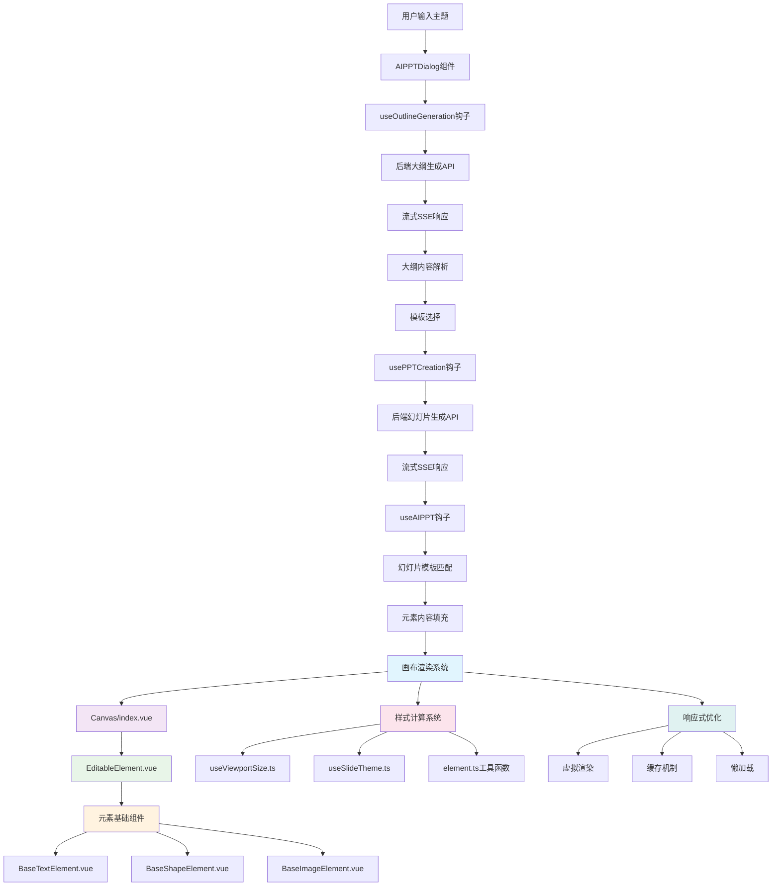

# 前端幻灯片生成流程文档

## 概述

本文档详细描述了AI PPTist前端在进行幻灯片生成时的完整流程，包括从用户输入到最终幻灯片渲染的各个环节。

## 整体架构图



## 详细流程分析

### 1. 用户交互阶段 (AIPPTDialog.vue)

**文件位置**: `frontend/src/views/Editor/AIPPTDialog.vue`

**主要功能**:
- 提供用户输入界面，包括主题、语言、风格、页数、模型等配置选项
- 管理生成流程的三个步骤：设置、大纲预览、模板选择
- 调用大纲生成和幻灯片生成钩子

**关键代码片段**:
```typescript
// 大纲生成
const createOutline = async () => {
  const success = await generateOutline({
    title: keyword.value,
    input_content: keyword.value,
    language: language.value,
    slide_count: slideCount.value,
    model_settings: { model: model.value }
  })
}

// 幻灯片生成
const createPPT = async () => {
  const success = await generatePPT({
    content: outline.value,
    language: language.value,
    style: style.value,
    model: model.value,
  }, selectedTemplate.value, img.value)
}
```

### 2. 大纲生成阶段 (useOutlineGeneration.ts)

**文件位置**: `frontend/src/hooks/useOutlineGeneration.ts`

**主要功能**:
- 处理流式大纲生成请求
- 解析SSE事件，实时更新大纲内容
- 处理错误和完成事件

**关键代码片段**:
```typescript
// 流式读取SSE响应
const readStream = () => {
  reader.read().then(({ done, value }) => {
    if (done) {
      // 处理完成
      return
    }

    const chunk = decoder.decode(value, { stream: true })
    const lines = chunk.split('\n')

    for (const line of lines) {
      if (line.trim()) {
        const eventData = parseSSEEvent(line)
        if (eventData) {
          processSSEEvent(eventData)
        }
      }
    }

    readStream()
  })
}
```

### 3. 后端API处理阶段 (backend)

#### 3.1 大纲生成API

**文件位置**: `backend/app/api/v1/endpoints/generation.py`

**主要功能**:
- 接收前端的大纲生成请求
- 调用流式生成处理器
- 返回SSE流式响应

**关键代码片段**:
```python
@router.post("/outline", response_class=StreamingResponse)
async def generate_presentation_outline_stream(
    request: Request,
    generation_request: OutlineGenerationRequest,
    db: AsyncSession = Depends(get_db)
):
    handler = OutlineStreamHandler(db)

    async def event_generator() -> AsyncGenerator[str, None]:
        async for event in handler.handle_outline_stream_generation(
            generation_request, request
        ):
            yield event

    return StreamingResponse(event_generator(), media_type="text/event-stream")
```

#### 3.2 大纲流式生成服务

**文件位置**: `backend/app/services/generation/outline_stream_service.py`

**主要功能**:
- 准备提示词和模型配置
- 根据配置选择AI服务或Mock服务
- 流式生成大纲内容
- 发送SSE事件

**关键代码片段**:
```python
async def generate_outline_stream(
    self, title: str, input_content: Optional[str] = None,
    slide_count: int = 8, language: str = "zh-CN",
    model_config: Optional[Dict[str, Any]] = None
) -> AsyncGenerator[str, None]:

    # 发送开始事件
    async for event in self.stream_events.send_start_event(...):
        yield event

    # AI服务或Mock服务生成
    if settings.enable_outline_mock:
        async for chunk in mock_outline_service.simulate_streaming_outline_call(...):
            accumulated_content += chunk
            async for event in self.stream_events.send_content_chunk_event(chunk):
                yield event
    else:
        async for chunk in self.ai_service.stream_ai_call(...):
            accumulated_content += chunk
            async for event in self.stream_events.send_content_chunk_event(chunk):
                yield event
```

### 4. 幻灯片生成阶段 (usePPTCreation.ts)

**文件位置**: `frontend/src/hooks/usePPTCreation.ts`

**主要功能**:
- 处理流式幻灯片生成请求
- 解析JSON格式的幻灯片数据
- 实时处理每个幻灯片
- 调用useAIPPT钩子进行幻灯片渲染

**关键代码片段**:
```typescript
// 处理流式幻灯片数据
while (true) {
  const { done, value } = await reader.read()

  if (done) break

  buffer += decoder.decode(value, { stream: true })
  const lines = buffer.split('\n\n')

  for (const line of lines) {
    if (line.trim().startsWith('data: ')) {
      const dataStr = line.replace('data: ', '').trim()
      const data = JSON.parse(dataStr)

      // 处理幻灯片对象
      if (data.type && data.data) {
        slideDataList.push(data)

        // 实时处理每个幻灯片
        AIPPT(templateSlides, [data])
      }
    }
  }
}
```

### 5. 幻灯片渲染阶段 (useAIPPT.ts)

**文件位置**: `frontend/src/hooks/useAIPPT.ts`

**主要功能**:
- 根据AI生成的幻灯片数据匹配模板
- 智能填充文本、图片等元素
- 处理幻灯片分页逻辑
- 最终渲染到画布

**详细实现分析**:

#### 5.1 核心函数 AIPPT()
```typescript
const AIPPT = (templateSlides: Slide[], _AISlides: AIPPTSlide[], imgs?: ImgPoolItem[]) => {
  // 1. 初始化状态
  slidesStore.updateSlideIndex(slidesStore.slides.length - 1)
  if (imgs) imgPool.value = imgs

  // 2. 幻灯片分页逻辑处理
  const AISlides: AIPPTSlide[] = []
  for (const template of _AISlides) {
    if (template.type === 'content') {
      // 根据项目数量自动分页
      const items = template.data.items
      if (items.length === 5 || items.length === 6) {
        // 分为两页：3+2 或 3+3
        const items1 = items.slice(0, 3)
        const items2 = items.slice(3)
        AISlides.push({ ...template, data: { ...template.data, items: items1 } })
        AISlides.push({ ...template, data: { ...template.data, items: items2 }, offset: 3 })
      }
      // ...其他分页逻辑
    }
  }

  // 3. 模板分类
  const coverTemplates = templateSlides.filter(slide => slide.type === 'cover')
  const contentsTemplates = templateSlides.filter(slide => slide.type === 'contents')
  const transitionTemplates = templateSlides.filter(slide => slide.type === 'transition')
  const contentTemplates = templateSlides.filter(slide => slide.type === 'content')
  const endTemplates = templateSlides.filter(slide => slide.type === 'end')

  // 4. 处理每种幻灯片类型
  const slides = []
  for (const item of AISlides) {
    if (item.type === 'cover') {
      // 封面幻灯片处理
      const coverTemplate = coverTemplates[Math.floor(Math.random() * coverTemplates.length)]
      const elements = coverTemplate.elements.map(el => {
        if (el.type === 'image' && el.imageType && imgPool.value.length)
          return getNewImgElement(el)
        if (checkTextType(el, 'title') && item.data.title)
          return getNewTextElement({ el, text: item.data.title, maxLine: 1 })
        if (checkTextType(el, 'content') && item.data.text)
          return getNewTextElement({ el, text: item.data.text, maxLine: 3 })
        return el
      })
      slides.push({ ...coverTemplate, id: nanoid(10), elements })
    }
    // ...其他幻灯片类型处理
  }

  // 5. 最终渲染
  if (isEmptySlide.value) slidesStore.setSlides(slides)
  else addSlidesFromData(slides)
}
```

#### 5.2 关键辅助函数

**文本元素智能适配**:
```typescript
const getNewTextElement = ({ el, text, maxLine, longestText, digitPadding }: {
  el: PPTTextElement | PPTShapeElement
  text: string
  maxLine: number
  longestText?: string
  digitPadding?: boolean
}) => {
  // 字体自适应计算
  const fontInfo = getFontInfo(el.type === 'text' ? el.content : el.text!.content)
  const size = getAdaptedFontsize({
    text: longestText || text,
    fontSize: fontInfo.fontSize,
    fontFamily: fontInfo.fontFamily,
    width: el.width - 20, // 考虑内边距
    maxLine,
  })

  // 数字填充处理（如 "1" -> "01"）
  if (digitPadding && text.length === 1) {
    text = '0' + text
  }

  // 更新文本内容
  const parser = new DOMParser()
  const doc = parser.parseFromString(content, 'text/html')
  const treeWalker = document.createTreeWalker(doc.body, NodeFilter.SHOW_TEXT)
  const firstTextNode = treeWalker.nextNode()
  if (firstTextNode) firstTextNode.textContent = text

  // 应用新字体大小
  content = doc.body.innerHTML.replace(/font-size:(.+?)px/g, `font-size: ${size}px`)

  return el.type === 'text'
    ? { ...el, content, lineHeight: size < 15 ? 1.2 : el.lineHeight }
    : { ...el, text: { ...el.text!, content } }
}
```

**图片元素智能适配**:
```typescript
const getNewImgElement = (el: PPTImageElement): PPTImageElement => {
  const img = getUseableImage(el)
  if (!img) return el

  // 图片裁剪和缩放计算
  let scale = 1, w = el.width, h = el.height
  let range: ImageClipDataRange = [[0, 0], [0, 0]]
  const radio = el.width / el.height

  if (img.width / img.height >= radio) {
    scale = img.height / el.height
    w = img.width / scale
    const diff = (w - el.width) / 2 / w * 100
    range = [[diff, 0], [100 - diff, 100]] // 水平裁剪
  } else {
    scale = img.width / el.width
    h = img.height / scale
    const diff = (h - el.height) / 2 / h * 100
    range = [[0, diff], [100, 100 - diff]] // 垂直裁剪
  }

  return { ...el, src: img.src, clip: { range, shape: el.clip?.shape || 'rect' } }
}
```

**可用模板筛选**:
```typescript
const getUseableTemplates = (templates: Slide[], n: number, type: TextType) => {
  // 寻找包含足够数量指定类型元素的模板
  const list = templates.filter(slide => {
    const len = slide.elements.filter(el => checkTextType(el, type)).length
    return len >= n
  })

  if (list.length === 0) {
    // 如果没有完全匹配的模板，选择最接近的
    const sorted = templates.sort((a, b) => {
      const aLen = a.elements.filter(el => checkTextType(el, type)).length
      const bLen = b.elements.filter(el => checkTextType(el, type)).length
      return aLen - bLen
    })
    const target = sorted[sorted.length - 1] // 选择元素最多的模板

    return templates.filter(slide => {
      const len = slide.elements.filter(el => checkTextType(el, type)).length
      const targetLen = target.elements.filter(el => checkTextType(el, type)).length
      return len === targetLen
    })
  }

  // 选择最接近需求数量的模板
  const target = list.reduce((closest, current) => {
    const currentLen = current.elements.filter(el => checkTextType(el, type)).length
    const closestLen = closest.elements.filter(el => checkTextType(el, type)).length
    return (currentLen - n) <= (closestLen - n) ? current : closest
  })

  return list.filter(slide => {
    const len = slide.elements.filter(el => checkTextType(el, type)).length
    const targetLen = target.elements.filter(el => checkTextType(el, type)).length
    return len === targetLen
  })
}
```

#### 5.3 元素排序和布局算法

**目录页项目排序**:
```typescript
// 根据位置坐标排序元素
const sortedItems = contentsTemplate.elements.filter(el => checkTextType(el, 'item'))
const sortedItemIds = sortedItems.sort((a, b) => {
  const aIndex = a.left + a.top * 2
  const bIndex = b.left + b.top * 2
  return aIndex - bIndex
}).map(el => el.id)
```

**内容页项目排序**:
```typescript
// 标题和文本元素的配对排序
const sortedTitleItemIds = contentTemplate.elements
  .filter(el => checkTextType(el, 'itemTitle'))
  .sort((a, b) => a.left + a.top * 2 - (b.left + b.top * 2))
  .map(el => el.id)

const sortedTextItemIds = contentTemplate.elements
  .filter(el => checkTextType(el, 'item'))
  .sort((a, b) => a.left + a.top * 2 - (b.left + b.top * 2))
  .map(el => el.id)
```


## 数据结构文档

### 1. 前端数据结构

#### Slide类型定义
```typescript
interface Slide {
  id: string
  type: 'cover' | 'contents' | 'transition' | 'content' | 'end'
  elements: PPTElement[]
  background?: Background
  animations?: Animation[]
}

interface PPTElement {
  id: string
  type: 'text' | 'image' | 'shape' | 'line' | 'chart' | 'table' | 'latex' | 'video' | 'audio'
  left: number
  top: number
  width: number
  height: number
  rotate: number
  groupId?: string
}
```

#### AIPPTSlide类型定义
```typescript
interface AIPPTSlide {
  type: 'cover' | 'contents' | 'transition' | 'content' | 'end'
  data: {
    title?: string
    text?: string
    items?: string[] | { title: string; text: string }[]
  }
  offset?: number
}
```

### 2. 后端数据结构

#### 请求数据结构
```python
class OutlineGenerationRequest(BaseModel):
    title: Optional[str] = None
    input_content: str
    slide_count: Optional[int] = None
    language: Optional[str] = None
    model_settings: Optional[Dict[str, Any]] = None

class SlidesGenerationRequest(BaseModel):
    content: str
    language: str
    style: str
    model: Optional[str] = None
```

#### SSE事件格式
```json
{
  "event": "content_chunk",
  "data": {
    "chunk": "生成的文本内容"
  }
}

{
  "event": "complete",
  "data": {
    "raw_markdown": "完整的大纲内容"
  }
}

{
  "event": "error",
  "data": {
    "error": "错误信息",
    "code": "错误代码"
  }
}
```


## 架构问题分析与改进建议

基于对 `useAIPPT.ts` 的详细分析，识别出以下架构层面的问题：

### 1. 代码可维护性问题

#### 1.1 函数体过长且职责混杂
- **问题**: `AIPPT()` 函数超过500行，承担了模板匹配、分页逻辑、元素填充、渲染等多个职责
- **影响**: 代码难以测试、调试和扩展
- **建议**: 按功能拆分为多个小函数，如 `handleSlidePagination()`、`processCoverSlide()`、`processContentSlide()` 等

#### 1.2 硬编码的分页逻辑
```typescript
// 当前实现中的硬编码分页规则
if (items.length === 5 || items.length === 6) {
  const items1 = items.slice(0, 3)
  const items2 = items.slice(3)
}
else if (items.length === 7 || items.length === 8) {
  const items1 = items.slice(0, 4)
  const items2 = items.slice(4)
}
```
- **问题**: 分页规则硬编码在代码中，难以适应不同模板和需求变化
- **建议**: 将分页规则配置化，支持动态调整

### 2. 可扩展性问题

#### 2.1 模板类型耦合
- **问题**: 幻灯片类型（cover、contents、transition、content、end）在代码中硬编码
- **影响**: 添加新的幻灯片类型需要修改多个函数
- **建议**: 使用策略模式，为每种幻灯片类型创建独立的处理器

#### 2.2 元素类型处理耦合
```typescript
// 当前代码中对元素类型的硬编码检查
if (el.type === 'image' && el.imageType && imgPool.value.length)
if (checkTextType(el, 'title') && item.data.title)
```
- **问题**: 元素类型处理逻辑分散在各个条件分支中
- **建议**: 使用工厂模式创建元素处理器，支持动态注册新元素类型

### 3. 性能优化问题

#### 3.1 重复的DOM操作
```typescript
// 每次文本更新都创建新的DOM解析器
const parser = new DOMParser()
const doc = parser.parseFromString(content, 'text/html')
```
- **问题**: 频繁的DOM操作影响性能
- **建议**: 缓存解析结果或使用更轻量的文本处理方案

#### 3.2 图片池管理效率
- **问题**: 图片池采用简单的数组过滤，在大规模图片库中效率较低
- **建议**: 使用更高效的数据结构（如按宽高比索引的Map）

### 4. 架构设计改进建议

#### 4.1 引入模板引擎模式
```typescript
// 建议的架构改进
interface SlideTemplateEngine {
  canHandle(slideType: string): boolean
  process(template: Slide, data: AIPPTSlide): Slide
}

class CoverTemplateEngine implements SlideTemplateEngine {
  canHandle(slideType: string) { return slideType === 'cover' }
  process(template: Slide, data: AIPPTSlide) {
    // 专门的封面处理逻辑
  }
}
```

#### 4.2 配置化分页策略
```typescript
interface PaginationRule {
  minItems: number
  maxItems: number
  splitStrategy: (items: any[]) => any[][]
}

const paginationRules: PaginationRule[] = [
  { minItems: 5, maxItems: 6, splitStrategy: (items) => [items.slice(0, 3), items.slice(3)] },
  { minItems: 7, maxItems: 8, splitStrategy: (items) => [items.slice(0, 4), items.slice(4)] }
]
```

#### 4.3 元素处理器工厂
```typescript
interface ElementProcessor {
  canHandle(element: PPTElement): boolean
  process(element: PPTElement, data: any): PPTElement
}

class TextElementProcessor implements ElementProcessor {
  canHandle(element: PPTElement) { return element.type === 'text' }
  process(element: PPTElement, data: any) {
    // 专门的文本处理逻辑
  }
}
```

### 5. 数据流优化建议

#### 5.1 状态管理优化
- **问题**: 当前使用Vue ref和Pinia混合管理状态，职责边界不清晰
- **建议**: 明确状态管理边界，将临时状态与持久状态分离

#### 5.2 错误处理机制
- **问题**: 缺乏完善的错误处理和回退机制
- **建议**: 添加模板匹配失败、图片资源不足等情况的处理逻辑

## 总结

AI PPTist的幻灯片生成流程采用了现代化的流式处理架构，结合了前端实时渲染和后端AI服务的优势。渲染阶段通过组件化设计、智能样式计算和性能优化策略，实现了高效、稳定且用户体验良好的幻灯片渲染系统。

**当前优势**:
- 智能的字体自适应和图片裁剪算法
- 灵活的模板匹配机制
- 实时的流式渲染体验

**需要改进的方面**:
- 代码结构需要重构以提高可维护性
- 架构设计需要增强扩展性以支持更多PPT生成功能
- 性能优化和错误处理机制需要完善

通过上述改进建议的实施，可以显著提升系统的可维护性、可扩展性和稳定性，为未来更多的PPT生成功能提供坚实的基础。