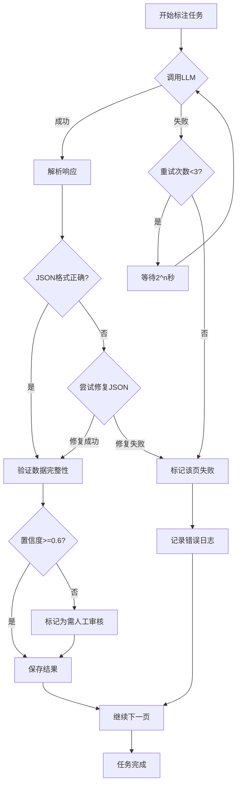

# 多模态自动标注系统架构设计 v2.0

## 文档信息
- **版本**: v2.0
- **创建日期**: 2025-01-11
- **最后更新**: 2025-01-11
- **状态**: 设计中
- **作者**: AI Assistant

## 1. 概述

### 1.1 项目背景

基于现有 AI PPTist 系统，实现智能PPT模板的自动化标注功能。当前系统已实现：
- ✅ 幻灯片的手工标注功能（页面类型、页面布局、元素类型标注）
- ✅ AI模型管理功能（增删改查和调用）
- ✅ 前后端分离架构
- ✅ 统一的API设计和响应规范

### 1.2 核心问题

**痛点1: 人工标注效率低**
- 典型PPT 20-30页，每页5-10个元素，需要100-300次手动操作
- 标注过程重复性高，耗时长

**痛点2: 专业知识门槛高**
- 非专业人士难以理解SmartArt布局类型
- 无法准确匹配布局与内容

**痛点3: 一致性难以保证**
- 标注标准不统一
- 质量参差不齐

### 1.3 设计目标

- **效率提升**: 减少90%以上的人工标注操作（从300次 → 30次）
- **准确性**: 基于多模态AI的智能识别，标注置信度≥85%
- **用户体验**: 可视化标注过程，提供用户确认和修正机制
- **扩展性**: 无缝对接现有模板导出功能，支持多种AI模型

### 1.4 核心价值

**"导入PPTX，AI自动理解并标注每一处设计细节"**

## 2. 系统架构

### 2.1 整体架构图

```
┌────────────────────────────────────────────────────────────────────┐
│                    多模态自动标注系统架构                             │
├────────────────┬────────────────┬────────────────┬─────────────────┤
│   前端层       │   API网关层     │   服务层        │   数据存储层      │
│                │                │                │                 │
│ ┌────────────┐ │ ┌────────────┐ │ ┌────────────┐ │ ┌─────────────┐ │
│ │ 标注界面   │ │ │ 路由管理   │ │ │ 标注服务   │ │ │ PostgreSQL  │ │
│ │ - 触发入口 │ │ │ - 端点层   │ │ │ - 提取服务 │ │ │ - 模型配置  │ │
│ │ - 进度展示 │ │ │ - 参数验证 │ │ │ - 分析服务 │ │ │ - 标注结果  │ │
│ │ - 可视化   │ │ │ - 异常处理 │ │ │ - 处理服务 │ │ │ - 模板数据  │ │
│ └────────────┘ │ └────────────┘ │ └────────────┘ │ └─────────────┘ │
│                │                │                │                 │
│ ┌────────────┐ │ ┌────────────┐ │ ┌────────────┐ │ ┌─────────────┐ │
│ │ 标注确认   │ │ │ 响应格式化 │ │ │ 缓存服务   │ │ │ Redis       │ │
│ │ - 审核编辑 │ │ │ - 日志记录 │ │ │ - 结果缓存 │ │ │ - 任务队列  │ │
│ │ - 批量操作 │ │ │ - 请求追踪 │ │ │ - 去重检测 │ │ │ - 进度缓存  │ │
│ └────────────┘ │ └────────────┘ │ └────────────┘ │ └─────────────┘ │
│                │                │                │                 │
│                │                │ ┌────────────┐ │ ┌─────────────┐ │
│                │                │ │ LLM集成    │ │ │ 腾讯云COS   │ │
│                │                │ │ - 多模态   │ │ │ - 截图存储  │ │
│                │                │ │ - 提示词   │ │ │             │ │
│                │                │ │ - 重试机制 │ │ │             │ │
│                │                │ └────────────┘ │ └─────────────┘ │
└────────────────┴────────────────┴────────────────┴─────────────────┘

外部服务:
┌────────────────────────────────────────────┐
│ 多模态LLM服务                               │
│ - GPT-4 Vision (OpenAI)                   │
│ - Gemini Pro Vision (Google)              │
│ - Claude 3 Vision (Anthropic)             │
│ - 其他兼容的多模态模型                      │
└────────────────────────────────────────────┘
```

### 2.2 技术栈

| 层级 | 技术选型 | 说明 |
|------|---------|------|
| **前端** | Vue 3 + TypeScript + Vite | 组合式API，TypeScript类型安全 |
| **UI组件** | Element Plus | 统一UI风格 |
| **状态管理** | Pinia | 轻量级状态管理 |
| **后端** | Python 3.11 + FastAPI | 异步高性能，类型提示 |
| **ORM** | SQLAlchemy 2.0 (Async) | 异步数据库操作 |
| **数据库** | PostgreSQL 15 | JSONB支持，全文搜索 |
| **缓存** | Redis 7 | 高性能缓存，任务队列 |
| **存储** | 腾讯云COS | 图片截图存储 |
| **AI集成** | OpenAI API / Gemini API | 多模态图像分析 |
| **部署** | Docker + Docker Compose | 容器化部署 |

### 2.3 分层架构设计

遵循项目统一的分层架构规范：

```
后端服务分层:
┌─────────────────────────────────────────────────┐
│ Endpoint Layer (端点层)                          │
│ - 处理HTTP请求/响应                               │
│ - 参数验证和序列化                                │
│ - 调用Handler                                    │
│ - 返回StandardResponse                           │
├─────────────────────────────────────────────────┤
│ Handler Layer (处理器层)                         │
│ - 网络层逻辑处理                                  │
│ - 统一日志记录                                    │
│ - 异常处理和转换                                  │
│ - 调用Service                                    │
├─────────────────────────────────────────────────┤
│ Service Layer (服务层)                           │
│ - 核心业务逻辑                                    │
│ - 数据验证和处理                                  │
│ - 调用Repository                                 │
│ - 业务规则控制                                    │
├─────────────────────────────────────────────────┤
│ Repository Layer (仓库层)                        │
│ - 数据访问封装                                    │
│ - 数据库操作                                      │
│ - 查询优化                                        │
└─────────────────────────────────────────────────┘
```

## 3. 核心时序流程图

### 3.1 完整标注流程时序图

以下是多模态自动标注系统的完整交互流程，展示了从用户触发到最终确认的全过程。

```mermaid
sequenceDiagram
    participant User as 用户
    participant Frontend as 前端界面
    participant Canvas as Canvas渲染器
    participant ImageGen as 图片生成服务
    participant API as API网关
    participant Handler as 标注Handler
    participant Service as 标注Service
    participant Cache as Redis缓存
    participant DB as PostgreSQL
    participant LLM as 多模态LLM
    participant COS as 腾讯云COS

    %% 第一阶段：触发标注
    User->>Frontend: 点击"智能标注"按钮
    Frontend->>Frontend: 打开标注对话框
    Frontend->>Frontend: 初始化标注状态
    
    %% 第二阶段：数据提取
    Note over Frontend,Canvas: 数据提取阶段
    Frontend->>Canvas: 获取当前演示文稿的幻灯片
    loop 遍历每页幻灯片
        Frontend->>Canvas: 渲染幻灯片到DOM
        Canvas-->>Frontend: 返回DOM元素
        Frontend->>ImageGen: 调用html-to-image生成截图
        ImageGen->>ImageGen: 配置参数(1920x1080, quality=0.9)
        ImageGen-->>Frontend: 返回Base64编码的截图
        Frontend->>Frontend: 提取元素数据(位置/样式/内容)
        Frontend->>Frontend: 更新进度(提取第N/M页)
    end
    
    %% 第三阶段：启动标注任务
    Note over Frontend,Service: 启动标注任务
    Frontend->>API: POST /api/v1/annotation/start
    Note right of Frontend: 请求体包含:<br/>- slides数据<br/>- model_config<br/>- extraction_config
    
    API->>API: 参数验证
    API->>Handler: handle_start_annotation(request)
    Handler->>Handler: 记录日志(开始标注)
    Handler->>Service: start_annotation(slides, config)
    
    Service->>Service: 生成task_id
    Service->>DB: 创建AnnotationTask记录
    Service->>Cache: 保存任务初始状态
    Note right of Cache: 任务状态: pending<br/>total_pages: N<br/>completed_pages: 0
    
    Service->>Service: 启动异步标注任务
    Service-->>Handler: 返回任务信息
    Handler-->>API: 返回任务ID和预估时间
    API-->>Frontend: StandardResponse(task_id, estimated_time)
    
    Frontend->>Frontend: 开始轮询进度
    Frontend->>Frontend: 更新UI状态为"分析中"
    
    %% 第四阶段：异步标注处理
    Note over Service,LLM: 异步标注处理(后台执行)
    Service->>Cache: 更新任务状态为processing
    
    loop 处理每页幻灯片
        Service->>Service: 获取slide数据
        
        %% 缓存检查
        Service->>Service: 生成缓存key(基于内容hash)
        Service->>Cache: 检查缓存是否存在
        
        alt 缓存命中
            Cache-->>Service: 返回缓存的分析结果
            Note right of Service: 跳过LLM调用<br/>节省成本和时间
        else 缓存未命中
            %% LLM调用流程
            Service->>Service: 构建分析提示词
            Note right of Service: 包含:<br/>- 元素信息<br/>- 类型定义<br/>- 识别规则
            
            Service->>LLM: 调用多模态API
            Note right of LLM: 请求包含:<br/>- Base64截图<br/>- 结构化提示词<br/>- temperature=0.2
            
            alt LLM调用成功
                LLM-->>Service: 返回JSON格式的分析结果
                Service->>Service: 解析和验证JSON
                Service->>Service: 验证标注一致性
                Service->>Cache: 缓存分析结果(TTL=24h)
            else LLM调用失败
                LLM-->>Service: 返回错误
                Service->>Service: 重试机制(最多3次)
                alt 重试成功
                    LLM-->>Service: 返回结果
                else 重试仍失败
                    Service->>Service: 标记该页失败
                    Service->>DB: 记录失败信息
                end
            end
        end
        
        Service->>DB: 保存SlideAnnotation记录
        Service->>Cache: 更新任务进度
        Note right of Cache: completed_pages++<br/>percentage更新
        Service->>Cache: 推送进度更新事件
    end
    
    Service->>Service: 计算统计信息
    Service->>Cache: 保存完整结果
    Service->>Cache: 更新任务状态为completed
    Service->>DB: 更新AnnotationTask记录
    
    %% 第五阶段：进度轮询
    Note over Frontend,Service: 进度轮询(并行进行)
    loop 每5秒轮询一次
        Frontend->>API: GET /api/v1/annotation/progress/{task_id}
        API->>Handler: handle_get_progress(task_id)
        Handler->>Service: get_progress(task_id)
        Service->>Cache: 获取任务进度
        Cache-->>Service: 返回进度数据
        Service-->>Handler: 返回进度信息
        Handler-->>API: 返回进度
        API-->>Frontend: StandardResponse(progress)
        
        Frontend->>Frontend: 更新进度条
        Frontend->>Frontend: 显示当前页/总页数
        
        alt 任务完成
            Frontend->>Frontend: 停止轮询
            Frontend->>Frontend: 进入结果展示阶段
        else 任务失败
            Frontend->>Frontend: 显示错误信息
            Frontend->>Frontend: 提供重试选项
        end
    end
    
    %% 第六阶段：获取结果
    Note over Frontend,Service: 获取标注结果
    Frontend->>API: GET /api/v1/annotation/results/{task_id}
    API->>Handler: handle_get_results(task_id)
    Handler->>Service: get_results(task_id)
    Service->>Cache: 获取结果数据
    Cache-->>Service: 返回完整结果
    Service->>Service: 计算统计信息
    Service-->>Handler: 返回结果和统计
    Handler-->>API: 返回结果
    API-->>Frontend: StandardResponse(results, statistics)
    
    %% 第七阶段：可视化展示
    Note over Frontend,User: 可视化标注结果
    Frontend->>Frontend: 渲染标注可视化
    loop 展示每页标注
        Frontend->>Frontend: 显示页面类型标签
        Frontend->>Frontend: 显示布局类型标签
        Frontend->>Frontend: 高亮显示元素标注
        Frontend->>Frontend: 显示置信度评分
    end
    
    Frontend->>User: 展示完整标注结果
    User->>Frontend: 审核标注结果
    
    %% 第八阶段：用户确认和修正
    Note over User,Service: 用户确认/修正阶段
    alt 用户发现需要修正的标注
        User->>Frontend: 点击修改元素标注
        Frontend->>Frontend: 显示编辑界面
        User->>Frontend: 选择新的元素类型
        Frontend->>Frontend: 记录修正数据
        
        User->>Frontend: 提交修正
        Frontend->>API: POST /api/v1/annotation/corrections
        Note right of Frontend: 包含修正列表:<br/>- slide_id<br/>- element_id<br/>- corrected_type
        
        API->>Handler: handle_submit_corrections
        Handler->>Service: submit_corrections(task_id, corrections)
        Service->>Cache: 获取原始结果
        Service->>Service: 应用用户修正
        Service->>Service: 更新置信度为1.0
        Service->>Cache: 保存更新后的结果
        Service->>DB: 记录用户修正
        Service-->>Handler: 返回修正结果
        Handler-->>API: 返回成功
        API-->>Frontend: StandardResponse(applied_corrections)
        
        Frontend->>Frontend: 更新本地标注数据
        Frontend->>Frontend: 刷新可视化显示
    end
    
    %% 第九阶段：最终确认
    User->>Frontend: 点击"确认标注"
    Frontend->>Frontend: 获取最终标注结果
    Frontend->>Frontend: 应用到当前演示文稿
    
    loop 应用每页标注
        Frontend->>Frontend: 更新幻灯片元数据
        Note right of Frontend: 设置:<br/>- page_type<br/>- layout_type<br/>- element_annotations
    end
    
    Frontend->>Frontend: 显示成功提示
    Frontend->>Frontend: 关闭标注对话框
    Frontend->>User: 标注完成，可继续编辑或导出
```



### 3.2 关键流程说明

#### 3.2.1 数据提取流程

**前端截图生成**：
```typescript
// 使用html-to-image库生成截图
import { toPng } from 'html-to-image'

async function generateSlideScreenshot(slide: Slide): Promise<string> {
  const slideElement = document.querySelector(`#slide-${slide.id}`)
  
  const dataUrl = await toPng(slideElement, {
    quality: 0.9,           // 高质量
    pixelRatio: 2,          // 视网膜屏支持
    width: 1920,            // Full HD宽度
    height: 1080,           // Full HD高度
    backgroundColor: '#fff' // 白色背景
  })
  
  return dataUrl // 返回Base64编码的PNG
}
```

**元素数据提取**：
```typescript
function extractElementsData(slide: Slide) {
  return slide.elements.map(element => ({
    id: element.id,
    type: element.type,
    left: element.left,
    top: element.top,
    width: element.width,
    height: element.height,
    content: element.content || '',
    style: {
      fontSize: element.fontSize,
      fontWeight: element.fontWeight,
      color: element.color,
      backgroundColor: element.backgroundColor
    }
  }))
}
```

#### 3.2.2 缓存机制流程

**缓存键生成**：
```python
import hashlib
import json

def generate_cache_key(slide: Dict[str, Any]) -> str:
    """
    基于幻灯片内容生成缓存键
    相同内容的幻灯片会命中缓存，避免重复分析
    """
    screenshot = slide.get("screenshot", "")
    elements_str = json.dumps(slide.get("elements", []), sort_keys=True)
    
    # 组合截图和元素数据
    content = screenshot + elements_str
    
    # 生成MD5哈希
    hash_key = hashlib.md5(content.encode()).hexdigest()
    
    return f"annotation:cache:{hash_key}"
```

**缓存查询流程**：
```
1. 生成缓存键 → 2. 查询Redis → 3. 命中则返回 → 4. 未命中则调用LLM → 5. 缓存结果
```

#### 3.2.3 LLM调用重试流程

```python
async def call_llm_with_retry(
    screenshot: str,
    prompt: str,
    max_retries: int = 3
) -> Dict[str, Any]:
    """带重试机制的LLM调用"""
    
    for attempt in range(max_retries):
        try:
            response = await llm_client.analyze_with_vision(
                image_base64=screenshot,
                prompt=prompt,
                temperature=0.2,
                max_tokens=2000
            )
            return response
            
        except Exception as e:
            if attempt < max_retries - 1:
                # 指数退避：2^attempt秒
                await asyncio.sleep(2 ** attempt)
                logger.warning(f"LLM调用失败，重试{attempt + 1}/{max_retries}")
            else:
                # 最后一次尝试失败，抛出异常
                logger.error(f"LLM调用失败，已达最大重试次数")
                raise
```

#### 3.2.4 错误处理流程



### 3.3 性能优化策略

#### 3.3.1 批量并行处理

```python
async def process_slides_in_batches(
    slides: List[Dict],
    batch_size: int = 5
) -> List[Dict]:
    """批量并行处理幻灯片"""
    
    results = []
    
    # 将幻灯片分批
    for i in range(0, len(slides), batch_size):
        batch = slides[i:i + batch_size]
        
        # 并行处理每批
        batch_results = await asyncio.gather(*[
            analyze_slide(slide)
            for slide in batch
        ], return_exceptions=True)
        
        results.extend(batch_results)
    
    return results
```

#### 3.3.2 缓存优化策略

| 缓存类型 | TTL | 用途 |
|---------|-----|------|
| 标注结果缓存 | 24小时 | 避免重复分析相同幻灯片 |
| 任务进度缓存 | 1小时 | 快速响应进度查询 |
| 最终结果缓存 | 1小时 | 快速返回完整结果 |

#### 3.3.3 数据库优化

```sql
-- 关键索引
CREATE INDEX idx_annotation_tasks_user_status 
ON annotation_tasks(user_id, status);

CREATE INDEX idx_annotation_tasks_created 
ON annotation_tasks(created_at DESC);

CREATE INDEX idx_slide_annotations_task 
ON slide_annotations(task_id);

CREATE INDEX idx_slide_annotations_confidence 
ON slide_annotations(overall_confidence);
```

### 3.4 监控埋点

#### 3.4.1 关键指标

```python
from prometheus_client import Counter, Histogram, Gauge

# 任务计数
annotation_tasks_total = Counter(
    'annotation_tasks_total',
    'Total annotation tasks',
    ['status']  # pending, processing, completed, failed
)

# 处理时长
annotation_duration = Histogram(
    'annotation_duration_seconds',
    'Annotation task duration',
    buckets=[10, 30, 60, 120, 300, 600]
)

# LLM调用
llm_calls_total = Counter(
    'llm_calls_total',
    'Total LLM API calls',
    ['model', 'status']
)

# 缓存命中
cache_hits = Counter(
    'cache_hits_total',
    'Cache hits/misses',
    ['result']  # hit, miss
)

# 平均置信度
annotation_confidence = Gauge(
    'annotation_avg_confidence',
    'Average confidence score'
)
```

#### 3.4.2 日志记录点

```python
# 关键日志点
logger.info("标注任务启动", extra={
    "task_id": task_id,
    "slide_count": len(slides),
    "model": model_id
})

logger.info("LLM分析完成", extra={
    "slide_id": slide_id,
    "duration_ms": duration,
    "cache_hit": cache_hit
})

logger.warning("置信度低", extra={
    "slide_id": slide_id,
    "confidence": confidence,
    "threshold": 0.6
})

logger.error("LLM调用失败", extra={
    "slide_id": slide_id,
    "error": str(e),
    "retry_count": retry_count
})
```

## 4. 核心功能模块设计

### 4.1 前端模块设计

#### 3.1.1 模块结构

```
frontend/src/views/Editor/Toolbar/
├── AutoAnnotation/
│   ├── AutoAnnotationDialog.vue          # 主对话框组件
│   ├── AnnotationTrigger.vue             # 触发按钮组件
│   ├── AnnotationProgress.vue            # 进度展示组件
│   ├── AnnotationVisualizer.vue          # 可视化渲染组件
│   ├── AnnotationConfirmation.vue        # 确认编辑组件
│   ├── types.ts                          # 类型定义
│   └── composables/
│       ├── useAnnotation.ts              # 标注逻辑
│       ├── useAnnotationAnimation.ts     # 动画效果
│       └── useAnnotationEdit.ts          # 编辑功能
```

#### 3.1.2 核心组件设计

**AutoAnnotationDialog.vue** - 主对话框

```typescript
<template>
  <el-dialog
    v-model="dialogVisible"
    title="智能标注"
    width="90%"
    :close-on-click-modal="false"
    :close-on-press-escape="false"
  >
    <!-- 进度展示 -->
    <AnnotationProgress
      v-if="isProcessing"
      :status="annotationStatus"
      :progress="currentProgress"
      :total="totalPages"
      :current-page="currentPage"
    />

    <!-- 可视化渲染 -->
    <AnnotationVisualizer
      v-if="isAnnotating"
      :slide="currentSlide"
      :annotations="currentAnnotations"
      @element-click="handleElementClick"
    />

    <!-- 确认编辑 -->
    <AnnotationConfirmation
      v-if="isConfirming"
      :results="annotationResults"
      @confirm="handleConfirm"
      @edit="handleEdit"
      @retry="handleRetry"
    />

    <template #footer>
      <el-button @click="handleCancel">取消</el-button>
      <el-button
        v-if="canConfirm"
        type="primary"
        @click="handleConfirmAll"
      >
        确认标注
      </el-button>
    </template>
  </el-dialog>
</template>

<script setup lang="ts">
import { ref, computed } from 'vue'
import { useAnnotation } from './composables/useAnnotation'
import type { AnnotationStatus, AnnotationResult } from './types'

const dialogVisible = ref(false)
const {
  annotationStatus,
  currentProgress,
  totalPages,
  currentPage,
  currentSlide,
  currentAnnotations,
  annotationResults,
  startAnnotation,
  confirmAnnotation,
  cancelAnnotation
} = useAnnotation()

const isProcessing = computed(() =>
  annotationStatus.value === 'extracting' ||
  annotationStatus.value === 'analyzing'
)

const isAnnotating = computed(() =>
  annotationStatus.value === 'annotating'
)

const isConfirming = computed(() =>
  annotationStatus.value === 'confirming'
)

const canConfirm = computed(() =>
  annotationStatus.value === 'confirming' &&
  annotationResults.value.length > 0
)

const open = async () => {
  dialogVisible.value = true
  await startAnnotation()
}

const handleElementClick = (elementId: string) => {
  // 处理元素点击，显示详情或编辑
}

const handleConfirm = () => {
  // 确认标注结果
}

const handleEdit = (annotationId: string) => {
  // 编辑单个标注
}

const handleRetry = (pageId: string) => {
  // 重试失败的页面
}

const handleConfirmAll = async () => {
  await confirmAnnotation()
  dialogVisible.value = false
}

const handleCancel = () => {
  cancelAnnotation()
  dialogVisible.value = false
}

defineExpose({ open })
</script>
```

**useAnnotation.ts** - 标注逻辑 Composable

```typescript
import { ref, computed } from 'vue'
import { ElMessage } from 'element-plus'
import { annotationApi } from '@/api/annotation'
import type {
  AnnotationStatus,
  AnnotationConfig,
  AnnotationResult,
  SlideData
} from '../types'

export function useAnnotation() {
  const annotationStatus = ref<AnnotationStatus>('idle')
  const taskId = ref<string>('')
  const currentProgress = ref(0)
  const totalPages = ref(0)
  const currentPage = ref(0)
  const currentSlide = ref<SlideData | null>(null)
  const currentAnnotations = ref<any[]>([])
  const annotationResults = ref<AnnotationResult[]>([])

  // 启动自动标注
  const startAnnotation = async (config?: AnnotationConfig) => {
    try {
      annotationStatus.value = 'extracting'

      // 1. 提取幻灯片数据
      const slides = await extractSlidesData(config)
      totalPages.value = slides.length

      // 2. 启动后端标注任务
      const response = await annotationApi.startAnnotation({
        slides: slides.map(s => ({
          slide_id: s.id,
          screenshot: s.screenshot,
          elements: s.elements
        })),
        model_config: config?.modelConfig,
        extraction_config: config?.extractionConfig
      })

      taskId.value = response.data.task_id
      annotationStatus.value = 'analyzing'

      // 3. 轮询进度
      await pollProgress()

      // 4. 获取结果
      await fetchResults()

      annotationStatus.value = 'confirming'

    } catch (error) {
      console.error('标注失败:', error)
      ElMessage.error('自动标注失败，请重试')
      annotationStatus.value = 'error'
    }
  }

  // 提取幻灯片数据
  const extractSlidesData = async (config?: AnnotationConfig): Promise<SlideData[]> => {
    annotationStatus.value = 'extracting'
    const slides: SlideData[] = []

    // 获取当前演示文稿的幻灯片
    const { slides: currentSlides } = useSlidesStore()

    for (let i = 0; i < currentSlides.length; i++) {
      currentPage.value = i + 1
      currentProgress.value = Math.floor((i / currentSlides.length) * 100)

      const slide = currentSlides[i]

      // 生成截图
      const screenshot = await generateSlideScreenshot(slide)

      // 提取元素数据
      const elements = extractElementsData(slide)

      slides.push({
        id: slide.id,
        index: i,
        screenshot: screenshot,
        elements: elements
      })
    }

    return slides
  }

  // 生成幻灯片截图
  const generateSlideScreenshot = async (slide: any): Promise<string> => {
    // 使用html-to-image库生成截图
    const slideElement = document.querySelector(`#slide-${slide.id}`)
    if (!slideElement) {
      throw new Error(`找不到幻灯片元素: ${slide.id}`)
    }

    const dataUrl = await toPng(slideElement, {
      quality: 0.9,
      pixelRatio: 2,
      width: 1920,
      height: 1080
    })

    return dataUrl
  }

  // 提取元素数据
  const extractElementsData = (slide: any) => {
    return slide.elements.map((el: any) => ({
      id: el.id,
      type: el.type,
      left: el.left,
      top: el.top,
      width: el.width,
      height: el.height,
      content: el.content || '',
      style: extractElementStyle(el)
    }))
  }

  // 轮询标注进度
  const pollProgress = async () => {
    const maxAttempts = 60 // 最多轮询5分钟
    let attempts = 0

    while (attempts < maxAttempts) {
      const response = await annotationApi.getProgress(taskId.value)
      const { status, progress } = response.data

      annotationStatus.value = status
      currentProgress.value = progress.percentage
      currentPage.value = progress.completed + 1

      if (status === 'completed' || status === 'error') {
        break
      }

      await new Promise(resolve => setTimeout(resolve, 5000))
      attempts++
    }

    if (attempts >= maxAttempts) {
      throw new Error('标注任务超时')
    }
  }

  // 获取标注结果
  const fetchResults = async () => {
    const response = await annotationApi.getResults(taskId.value)
    annotationResults.value = response.data.results
  }

  // 确认标注
  const confirmAnnotation = async () => {
    // 应用标注结果到当前演示文稿
    const { updateSlideAnnotations } = useSlidesStore()

    for (const result of annotationResults.value) {
      await updateSlideAnnotations(result.slide_id, {
        page_type: result.page_type.type,
        layout_type: result.layout_type.type,
        element_annotations: result.element_annotations
      })
    }

    ElMessage.success('标注已应用')
  }

  // 取消标注
  const cancelAnnotation = () => {
    // 清理状态
    annotationStatus.value = 'idle'
    taskId.value = ''
    currentProgress.value = 0
    totalPages.value = 0
    currentPage.value = 0
    annotationResults.value = []
  }

  return {
    annotationStatus,
    currentProgress,
    totalPages,
    currentPage,
    currentSlide,
    currentAnnotations,
    annotationResults,
    startAnnotation,
    confirmAnnotation,
    cancelAnnotation
  }
}
```

#### 3.1.3 类型定义

```typescript
// frontend/src/views/Editor/Toolbar/AutoAnnotation/types.ts

export type AnnotationStatus =
  | 'idle'
  | 'extracting'
  | 'analyzing'
  | 'annotating'
  | 'confirming'
  | 'completed'
  | 'error'

export interface AnnotationConfig {
  modelConfig?: {
    model_id: string
    multimodal_enabled: boolean
  }
  extractionConfig?: {
    screenshot_quality: 'standard' | 'high'
    include_element_data: boolean
  }
  slideRange?: {
    start: number
    end: number
  }
}

export interface SlideData {
  id: string
  index: number
  screenshot: string  // Base64编码的截图
  elements: ElementData[]
}

export interface ElementData {
  id: string
  type: string
  left: number
  top: number
  width: number
  height: number
  content?: string
  style?: Record<string, any>
}

export interface AnnotationResult {
  slide_id: string
  page_type: {
    type: string
    confidence: number
    reason: string
  }
  layout_type: {
    type: string
    confidence: number
    reason: string
  }
  element_annotations: ElementAnnotation[]
  overall_confidence: number
}

export interface ElementAnnotation {
  element_id: string
  type: string
  confidence: number
  reason: string
}
```

### 3.2 后端模块设计

#### 3.2.1 目录结构

```
backend/app/
├── api/v1/
│   └── endpoints/
│       └── annotation.py              # 标注API端点
├── services/
│   └── annotation/
│       ├── annotation_handler.py      # 标注处理器
│       ├── annotation_service.py      # 标注服务
│       ├── extraction_service.py      # 数据提取服务
│       ├── analysis_service.py        # 多模态分析服务
│       └── processing_service.py      # 结果处理服务
├── repositories/
│   └── annotation.py                  # 标注仓库
├── models/
│   └── annotation.py                  # 标注数据模型
├── schemas/
│   └── annotation.py                  # 标注Schema
└── core/
    └── llm/
        └── multimodal_client.py       # 多模态LLM客户端
```

#### 3.2.2 API端点层

**annotation.py** - 端点实现

```python
"""
标注API端点

遵循项目API设计规范:
- 轻路由：只处理HTTP请求和响应
- 参数验证和序列化
- 调用Handler处理业务逻辑
- 返回StandardResponse
"""

from fastapi import APIRouter, Depends, HTTPException, status
from sqlalchemy.ext.asyncio import AsyncSession
from typing import Optional

from app.db.database import get_db
from app.services.annotation.annotation_handler import AnnotationHandler
from app.schemas.annotation import (
    AnnotationStartRequest,
    AnnotationProgressResponse,
    AnnotationResultResponse
)
from app.schemas.common import StandardResponse
from app.core.log_utils import get_logger
from app.core.log_messages import log_messages

logger = get_logger(__name__)

router = APIRouter(tags=["Annotation"])


@router.post(
    "/start",
    response_model=StandardResponse,
    summary="启动自动标注",
    description="启动PPT模板的自动标注任务"
)
async def start_annotation(
    request: AnnotationStartRequest,
    db: AsyncSession = Depends(get_db)
) -> StandardResponse:
    """
    启动自动标注任务

    Args:
        request: 标注请求参数
        db: 数据库会话

    Returns:
        StandardResponse: 包含任务ID的响应
    """
    try:
        logger.info(
            log_messages.START_OPERATION,
            operation_name="自动标注",
            extra={
                "slide_count": len(request.slides),
                "model_id": request.model_config.model_id if request.model_config else None
            }
        )

        handler = AnnotationHandler(db)
        result = await handler.handle_start_annotation(request)

        logger.info(
            log_messages.OPERATION_SUCCESS,
            operation_name="启动自动标注",
            extra={"task_id": result["task_id"]}
        )

        return StandardResponse(
            status="success",
            message="自动标注任务已启动",
            data=result
        )

    except Exception as e:
        logger.error(
            log_messages.OPERATION_FAILED,
            operation_name="启动自动标注",
            exception=e
        )
        raise HTTPException(
            status_code=status.HTTP_500_INTERNAL_SERVER_ERROR,
            detail=f"启动标注任务失败: {str(e)}"
        )


@router.get(
    "/progress/{task_id}",
    response_model=StandardResponse,
    summary="获取标注进度",
    description="查询标注任务的当前进度"
)
async def get_annotation_progress(
    task_id: str,
    db: AsyncSession = Depends(get_db)
) -> StandardResponse:
    """
    获取标注进度

    Args:
        task_id: 任务ID
        db: 数据库会话

    Returns:
        StandardResponse: 包含进度信息的响应
    """
    try:
        handler = AnnotationHandler(db)
        result = await handler.handle_get_progress(task_id)

        return StandardResponse(
            status="success",
            message="标注进度查询成功",
            data=result
        )

    except Exception as e:
        logger.error(
            log_messages.OPERATION_FAILED,
            operation_name="查询标注进度",
            extra={"task_id": task_id},
            exception=e
        )
        raise HTTPException(
            status_code=status.HTTP_500_INTERNAL_SERVER_ERROR,
            detail=f"查询进度失败: {str(e)}"
        )


@router.get(
    "/results/{task_id}",
    response_model=StandardResponse,
    summary="获取标注结果",
    description="获取标注任务的完整结果"
)
async def get_annotation_results(
    task_id: str,
    db: AsyncSession = Depends(get_db)
) -> StandardResponse:
    """
    获取标注结果

    Args:
        task_id: 任务ID
        db: 数据库会话

    Returns:
        StandardResponse: 包含标注结果的响应
    """
    try:
        handler = AnnotationHandler(db)
        result = await handler.handle_get_results(task_id)

        return StandardResponse(
            status="success",
            message="标注结果获取成功",
            data=result
        )

    except Exception as e:
        logger.error(
            log_messages.OPERATION_FAILED,
            operation_name="获取标注结果",
            extra={"task_id": task_id},
            exception=e
        )
        raise HTTPException(
            status_code=status.HTTP_500_INTERNAL_SERVER_ERROR,
            detail=f"获取结果失败: {str(e)}"
        )


@router.post(
    "/corrections",
    response_model=StandardResponse,
    summary="提交用户修正",
    description="提交用户对标注结果的修正"
)
async def submit_corrections(
    task_id: str,
    corrections: list,
    db: AsyncSession = Depends(get_db)
) -> StandardResponse:
    """
    提交用户修正

    Args:
        task_id: 任务ID
        corrections: 修正数据
        db: 数据库会话

    Returns:
        StandardResponse: 修正结果响应
    """
    try:
        handler = AnnotationHandler(db)
        result = await handler.handle_submit_corrections(task_id, corrections)

        return StandardResponse(
            status="success",
            message="用户修正已应用",
            data=result
        )

    except Exception as e:
        logger.error(
            log_messages.OPERATION_FAILED,
            operation_name="提交用户修正",
            extra={"task_id": task_id},
            exception=e
        )
        raise HTTPException(
            status_code=status.HTTP_500_INTERNAL_SERVER_ERROR,
            detail=f"提交修正失败: {str(e)}"
        )
```

#### 3.2.3 Handler层

**annotation_handler.py** - 处理器实现

```python
"""
标注处理器

职责:
- 处理网络层逻辑
- 日志记录和异常处理
- 调用服务层
- 数据转换和格式化
"""

from typing import Dict, Any, List
from fastapi import HTTPException, status
from sqlalchemy.ext.asyncio import AsyncSession

from app.services.annotation.annotation_service import AnnotationService
from app.schemas.annotation import AnnotationStartRequest
from app.core.log_utils import get_logger
from app.core.log_messages import log_messages

logger = get_logger(__name__)


class AnnotationHandler:
    """标注处理器"""

    def __init__(self, db: AsyncSession):
        self.db = db
        self.annotation_service = AnnotationService(db)

    async def handle_start_annotation(
        self,
        request: AnnotationStartRequest
    ) -> Dict[str, Any]:
        """
        处理启动标注请求

        Args:
            request: 标注请求

        Returns:
            Dict[str, Any]: 任务信息
        """
        try:
            logger.info(
                "处理启动标注请求",
                extra={
                    "slide_count": len(request.slides),
                    "model_config": request.model_config.model_dump() if request.model_config else None
                }
            )

            # 验证请求
            self._validate_start_request(request)

            # 调用服务层启动标注
            result = await self.annotation_service.start_annotation(
                slides=request.slides,
                model_config=request.model_config,
                extraction_config=request.extraction_config
            )

            logger.info(
                "标注任务启动成功",
                extra={
                    "task_id": result["task_id"],
                    "estimated_time": result["estimated_time"]
                }
            )

            return result

        except ValueError as e:
            logger.warning(
                "标注请求验证失败",
                extra={"error": str(e)}
            )
            raise HTTPException(
                status_code=status.HTTP_400_BAD_REQUEST,
                detail=str(e)
            )
        except Exception as e:
            logger.error(
                log_messages.OPERATION_FAILED,
                operation_name="启动标注",
                exception=e
            )
            raise HTTPException(
                status_code=status.HTTP_500_INTERNAL_SERVER_ERROR,
                detail=f"启动标注失败: {str(e)}"
            )

    async def handle_get_progress(self, task_id: str) -> Dict[str, Any]:
        """
        处理获取进度请求

        Args:
            task_id: 任务ID

        Returns:
            Dict[str, Any]: 进度信息
        """
        try:
            logger.info(
                "查询标注进度",
                extra={"task_id": task_id}
            )

            progress = await self.annotation_service.get_progress(task_id)

            return progress

        except Exception as e:
            logger.error(
                log_messages.OPERATION_FAILED,
                operation_name="查询标注进度",
                extra={"task_id": task_id},
                exception=e
            )
            raise

    async def handle_get_results(self, task_id: str) -> Dict[str, Any]:
        """
        处理获取结果请求

        Args:
            task_id: 任务ID

        Returns:
            Dict[str, Any]: 标注结果
        """
        try:
            logger.info(
                "获取标注结果",
                extra={"task_id": task_id}
            )

            results = await self.annotation_service.get_results(task_id)

            logger.info(
                "标注结果获取成功",
                extra={
                    "task_id": task_id,
                    "result_count": len(results.get("results", []))
                }
            )

            return results

        except Exception as e:
            logger.error(
                log_messages.OPERATION_FAILED,
                operation_name="获取标注结果",
                extra={"task_id": task_id},
                exception=e
            )
            raise

    async def handle_submit_corrections(
        self,
        task_id: str,
        corrections: List[Dict[str, Any]]
    ) -> Dict[str, Any]:
        """
        处理提交修正请求

        Args:
            task_id: 任务ID
            corrections: 修正数据

        Returns:
            Dict[str, Any]: 修正结果
        """
        try:
            logger.info(
                "提交用户修正",
                extra={
                    "task_id": task_id,
                    "correction_count": len(corrections)
                }
            )

            result = await self.annotation_service.submit_corrections(
                task_id,
                corrections
            )

            logger.info(
                "用户修正已应用",
                extra={
                    "task_id": task_id,
                    "applied_count": result.get("applied_corrections", 0)
                }
            )

            return result

        except Exception as e:
            logger.error(
                log_messages.OPERATION_FAILED,
                operation_name="提交用户修正",
                extra={"task_id": task_id},
                exception=e
            )
            raise

    def _validate_start_request(self, request: AnnotationStartRequest):
        """验证启动请求"""
        if not request.slides or len(request.slides) == 0:
            raise ValueError("幻灯片数据不能为空")

        if len(request.slides) > 50:
            raise ValueError("单次标注最多支持50页幻灯片")

        # 验证每个幻灯片数据
        for slide in request.slides:
            if not slide.get("slide_id"):
                raise ValueError("幻灯片ID不能为空")
            if not slide.get("screenshot"):
                raise ValueError(f"幻灯片 {slide['slide_id']} 缺少截图")
```

#### 3.2.4 Service层

**annotation_service.py** - 核心服务

```python
"""
标注服务

职责:
- 实现核心业务逻辑
- 协调各个子服务
- 管理标注任务生命周期
"""

from typing import Dict, Any, List, Optional
from datetime import datetime
import uuid
import asyncio

from sqlalchemy.ext.asyncio import AsyncSession

from app.services.annotation.extraction_service import ExtractionService
from app.services.annotation.analysis_service import AnalysisService
from app.services.annotation.processing_service import ProcessingService
from app.repositories.annotation import AnnotationRepository
from app.core.redis import get_redis_client
from app.core.log_utils import get_logger

logger = get_logger(__name__)


class AnnotationService:
    """标注服务"""

    def __init__(self, db: AsyncSession):
        self.db = db
        self.extraction_service = ExtractionService()
        self.analysis_service = AnalysisService()
        self.processing_service = ProcessingService()
        self.annotation_repo = AnnotationRepository(db)
        self.redis_client = get_redis_client()

    async def start_annotation(
        self,
        slides: List[Dict[str, Any]],
        model_config: Optional[Dict[str, Any]] = None,
        extraction_config: Optional[Dict[str, Any]] = None
    ) -> Dict[str, Any]:
        """
        启动标注任务

        Args:
            slides: 幻灯片数据列表
            model_config: 模型配置
            extraction_config: 提取配置

        Returns:
            Dict[str, Any]: 任务信息
        """
        # 生成任务ID
        task_id = f"task_{uuid.uuid4().hex[:12]}"

        # 创建任务记录
        task_data = {
            "task_id": task_id,
            "status": "pending",
            "total_pages": len(slides),
            "completed_pages": 0,
            "created_at": datetime.utcnow().isoformat(),
            "model_config": model_config,
            "extraction_config": extraction_config
        }

        # 保存到Redis
        await self.redis_client.setex(
            f"annotation:task:{task_id}",
            3600,  # 1小时过期
            json.dumps(task_data)
        )

        # 启动异步标注任务
        asyncio.create_task(
            self._process_annotation_task(task_id, slides, model_config)
        )

        return {
            "task_id": task_id,
            "estimated_time": len(slides) * 30,  # 每页约30秒
            "total_pages": len(slides)
        }

    async def _process_annotation_task(
        self,
        task_id: str,
        slides: List[Dict[str, Any]],
        model_config: Optional[Dict[str, Any]]
    ):
        """
        处理标注任务（异步执行）

        Args:
            task_id: 任务ID
            slides: 幻灯片数据
            model_config: 模型配置
        """
        try:
            # 更新任务状态
            await self._update_task_status(task_id, "processing")

            results = []

            for i, slide in enumerate(slides):
                try:
                    # 更新进度
                    await self._update_task_progress(task_id, i, len(slides))

                    # 分析单个幻灯片
                    result = await self._analyze_slide(
                        slide,
                        model_config
                    )

                    results.append(result)

                except Exception as e:
                    logger.error(
                        f"标注失败: slide_id={slide.get('slide_id')}",
                        exception=e
                    )
                    # 记录失败但继续处理其他页面
                    results.append({
                        "slide_id": slide.get("slide_id"),
                        "status": "failed",
                        "error": str(e)
                    })

            # 保存结果
            await self._save_results(task_id, results)

            # 更新任务状态为完成
            await self._update_task_status(task_id, "completed")

            logger.info(
                f"标注任务完成: task_id={task_id}, total={len(slides)}, "
                f"success={len([r for r in results if r.get('status') != 'failed'])}"
            )

        except Exception as e:
            logger.error(
                f"标注任务失败: task_id={task_id}",
                exception=e
            )
            await self._update_task_status(task_id, "error")

    async def _analyze_slide(
        self,
        slide: Dict[str, Any],
        model_config: Optional[Dict[str, Any]]
    ) -> Dict[str, Any]:
        """
        分析单个幻灯片

        Args:
            slide: 幻灯片数据
            model_config: 模型配置

        Returns:
            Dict[str, Any]: 分析结果
        """
        # 1. 检查缓存
        cache_key = self._generate_cache_key(slide)
        cached_result = await self._get_cached_result(cache_key)
        if cached_result:
            logger.info(f"使用缓存结果: slide_id={slide.get('slide_id')}")
            return cached_result

        # 2. 调用多模态分析服务
        result = await self.analysis_service.analyze_slide(
            screenshot=slide.get("screenshot"),
            elements=slide.get("elements", []),
            model_config=model_config
        )

        # 3. 缓存结果
        await self._cache_result(cache_key, result)

        return result

    async def get_progress(self, task_id: str) -> Dict[str, Any]:
        """
        获取任务进度

        Args:
            task_id: 任务ID

        Returns:
            Dict[str, Any]: 进度信息
        """
        task_data_str = await self.redis_client.get(f"annotation:task:{task_id}")
        if not task_data_str:
            raise ValueError(f"任务不存在: {task_id}")

        task_data = json.loads(task_data_str)

        return {
            "task_id": task_id,
            "status": task_data.get("status"),
            "progress": {
                "completed": task_data.get("completed_pages", 0),
                "total": task_data.get("total_pages", 0),
                "percentage": int(
                    (task_data.get("completed_pages", 0) / task_data.get("total_pages", 1)) * 100
                )
            },
            "current_page": task_data.get("completed_pages", 0) + 1,
            "estimated_remaining_time": (
                task_data.get("total_pages", 0) - task_data.get("completed_pages", 0)
            ) * 30
        }

    async def get_results(self, task_id: str) -> Dict[str, Any]:
        """
        获取标注结果

        Args:
            task_id: 任务ID

        Returns:
            Dict[str, Any]: 标注结果
        """
        # 从Redis获取结果
        results_str = await self.redis_client.get(f"annotation:results:{task_id}")
        if not results_str:
            raise ValueError(f"结果不存在: {task_id}")

        results = json.loads(results_str)

        # 计算统计信息
        successful_pages = len([r for r in results if r.get("status") != "failed"])
        failed_pages = len(results) - successful_pages

        total_confidence = sum(
            r.get("overall_confidence", 0)
            for r in results
            if r.get("status") != "failed"
        )
        average_confidence = (
            total_confidence / successful_pages if successful_pages > 0 else 0
        )

        return {
            "task_id": task_id,
            "status": "completed",
            "results": results,
            "statistics": {
                "total_pages": len(results),
                "successful_pages": successful_pages,
                "failed_pages": failed_pages,
                "average_confidence": round(average_confidence, 2)
            }
        }

    async def submit_corrections(
        self,
        task_id: str,
        corrections: List[Dict[str, Any]]
    ) -> Dict[str, Any]:
        """
        提交用户修正

        Args:
            task_id: 任务ID
            corrections: 修正数据

        Returns:
            Dict[str, Any]: 修正结果
        """
        # 获取原始结果
        results_str = await self.redis_client.get(f"annotation:results:{task_id}")
        if not results_str:
            raise ValueError(f"结果不存在: {task_id}")

        results = json.loads(results_str)

        # 应用修正
        applied_count = 0
        for correction in corrections:
            slide_id = correction.get("slide_id")
            element_id = correction.get("element_id")

            # 查找对应的结果
            for result in results:
                if result.get("slide_id") == slide_id:
                    # 更新元素标注
                    for elem_ann in result.get("element_annotations", []):
                        if elem_ann.get("element_id") == element_id:
                            elem_ann.update({
                                "type": correction.get("corrected_type"),
                                "confidence": 1.0,  # 用户确认的置信度设为1.0
                                "reason": correction.get("reason", "用户手动修正")
                            })
                            applied_count += 1
                            break
                    break

        # 保存更新后的结果
        await self.redis_client.setex(
            f"annotation:results:{task_id}",
            3600,
            json.dumps(results)
        )

        return {
            "applied_corrections": applied_count,
            "updated_results": True
        }

    # 辅助方法
    async def _update_task_status(self, task_id: str, status: str):
        """更新任务状态"""
        task_data_str = await self.redis_client.get(f"annotation:task:{task_id}")
        if task_data_str:
            task_data = json.loads(task_data_str)
            task_data["status"] = status
            task_data["updated_at"] = datetime.utcnow().isoformat()
            await self.redis_client.setex(
                f"annotation:task:{task_id}",
                3600,
                json.dumps(task_data)
            )

    async def _update_task_progress(
        self,
        task_id: str,
        completed: int,
        total: int
    ):
        """更新任务进度"""
        task_data_str = await self.redis_client.get(f"annotation:task:{task_id}")
        if task_data_str:
            task_data = json.loads(task_data_str)
            task_data["completed_pages"] = completed
            task_data["updated_at"] = datetime.utcnow().isoformat()
            await self.redis_client.setex(
                f"annotation:task:{task_id}",
                3600,
                json.dumps(task_data)
            )

    async def _save_results(self, task_id: str, results: List[Dict[str, Any]]):
        """保存标注结果"""
        await self.redis_client.setex(
            f"annotation:results:{task_id}",
            3600,
            json.dumps(results)
        )

    def _generate_cache_key(self, slide: Dict[str, Any]) -> str:
        """生成缓存键"""
        import hashlib
        screenshot = slide.get("screenshot", "")
        elements_str = json.dumps(slide.get("elements", []), sort_keys=True)
        content = screenshot + elements_str
        return f"annotation:cache:{hashlib.md5(content.encode()).hexdigest()}"

    async def _get_cached_result(self, cache_key: str) -> Optional[Dict[str, Any]]:
        """获取缓存结果"""
        cached_str = await self.redis_client.get(cache_key)
        if cached_str:
            return json.loads(cached_str)
        return None

    async def _cache_result(self, cache_key: str, result: Dict[str, Any]):
        """缓存结果"""
        await self.redis_client.setex(
            cache_key,
            86400,  # 24小时
            json.dumps(result)
        )
```

由于文档篇幅较长，我将继续在下一个文件中完成剩余部分。


