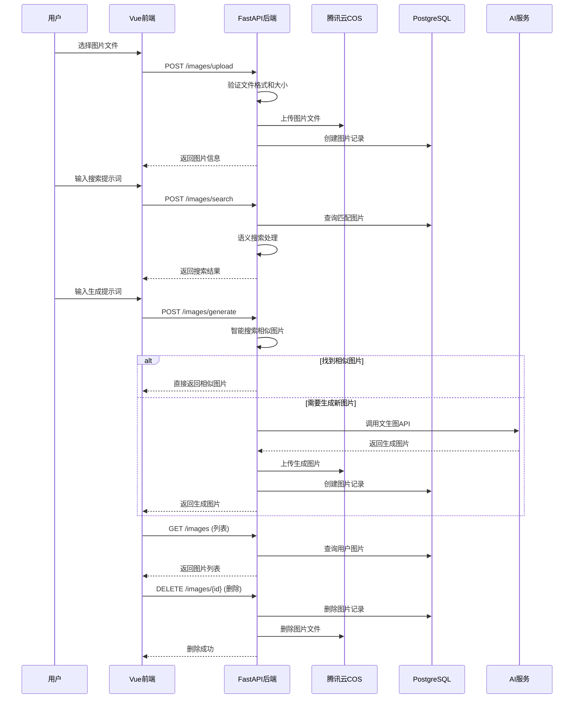

# AI PPTist 系统架构设计

## 1. 当前项目现状分析

### 1.1 现有技术栈
- **前端框架**: Vue 3 + TypeScript + Vite
- **状态管理**: Pinia
- **HTTP客户端**: Axios
- **本地存储**: IndexedDB (Dexie)
- **UI组件**: 自定义组件库
- **构建工具**: Vite

### 1.2 核心功能现状
- ✅ 完整的幻灯片编辑器
- ✅ AI生成功能 (流式输出)
- ✅ 模板系统
- ✅ 本地文件操作 (.pptist格式)
- ❌ 图片云存储管理
- ❌ 后端服务集成
- ❌ 用户管理系统
- ❌ 多模型配置

### 1.3 数据存储问题
当前使用base64存储图片数据，导致：
- 文件体积庞大 (template_5.json 达到34MB)
- 加载性能差
- 无法有效管理图片资源

## 2. 架构演进策略

### 2.1 渐进式架构升级

```
当前状态 (Vue3前端Demo) → 阶段1 (增加Python后端) → 阶段2 (完整全栈应用)
```

### 2.2 阶段1：最小可行后端集成

**目标**: 在不破坏现有前端架构的前提下，逐步引入Python后端服务

**技术选择**:
- **后端框架**: FastAPI + Python 3.10+ (高性能，异步支持)
- **数据库**: PostgreSQL (生产级关系数据库)
- **文件存储**: 腾讯云COS集成
- **认证**: JWT + OAuth2
- **AI集成**: 基于现有ai_presentation项目的成熟方案

### 2.3 架构框架图 (阶段1)

```
┌─────────────────────────────────────────────────────────────┐
│                        前端层 (Vue 3)                       │
├─────────────────────────────────────────────────────────────┤
│  ┌─────────────┐  ┌─────────────┐  ┌─────────────┐          │
│  │  编辑器组件  │  │  AI生成组件 │  │  图片管理   │          │
│  │             │  │             │  │  组件       │          │
│  └─────────────┘  └─────────────┘  └─────────────┘          │
└─────────────────────────────────────────────────────────────┘
                                   │
                                   ▼
┌─────────────────────────────────────────────────────────────┐
│                        代理层 (Vite)                        │
├─────────────────────────────────────────────────────────────┤
│  ┌─────────────────────────────────────────────────────┐    │
│  │               开发环境反向代理配置                   │    │
│  │        /api/* → http://localhost:8000/api/*         │    │
│  └─────────────────────────────────────────────────────┘    │
└─────────────────────────────────────────────────────────────┘
                                   │
                                   ▼
┌─────────────────────────────────────────────────────────────┐
│                        后端层 (Python FastAPI)              │
├─────────────────────────────────────────────────────────────┤
│  ┌─────────────┐  ┌─────────────┐  ┌─────────────┐          │
│  │  图片服务   │  │  AI代理服务 │  │  模板服务   │          │
│  │ (COS集成)   │  │ (多模型支持)│  │ (迁移管理)  │          │
│  └─────────────┘  └─────────────┘  └─────────────┘          │
└─────────────────────────────────────────────────────────────┘
                                   │
                                   ▼
┌─────────────────────────────────────────────────────────────┐
│                        数据存储层                           │
├─────────────────────────────────────────────────────────────┤
│  ┌─────────────┐  ┌─────────────┐  ┌─────────────┐          │
│  │ PostgreSQL  │  │   Redis     │  │  腾讯云COS  │          │
│  │  (主数据库) │  │  (缓存)     │  │ (图片存储)  │          │
│  └─────────────┘  └─────────────┘  └─────────────┘          │
└─────────────────────────────────────────────────────────────┘
                                   │
                                   ▼
┌─────────────────────────────────────────────────────────────┐
│                        云服务层                             │
├─────────────────────────────────────────────────────────────┤
│  ┌─────────────┐  ┌─────────────┐  ┌─────────────┐          │
│  │  AI模型服务 │  │  元数据搜索 │  │  对象存储   │          │
│  │ (多供应商)  │  │ (MetaInsight)│  │  (备份)     │          │
│  └─────────────┘  └─────────────┘  └─────────────┘          │
└─────────────────────────────────────────────────────────────┘
```

## 3. 数据存储设计 (针对性优化)

### 3.1 数据库选型分析

#### PostgreSQL vs MySQL 对比分析

**PostgreSQL 优势**:
1. **JSONB支持**: 原生支持JSONB数据类型，非常适合存储幻灯片模板的JSON内容
2. **扩展性**: 支持自定义函数、操作符和索引类型
3. **标准兼容**: 更严格的SQL标准兼容性
4. **并发性能**: MVCC(多版本并发控制)实现更优秀
5. **地理空间**: 内置PostGIS扩展，适合未来可能的地理相关功能

**MySQL 适用场景**:
- 简单的读写操作为主的应用
- 需要与现有MySQL生态系统集成
- 对特定MySQL特性有依赖

**推荐选择**: PostgreSQL，原因：
- 更好的JSON支持，适合存储幻灯片模板数据
- 更强的扩展性和功能丰富性
- 更适合AI和内容管理类应用

### 3.2 数据库设计 (PostgreSQL)

```sql
-- 图片资源表
CREATE TABLE images (
    id UUID PRIMARY KEY DEFAULT gen_random_uuid(),
    cos_key VARCHAR(512) NOT NULL,
    filename VARCHAR(255) NOT NULL,
    file_size BIGINT NOT NULL,
    mime_type VARCHAR(100),
    width INTEGER,
    height INTEGER,
    description TEXT,
    tags TEXT[],
    created_at TIMESTAMP DEFAULT CURRENT_TIMESTAMP,
    user_id UUID REFERENCES users(id)
);

-- 模板表 (优化后)
CREATE TABLE templates (
    id UUID PRIMARY KEY DEFAULT gen_random_uuid(),
    name VARCHAR(255) NOT NULL,
    content JSONB NOT NULL,  -- 存储去base64后的JSON
    thumbnail_cos_key VARCHAR(512),
    is_system BOOLEAN DEFAULT FALSE,
    created_at TIMESTAMP DEFAULT CURRENT_TIMESTAMP
);

-- AI模型配置表 (采用标准命名)
CREATE TABLE ai_models (
    id UUID PRIMARY KEY DEFAULT gen_random_uuid(),
    name VARCHAR(255) NOT NULL,
    provider VARCHAR(100) NOT NULL,
    model_name VARCHAR(255) NOT NULL,
    base_url VARCHAR(512),
    api_key_encrypted TEXT NOT NULL,  -- 加密存储
    is_enabled BOOLEAN DEFAULT TRUE,
    created_at TIMESTAMP DEFAULT CURRENT_TIMESTAMP,
    updated_at TIMESTAMP DEFAULT CURRENT_TIMESTAMP
);
```

### 3.3 本地存储优化

保持现有IndexedDB结构，增加：
- `cached_images`: 图片URL缓存
- `user_settings`: 用户配置
- `api_cache`: API响应缓存

## 4. 核心实现流程 (针对性设计)

### 4.1 图片管理完整流程 (基于ai_presentation架构)

ai_presentation项目采用模块化设计，将图片功能拆分为四个独立的API端点：

#### 图片管理API结构
```
/images           - 基础管理 (GET, DELETE, 详情)
/images/upload    - 图片上传 (POST)
/images/search    - 图片搜索 (POST)
/images/generate  - 图片生成 (POST)
```

#### 完整图片工作流



#### 核心功能特性
1. **智能集成**: 生成图片前先搜索相似图片，避免重复生成
2. **批量操作**: 支持批量上传和删除
3. **预签名URL**: 前端可直接上传到COS，减轻后端压力
4. **语义搜索**: 基于提示词哈希和向量搜索
5. **完整CRUD**: 完整的增删改查和详情查看


## 5. 项目工程目录结构 (详细规划)

### 5.1 整体项目结构

```
ai-pptist/
├── frontend/                 # Vue 3 + TypeScript 前端
├── backend/                  # Python FastAPI 后端
├── workspace/                # 工作区目录 (数据、临时文件、日志)
│   ├── uploads/              # 上传文件目录
│   ├── temp/                 # 临时文件目录
│   ├── logs/                 # 应用日志目录
│   └── data/                 # 其他数据文件
├── config/                   # 配置文件目录
│   ├── .env.example         # 环境变量示例 (统一维护)
│   └── .env.local           # 本地环境变量
├── docker/                   # Docker相关配置
│   ├── frontend/
│   ├── backend/
│   └── database/
├── scripts/                  # 运维脚本
├── docs/                     # 项目文档
├── .github/                  # GitHub配置
├── docker-compose.yml        # 主Docker编排文件
├── docker-compose-dev.yml    # 开发环境编排
├── docker-compose-test.yml   # 测试环境编排
├── .dockerignore
├── .gitignore
├── README.md
├── LICENSE
└── requirements.txt          # Python依赖
```

### 5.2 前端详细目录结构

```
ai-pptist/
├── frontend/                 # Vue 3 + TypeScript 前端 (独立项目)
│   ├── public/              # 静态资源目录 (不会被Vite处理)
│   │   ├── mocks/           # 模拟数据 (开发阶段使用)
│   │   │   ├── template_1.json
│   │   │   ├── template_2.json
│   │   │   ├── template_3.json
│   │   │   ├── template_4.json
│   │   │   ├── template_5.json
│   │   │   └── imgs.json
│   │   └── imgs/            # 静态图片资源 (直接引用)
│   │       ├── template_1.jpg
│   │       ├── template_2.jpg
│   │       ├── template_3.jpg
│   │       └── template_4.jpg
│   ├── src/
│   │   ├── assets/          # 编译资源目录 (会被Vite处理)
│   │   │   ├── css/         # 全局样式文件
│   │   │   │   ├── global.css      # 全局基础样式
│   │   │   │   ├── variables.css   # CSS变量定义
│   │   │   │   ├── animations.css  # 动画样式
│   │   │   │   └── responsive.css  # 响应式样式
│   │   │   ├── icons/       # SVG图标资源
│   │   │   │   ├── common/         # 通用图标
│   │   │   │   ├── editor/         # 编辑器专用图标
│   │   │   │   └── ai/             # AI功能图标
│   │   │   └── images/      # 项目图片资源
│   │   │       ├── backgrounds/    # 背景图片
│   │   │       ├── logos/          # Logo图片
│   │   │       └── placeholders/   # 占位图片
│   │   ├── components/      # Vue组件目录 (按功能模块组织)
│   │   │   ├── common/      # 基础通用组件
│   │   │   │   ├── Button/          # 按钮组件
│   │   │   │   │   ├── Button.vue
│   │   │   │   │   ├── ButtonGroup.vue
│   │   │   │   │   └── index.ts
│   │   │   │   ├── Modal/
│   │   │   │   ├── Input/
│   │   │   │   └── Select/
│   │   │   ├── editor/      # 编辑器组件
│   │   │   │   ├── Canvas/
│   │   │   │   ├── Toolbar/
│   │   │   │   ├── Sidebar/
│   │   │   │   └── Element/
│   │   │   └── ai/          # AI相关组件
│   │   │       ├── AIPPTDialog/
│   │   │       ├── ModelConfig/
│   │   │       └── ImageLibrary/
│   │   ├── hooks/           # Composition API hooks
│   │   │   ├── useSlides.ts
│   │   │   ├── useAIPPT.ts
│   │   │   ├── useImage.ts
│   │   │   └── useModel.ts
│   │   ├── router/          # 路由配置
│   │   │   └── index.ts
│   │   ├── store/           # Pinia状态管理
│   │   │   ├── index.ts
│   │   │   ├── slides.ts
│   │   │   ├── ai.ts
│   │   │   ├── images.ts
│   │   │   └── user.ts
│   │   ├── services/        # API服务层
│   │   │   ├── api.ts       # 基础API配置
│   │   │   ├── image.ts     # 图片上传服务
│   │   │   ├── ai.ts        # AI服务
│   │   │   ├── template.ts  # 模板服务
│   │   │   ├── config.ts    # 配置管理
│   │   │   └── auth.ts      # 认证服务
│   │   ├── types/           # TypeScript类型定义
│   │   │   ├── slides.ts    # 幻灯片类型
│   │   │   ├── ai.ts        # AI相关类型
│   │   │   ├── image.ts     # 图片类型
│   │   │   ├── user.ts      # 用户类型
│   │   │   └── index.ts     # 类型导出
│   │   ├── utils/           # 工具函数
│   │   │   ├── common.ts    # 通用工具
│   │   │   ├── file.ts      # 文件操作
│   │   │   ├── dom.ts       # DOM操作
│   │   │   └── validation.ts # 数据验证
│   │   ├── views/           # 页面组件
│   │   │   ├── Editor/      # 编辑器页面
│   │   │   ├── Home/        # 首页
│   │   │   ├── Templates/   # 模板页面
│   │   │   └── Settings/    # 设置页面
│   │   ├── App.vue
│   │   ├── main.ts
│   │   └── env.d.ts
│   ├── index.html
│   ├── package.json
│   ├── tsconfig.json
│   ├── vite.config.ts       # Vite配置（含代理配置）
│   └── .env                 # 环境变量 (链接到根目录.env)
```

### 5.3 后端详细目录结构

```
ai-pptist/
├── backend/                 # Python FastAPI 后端
│   ├── app/                 # 应用主目录
│   │   ├── __init__.py
│   │   ├── main.py          # 应用入口
│   │   ├── core/            # 核心配置
│   │   │   ├── __init__.py
│   │   │   ├── config.py    # 应用配置
│   │   │   ├── security.py  # 安全配置
│   │   │   ├── database.py  # 数据库配置
│   │   │   └── exceptions.py # 异常处理
│   │   ├── api/             # API路由
│   │   │   ├── __init__.py
│   │   │   ├── deps.py      # 依赖注入
│   │   │   └── v1
│   │   │   │   └── endpoints/   # API端点
│   │   │   │       ├── __init__.py
│   │   │   │       ├── auth.py  # 认证相关
│   │   │   │       ├── images.py # 图片管理
│   │   │   │       ├── ai.py    # AI服务
│   │   │   │       ├── templates.py # 模板管理
│   │   │   │       ├── config.py # 配置管理
│   │   │   │       └── users.py  # 用户管理
│   │   │   │  └── router.py  # API路由聚合
│   │   ├── db/              # 数据库相关
│   │   │   ├── __init__.py
│   │   │   ├── base.py      # 基础模型
│   │   │   ├── base_class.py # 基础类
│   │   │   ├── session.py   # 会话管理
│   │   │   └── repositories/ # 数据仓库
│   │   │       ├── __init__.py
│   │   │       ├── images.py
│   │   │       ├── templates.py
│   │   │       ├── ai_models.py
│   │   │       └── users.py
│   │   ├── models/          # SQLAlchemy 数据模型
│   │   │   ├── __init__.py
│   │   │   ├── image.py     # 图片模型
│   │   │   ├── template.py  # 模板模型
│   │   │   ├── ai_model.py  # AI模型配置
│   │   │   ├── user.py      # 用户模型
│   │   │   └── base.py      # 基础模型
│   │   ├── schemas/         # Pydantic 数据验证
│   │   │   ├── __init__.py
│   │   │   ├── image.py     # 图片验证
│   │   │   ├── template.py  # 模板验证
│   │   │   ├── ai_model.py  # AI模型验证
│   │   │   ├── user.py      # 用户验证
│   │   │   └── auth.py      # 认证验证
│   │   ├── services/        # 业务逻辑层
│   │   │   ├── __init__.py
│   │   │   ├── image.py     # 图片服务
│   │   │   ├── template.py  # 模板服务
│   │   │   ├── ai.py        # AI服务
│   │   │   ├── auth.py      # 认证服务
│   │   │   ├── cos.py       # 腾讯云COS服务
│   │   │   └── file.py      # 文件服务
│   │   ├── utils/           # 工具函数
│   │   │   ├── __init__.py
│   │   │   ├── security.py  # 安全工具
│   │   │   ├── file.py      # 文件工具
│   │   │   ├── image.py     # 图片处理
│   │   │   ├── ai.py        # AI工具
│   │   │   └── common.py    # 通用工具
│   │   ├── middleware/      # 中间件
│   │   │   ├── __init__.py
│   │   │   ├── cors.py      # CORS中间件
│   │   │   ├── auth.py      # 认证中间件
│   │   │   └── logging.py   # 日志中间件
│   │   └── tasks/           # 后台任务
│   │       ├── __init__.py
│   │       ├── celery.py    # Celery配置
│   │       └── image_processing.py # 图片处理任务
│   ├── migrations/          # 数据库迁移
│   │   ├── versions/        # 迁移版本
│   │   ├── env.py
│   │   ├── script.py.mako
│   │   └── alembic.ini
│   ├── tests/               # 测试
│   │   ├── __init__.py
│   │   ├── conftest.py
│   │   ├── test_api/        # API测试
│   │   ├── test_services/   # 服务测试
│   │   └── test_models/     # 模型测试
│   ├── static/              # 静态文件
│   │   ├── templates/       # 模板文件
│   │   └── uploads/         # 上传目录
│   ├── requirements.txt     # Python依赖
│   ├── requirements-dev.txt # 开发依赖
│   ├── .env.example         # 环境变量示例 (实际使用根目录的.env)
│   ├── Dockerfile           # Docker配置
│   └── pyproject.toml       # Python项目配置
```

### 5.2 前端服务层扩展

**src/services/api.ts** (基础API配置):
```typescript
import axios from 'axios';

const API_BASE_URL = import.meta.env.VITE_API_BASE_URL || '/api/v1';

export const api = axios.create({
  baseURL: API_BASE_URL,
  timeout: 30000,
  headers: {
    'Content-Type': 'application/json',
  },
});

// 请求拦截器
api.interceptors.request.use(
  (config) => {
    const token = localStorage.getItem('access_token');
    if (token) {
      config.headers.Authorization = `Bearer ${token}`;
    }
    return config;
  },
  (error) => Promise.reject(error)
);

// 响应拦截器
api.interceptors.response.use(
  (response) => response,
  (error) => {
    if (error.response?.status === 401) {
      localStorage.removeItem('access_token');
      window.location.href = '/login';
    }
    return Promise.reject(error);
  }
);

export default api;
```

**src/services/image.ts** (图片上传服务):
```typescript
import { api } from './api';

export interface ImageUploadResult {
  id: string;
  url: string;
  width: number;
  height: number;
  filename: string;
  file_size: number;
  mime_type: string;
  created_at: string;
}

export interface ImageItem {
  id: string;
  url: string;
  width: number;
  height: number;
  filename: string;
  description?: string;
  tags?: string[];
  created_at: string;
}

export const uploadImage = async (file: File): Promise<ImageUploadResult> => {
  const formData = new FormData();
  formData.append('file', file);

  const response = await api.post('/images/upload', formData, {
    headers: { 'Content-Type': 'multipart/form-data' }
  });

  return response.data;
};

export const getImageList = async (params?: {
  page?: number;
  limit?: number;
  search?: string;
  tags?: string[];
}): Promise<{ images: ImageItem[]; total: number }> => {
  const response = await api.get('/images', { params });
  return response.data;
};

export const deleteImage = async (id: string): Promise<void> => {
  await api.delete(`/images/${id}`);
};

export const updateImage = async (id: string, data: {
  description?: string;
  tags?: string[];
}): Promise<ImageItem> => {
  const response = await api.patch(`/images/${id}`, data);
  return response.data;
};
```

**src/services/ai.ts** (AI服务):
```typescript
import { api } from './api';

export interface ModelConfig {
  id: string;
  name: string;
  provider: string;
  model_name: string;
  base_url?: string;
  is_enabled: boolean;
  created_at: string;
  updated_at: string;
}

export interface AIGenerationRequest {
  prompt: string;
  model_id?: string;
  template_id?: string;
  style?: string;
  num_slides?: number;
}

export interface AIGenerationResponse {
  task_id: string;
  status: 'processing' | 'completed' | 'failed';
  progress?: number;
  result?: {
    slides: any[];
    total_time?: number;
  };
}

export const getModelConfigs = async (): Promise<ModelConfig[]> => {
  const response = await api.get('/ai/models');
  return response.data;
};

export const updateModelConfig = async (
  id: string,
  config: Partial<ModelConfig>
): Promise<ModelConfig> => {
  const response = await api.put(`/ai/models/${id}`, config);
  return response.data;
};

export const testModelConnection = async (id: string): Promise<{ success: boolean; message: string }> => {
  const response = await api.post(`/ai/models/${id}/test`);
  return response.data;
};

export const generatePresentation = async (
  request: AIGenerationRequest
): Promise<AIGenerationResponse> => {
  const response = await api.post('/ai/generate', request);
  return response.data;
};

export const getGenerationStatus = async (taskId: string): Promise<AIGenerationResponse> => {
  const response = await api.get(`/ai/tasks/${taskId}`);
  return response.data;
};
```

**src/services/template.ts** (模板服务):
```typescript
import { api } from './api';

export interface Template {
  id: string;
  name: string;
  content: any;
  thumbnail_url?: string;
  is_system: boolean;
  created_at: string;
  updated_at: string;
}

export const getTemplates = async (): Promise<Template[]> => {
  const response = await api.get('/templates');
  return response.data;
};

export const getTemplate = async (id: string): Promise<Template> => {
  const response = await api.get(`/templates/${id}`);
  return response.data;
};

export const createTemplate = async (data: {
  name: string;
  content: any;
  thumbnail_file?: File;
}): Promise<Template> => {
  const formData = new FormData();
  formData.append('name', data.name);
  formData.append('content', JSON.stringify(data.content));

  if (data.thumbnail_file) {
    formData.append('thumbnail', data.thumbnail_file);
  }

  const response = await api.post('/templates', formData, {
    headers: { 'Content-Type': 'multipart/form-data' }
  });

  return response.data;
};

export const updateTemplate = async (
  id: string,
  data: Partial<{
    name: string;
    content: any;
    thumbnail_file?: File;
  }>
): Promise<Template> => {
  const formData = new FormData();

  if (data.name) formData.append('name', data.name);
  if (data.content) formData.append('content', JSON.stringify(data.content));
  if (data.thumbnail_file) formData.append('thumbnail', data.thumbnail_file);

  const response = await api.patch(`/templates/${id}`, formData, {
    headers: { 'Content-Type': 'multipart/form-data' }
  });

  return response.data;
};

export const deleteTemplate = async (id: string): Promise<void> => {
  await api.delete(`/templates/${id}`);
};
```

**src/services/config.ts** (配置管理):
```typescript
import { api } from './api';

export interface AppConfig {
  theme: 'light' | 'dark' | 'auto';
  language: string;
  auto_save: boolean;
  save_interval: number;
  default_model?: string;
  image_quality: 'low' | 'medium' | 'high';
}

export const getConfig = async (): Promise<AppConfig> => {
  const response = await api.get('/config');
  return response.data;
};

export const updateConfig = async (config: Partial<AppConfig>): Promise<AppConfig> => {
  const response = await api.patch('/config', config);
  return response.data;
};

export const resetConfig = async (): Promise<AppConfig> => {
  const response = await api.post('/config/reset');
  return response.data;
};
```

**src/services/auth.ts** (认证服务):
```typescript
import { api } from './api';

export interface User {
  id: string;
  email: string;
  name: string;
  avatar_url?: string;
  is_active: boolean;
  is_superuser: boolean;
  created_at: string;
}

export interface LoginRequest {
  email: string;
  password: string;
}

export interface RegisterRequest {
  email: string;
  password: string;
  name: string;
}

export interface AuthResponse {
  access_token: string;
  token_type: string;
  user: User;
}

export const login = async (credentials: LoginRequest): Promise<AuthResponse> => {
  const response = await api.post('/auth/login', credentials);
  const { access_token, user } = response.data;

  if (access_token) {
    localStorage.setItem('access_token', access_token);
  }

  return response.data;
};

export const register = async (userData: RegisterRequest): Promise<AuthResponse> => {
  const response = await api.post('/auth/register', userData);
  const { access_token } = response.data;

  if (access_token) {
    localStorage.setItem('access_token', access_token);
  }

  return response.data;
};

export const logout = async (): Promise<void> => {
  localStorage.removeItem('access_token');
  await api.post('/auth/logout');
};

export const getCurrentUser = async (): Promise<User> => {
  const response = await api.get('/auth/me');
  return response.data;
};

export const refreshToken = async (): Promise<{ access_token: string }> => {
  const response = await api.post('/auth/refresh');
  const { access_token } = response.data;

  if (access_token) {
    localStorage.setItem('access_token', access_token);
  }

  return response.data;
};
```

## 6. 关键特性实现方案

### 6.1 图片管理功能

**基于ai_presentation的成熟方案**:
- 复用现有的图片上传端点
- 集成MetaInsight搜索功能
- 支持批量操作和管理

### 6.2 AI模型配置

**安全存储**: 使用Fernet加密API密钥
**多模型支持**: 可配置多个AI服务提供商
**统一接口**: 提供标准化的模型调用接口

### 6.3 调试功能

**流式输出调试**: 复用现有的流式处理机制
**文生图测试**: 集成文生图API端点

## 7. 部署和迁移方案

### 7.1 开发环境部署
1. 安装Python依赖: `pip install -r requirements.txt`
2. 启动后端服务: `uvicorn app.main:app --reload --port 8000`
3. 配置Vite代理指向Python后端
4. 前端正常开发

### 7.2 数据初始化
1. 初始化数据库表结构
2. 导入系统默认模板
3. 配置基础AI模型设置
4. 设置管理员账户

### 7.3 生产环境部署
- Docker容器化部署
- Nginx反向代理
- PostgreSQL高可用配置
- 自动化备份机制

## 8. 技术优势

### 8.1 成熟技术栈
- **FastAPI**: 高性能，自动API文档，异步支持
- **PostgreSQL**: 生产级关系数据库，JSONB支持
- **SQLAlchemy**: ORM支持，数据库迁移
- **Pydantic**: 数据验证和序列化

### 8.2 安全性
- API密钥加密存储
- JWT身份验证
- 输入数据验证
- CORS安全配置

### 8.3 可扩展性
- 基于ai_presentation成熟架构
- 模块化设计
- 易于添加新功能
- 良好的性能表现

### 8.4 开发效率
- 自动API文档 (Swagger/ReDoc)
- 类型提示和代码补全
- 丰富的生态系统
- 完善的错误处理

这个架构设计基于成熟的Python技术栈，充分利用了现有ai_presentation项目的经验，提供了稳定、安全、可扩展的后端解决方案，同时保持了与前端的良好集成。